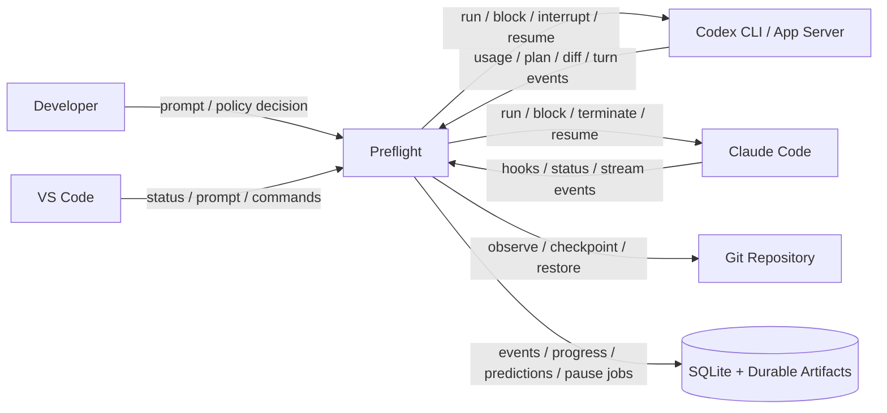
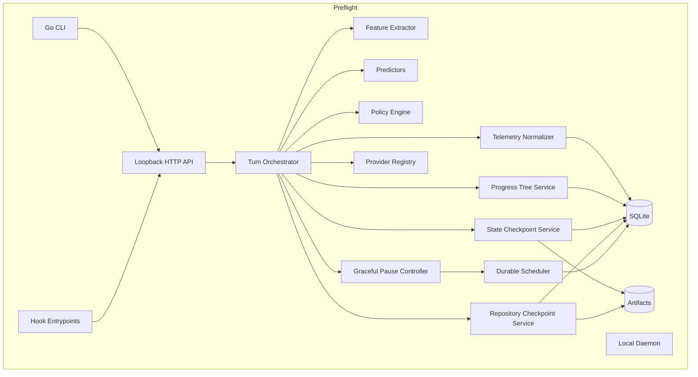
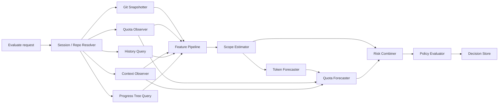
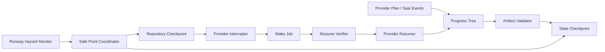
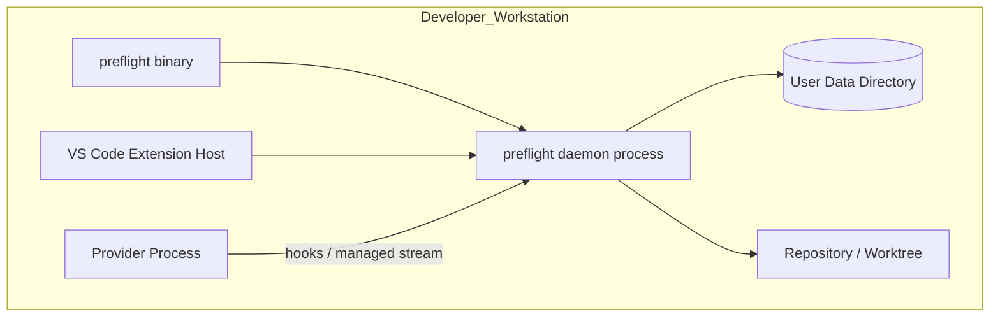
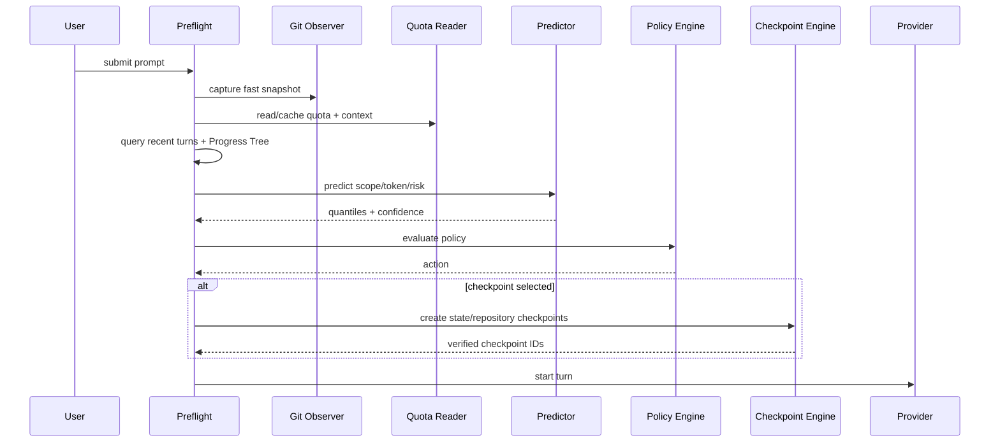
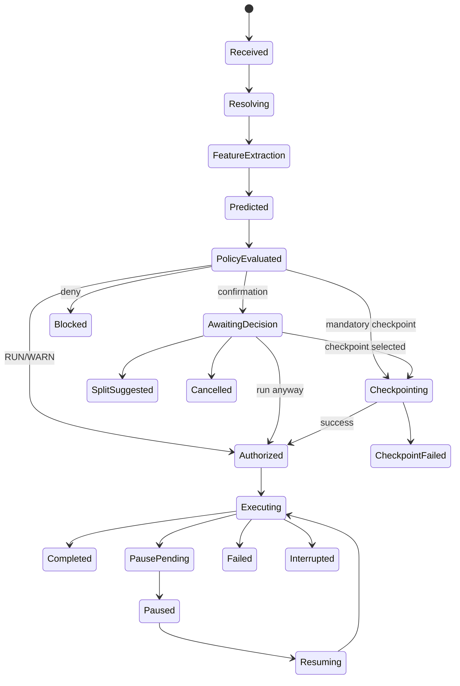
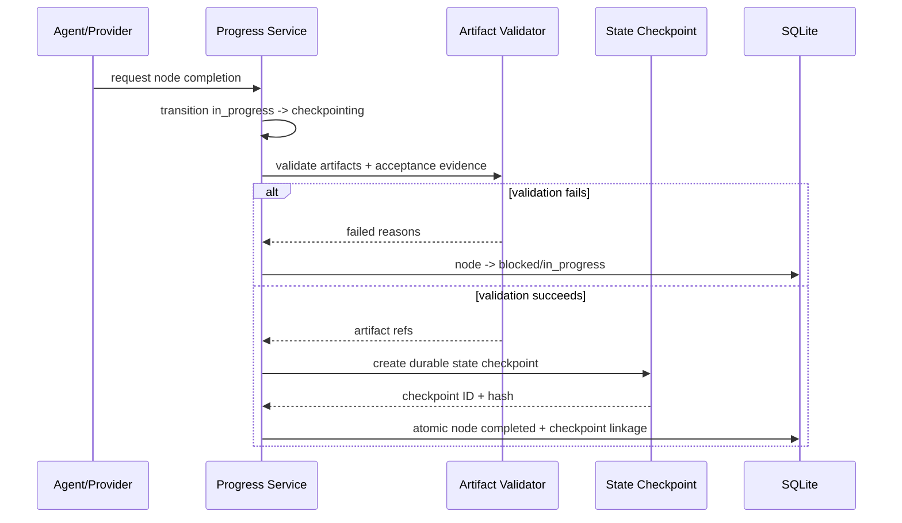
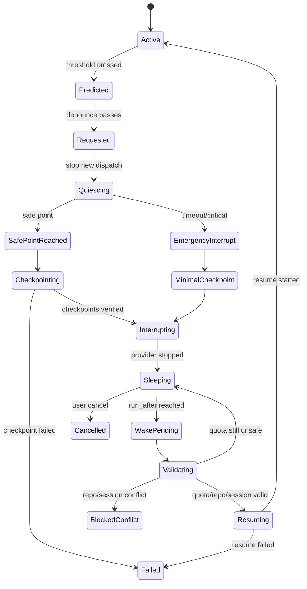

# Preflight Architecture Design Document

| 欄位 | 值 |
|---|---|
| 專案 | **Preflight** |
| 文件類型 | Architecture Design Document（ADD）＋ Implementation Specification |
| 狀態 | **Approved implementation baseline** |
| 版本 | 1.0.0-draft.1 |
| 日期 | 2026-07-12 |
| Production runtime | Go 1.26.x |
| VS Code integration | TypeScript |
| Research toolchain | Python，僅限離線研究 |
| 目標授權 | Apache License 2.0 |
| 主要讀者 | Maintainers、contributors、Codex、Claude Code、reviewers、release engineers |

> **規範性聲明：** 本文件是 Preflight 第一個 production-capable 實作的 source of truth。當程式碼、Issue、PR、prompt 或註解與本文件衝突時，以本文件及已接受的 ADR 為準。Codex 不得因較容易實作而自行改變本文的核心決策。

---

## 目錄

0. [文件使用方式](#0-文件使用方式)
1. [Executive Decision Record](#1-executive-decision-record)
2. [問題定義與產品定位](#2-問題定義與產品定位)
3. [Goals、Non-goals 與成功標準](#3-goalsnon-goals-與成功標準)
4. [開源生態與差異化](#4-開源生態與差異化)
5. [需求規格](#5-需求規格)
6. [架構原則](#6-架構原則)
7. [C4 與系統架構](#7-c4-與系統架構)
8. [Runtime modes 與 provider capability](#8-runtime-modes-與-provider-capability)
9. [Domain model](#9-domain-model)
10. [Repository 與 package layout](#10-repository-與-package-layout)
11. [Telemetry 與 event protocol](#11-telemetry-與-event-protocol)
12. [Persistence 與 SQLite schema](#12-persistence-與-sqlite-schema)
13. [Preflight evaluation pipeline](#13-preflight-evaluation-pipeline)
14. [Scope estimator](#14-scope-estimator)
15. [Token、quota 與 runway prediction](#15-tokenquota-與-runway-prediction)
16. [Risk model](#16-risk-model)
17. [Policy engine](#17-policy-engine)
18. [Progress Tree 與 State Checkpointing](#18-progress-tree-與-state-checkpointing)
19. [Repository Checkpoint 與 Recovery Engine](#19-repository-checkpoint-與-recovery-engine)
20. [Graceful Pause 與 Auto Resume](#20-graceful-pause-與-auto-resume)
21. [Codex integration](#21-codex-integration)
22. [Claude Code integration](#22-claude-code-integration)
23. [Local daemon 與 API](#23-local-daemon-與-api)
24. [CLI specification](#24-cli-specification)
25. [VS Code extension](#25-vs-code-extension)
26. [Configuration](#26-configuration)
27. [Security 與 privacy](#27-security-與-privacy)
28. [Reliability、operations 與 observability](#28-reliabilityoperations-與-observability)
29. [Testing、evaluation 與 benchmark](#29-testingevaluation-與-benchmark)
30. [Open-source delivery、CI/CD 與 governance](#30-open-source-deliverycicd-與-governance)
31. [Implementation roadmap](#31-implementation-roadmap)
32. [Definition of Done](#32-definition-of-done)
33. [Architecture Decision Records](#33-architecture-decision-records)
34. [Codex execution contract](#34-codex-execution-contract)
35. [Appendices](#35-appendices)

---

# 0. 文件使用方式

本文件不是概念性 README，而是可直接交給 Codex 分階段實作的工程契約。

## 0.1 規範性關鍵字

- **MUST／必須**：不符合即視為架構違反。
- **MUST NOT／不得**：禁止實作。
- **SHOULD／應**：除非有記錄於 ADR 的理由，否則必須遵循。
- **SHOULD NOT／不應**：除非有記錄於 ADR 的理由，否則不得採用。
- **MAY／可以**：可選實作。

## 0.2 實作順序

Codex MUST：

1. 先讀完本文件及 `AGENTS.md`；
2. 確認目前 milestone；
3. 只實作該 milestone 及必要前置；
4. 不得提早加入未被 milestone 使用的 abstraction；
5. 在宣稱完成前執行 acceptance commands；
6. 若 upstream provider capability 已改變，必須以 explicit degraded capability 處理，不得猜測。

## 0.3 架構變更流程

下列變更 MUST 新增或更新 ADR：

- runtime 語言；
- daemon transport；
- SQLite schema 的不相容變更；
- provider integration contract；
- checkpoint 格式或 restore 安全模型；
- State Checkpointing invariant；
- Graceful Pause／Auto Resume 語意；
- privacy default；
- public CLI/API/protocol compatibility；
- OSS license；
- prediction output 從 score 變為 probability。

## 0.4 Implementation authority

信任順序：

```text
Provider event / Git / process exit code / verification result
    > normalized structured observation
    > durable Progress Tree / checkpoint manifest
    > statistical estimate
    > LLM-generated summary
    > conversation memory
```

---

# 1. Executive Decision Record

## 1.1 一句話定位

> **Preflight 是位於使用者與 AI coding agent 之間的 local-first predictive runtime guard；它在 turn 開始前及執行中預估 quota、context、完成度與 blast-radius 風險，並依 policy 決定執行、警告、checkpoint、切分、優雅暫停或阻擋。**

## 1.2 核心產品迴圈

```text
Observe
  ↓
Estimate Scope
  ↓
Forecast Token / Quota / Runway
  ↓
Apply Policy
  ↓
Checkpoint / Split / Run / Pause
  ↓
Observe Outcome
  ↓
Calibrate
```

## 1.3 兩個核心 continuity feature

### State Checkpointing（狀態存檔點）

Preflight 不允許 agent 將進度只保存在 process memory 或單一 conversation context。

每個 logical work unit 完成時，例如：

- 架構文件的一個章節；
- 一個 package；
- 一個 migration step；
- 一組 tests；
- 一個 plan node；

都 MUST 產生 durable evidence：

- 實體 Markdown／程式碼／測試 artifact；或
- SQLite 中的結構化 state record；
- 並記錄 checksum、Git snapshot、acceptance evidence 與下一個 action。

一個 Progress Tree node 未通過 artifact validator 前，不得標記為 `completed`。

### Graceful Pause（優雅暫停）

當 runtime forecaster 判定：

```text
P(在未來 10 分鐘內觸發任一 5-hour quota limit) >= 0.80
```

且模型已校準、資料新鮮度足夠、managed mode 可控制 provider 時，Preflight MUST：

1. 發出 `PauseRequested`；
2. 停止派送新的 unsafe work；
3. 等待最近的 safe point；
4. 保存 Progress Tree 與 repository checkpoint；
5. 中斷／暫停 provider turn；
6. 將 wake job 持久化；
7. 等 quota reset 後重新驗證 quota、repository 與 provider session；
8. 在使用者允許 auto-resume 時載入進度並繼續。

「休眠」不是讓 hook process 阻塞五小時，而是由 daemon 將 wake schedule 寫入 SQLite；daemon restart、OS sleep 或 process crash 後仍可重建排程。

## 1.4 技術選型

| 項目 | 決策 | 理由 |
|---|---|---|
| Production runtime | Go 1.26.x | 單一 binary、跨平台、subprocess／daemon／hooks 適配良好 |
| Research pipeline | Python 3.12+ | quantile、survival、calibration 與資料分析 |
| VS Code extension | TypeScript strict mode | VS Code 原生 ecosystem |
| Runtime 架構 | Modular monolith | 先避免分散式部署與跨程序一致性成本 |
| Persistence | SQLite WAL | local-first、transaction、scheduler、historical query |
| SQLite driver | `modernc.org/sqlite` | pure Go、避免 CGO |
| CLI | Cobra | 成熟、completion、cross-platform |
| Managed prompt UX | Charmbracelet `huh`；必要時 Bubble Tea | 可測試的 terminal decision UI |
| Logging | `log/slog` | 標準庫 structured logging |
| Config | YAML + JSON Schema | 適合階層式 policy 與 repo config |
| ID | UUIDv7 | RFC 9562、可排序、opaque |
| Local API | authenticated loopback HTTP/JSON + SSE | VS Code 與 hooks 跨平台 |
| Provider extension | JSONL subprocess protocol | 避免 Go plugin ABI |
| License | Apache-2.0 | permissive 且有 patent grant |
| Contribution | DCO | early-stage OSS 維護成本較低 |

## 1.5 最終產品形式

```text
preflight binary
├── CLI
├── hook entrypoints
├── managed runner / shell
├── local daemon
├── predictor + policy engine
├── Progress Tree + State Checkpointing
├── repository checkpoint engine
├── Graceful Pause scheduler
├── SQLite store
└── Codex / Claude adapters

vscode-preflight
└── TypeScript companion extension

research/
└── Python offline training and evaluation
```

## 1.6 不可妥協的原則

1. **Unknown is not zero.**
2. **Score is not probability.** 未校準前只能叫 risk score。
3. **No hidden prompt retention.** raw prompt 預設不持久化。
4. **State must cross process boundaries.** 重要狀態不能只留在 context。
5. **Completed means evidenced.** 無 artifact／verification 不得宣稱完成。
6. **Pause must be recoverable.** 未完成 durable state checkpoint 不得結束 active run。
7. **Native hook is not a full interactive UI.**
8. **Capabilities are explicit.** 缺能力時明確降級。
9. **Checkpoint does not silently commit active branch.**
10. **Auto-resume is opt-in.** 因為它可能在使用者離開後繼續執行程式碼。
11. **No blind resume.** resume 前必須驗證 repo、quota、session 與 authorization。
12. **No waiting inside hooks.** 五小時等待由 daemon scheduler 負責。

---

# 2. 問題定義與產品定位

## 2.1 主要問題

Codex、Claude Code 等 agent 的單一 turn 成本受下列因素影響：

- session context；
- rolling 5-hour／7-day quota；
- prompt 明確度；
- repository 規模；
- dependency fan-out；
- files read／changed；
- changed LOC；
- tool output；
- build/test loops；
- retry／failure；
- model、cache、compaction；
- worktree 既有 dirty state。

使用者通常在送出 prompt 前無法知道：

1. 這輪可能消耗多少資源？
2. 是否會在 quota 用完前完成？
3. 是否應先 checkpoint？
4. 是否應拆成多輪？
5. 執行中是否已接近不可恢復中斷？
6. 中斷後是否有足夠 state 精確續跑？

## 2.2 產品要回答的決策

```go
type PreflightDecision struct {
    EstimatedScope       ScopeEstimate
    TokenForecast        TokenForecast
    QuotaForecast        QuotaForecast
    ContextRisk          RiskComponent
    CompletionRisk       RiskComponent
    BlastRadiusRisk      RiskComponent
    OverallRisk          RiskComponent
    Runway               RunwayForecast
    RecommendedAction    PolicyAction
    ReasonCodes          []ReasonCode
    DataQuality          DataQuality
}
```

`ScopeEstimate`、`TokenForecast`、`QuotaForecast`、`RiskComponent`、
`DataQuality`、`ReasonCode` 現已在 `internal/domain` 凍結為具體 Go type
（ADR-041）。`TokenForecast` 與 `QuotaForecast` 由獨立的 pipeline stage
產生，位於 Scope Estimator 與 Risk Combiner 之間；`Runway` 維持獨立，不
是 Risk Combiner 的輸入（見 §7.3、§9.9、§15、§16 的對應更新）。

Actions：

```text
RUN
WARN
REQUIRE_CONFIRMATION
CHECKPOINT_AND_RUN
SPLIT
PAUSE
PAUSE_AND_AUTO_RESUME
BLOCK
```

## 2.3 典型情境

### A. 小型低風險修改

兩個檔案、無整合測試、quota headroom 足夠：`RUN`。

### B. 高風險跨層 feature

目前 5-hour usage 81%，同類型 turn P90 quota delta 24%，估計修改 8–15 files：`CHECKPOINT_AND_RUN` 或 `SPLIT`。

### C. 長文件產生

任務要求完成 20 章 ADD。Preflight 建立 20 個 `document_section` nodes。每完成一章：

1. 寫入實體 `.md`；
2. 執行 Markdown validator；
3. checksum；
4. 更新 Progress Tree；
5. 建立 state checkpoint；
6. 才允許下一章。

任何 conversation compaction 都不會抹掉已完成章節。

### D. 執行中 quota runway 惡化

Active turn 的 quota burn rate 上升，模型估算未來 10 分鐘 hit limit 機率 86%。Preflight 在下一個 safe point：

- freeze dispatch；
- state checkpoint；
- repository checkpoint；
- interrupt provider；
- 記錄 reset 時間；
- pause；
- quota reset 後 verify 並 resume。

### E. Native CLI

Native Codex／Claude hook 可在 prompt 前 block；但不能保證對 active native TUI 做完整 pause/resume。Preflight 必須顯示 `degraded`，不得宣稱 full graceful pause。

---

# 3. Goals、Non-goals 與成功標準

## 3.1 Goals

Preflight MUST：

1. 在 main turn 開始前評估 prompt；
2. normalize Codex／Claude telemetry；
3. 保存 source、confidence、freshness；
4. 輸出 quantile，不只單點；
5. 分開 quota、context、completion、blast-radius risk；
6. 提供 managed mode 決策 UI；
7. 提供 native hook allow/block；
8. 建立 machine-verifiable repository checkpoint；
9. 建立 durable Progress Tree；
10. 在 logical node 完成時強制 state checkpoint；
11. 在 managed mode 執行 continuous runway forecast；
12. 在符合 policy 時 graceful pause；
13. quota reset 後安全 resume；
14. daemon restart 後恢復 wake jobs；
15. local-first、no required cloud；
16. 單一 Go binary；
17. VS Code companion；
18. provider extension protocol；
19. post-turn outcome calibration；
20. 公開 OSS 可維護性。

## 3.2 Non-goals v1

- 繞過 quota；
- 自動購買 credits；
- 保證一定完成；
- 取代 Codex／Claude；
- 取代 Git；
- generic agent memory；
- 預設保存完整 transcript；
- 預設上傳 telemetry；
- 在未校準時輸出假 probability；
- fork provider TUI；
- 攔截其他 VS Code extension 私有 UI；
- 在 native TUI 承諾可靠 mid-turn pause；
- 讓 hook process sleep 到 reset；
- 未驗證 repo 就 auto-resume；
- 自動 commit active branch；
- 使用 LLM 做每次 fast-path preflight；
- 自動喚醒關機或休眠中的作業系統。

## 3.3 Success criteria

### Runtime

- warm evaluate P95 < 100 ms（quota cached）；
- cold daemon start + evaluate P95 < 750 ms；
- idle daemon RSS < 75 MiB；
- checkpoint 不留半成品；
- scheduler 在 daemon restart 後 100% 重建未完成 jobs。

### Prediction

- P90 token coverage 85%–95%；
- high-risk precision > 0.60；
- quota-hit recall > 0.85；
- calibrated ECE <= 0.08；
- graceful-pause trigger false-positive rate < 20%；
- 不得以 0 代替 unknown。

### Continuity

- completed Progress Tree node 100% 有 durable evidence；
- document section node 100% 有 persisted Markdown／DB artifact；
- pause record 100% 可在 crash 後重建；
- repository 未變更時，managed resume success > 95%；
- repository 衝突時，auto-resume 100% 停止並要求處理；
- duplicate resume 不得重複執行同一 node。

### OSS

- Linux/macOS/Windows release；
- signed artifacts、checksums、SBOM；
- provider contract fixtures；
- public security policy；
- install／uninstall 不破壞既有 hooks。

---

# 4. 開源生態與差異化

## 4.1 相鄰類別

1. observability／usage dashboard；
2. session browser；
3. Git-linked checkpoint／provenance；
4. continuity state；
5. terminal session manager；
6. hooks／agent orchestration。

## 4.2 代表性專案

| 專案 | 強項 | 與 Preflight 的邊界 |
|---|---|---|
| Entire CLI | Git-linked session、checkpoint、rewind、resume、traceability | Preflight 的核心是 turn 前預測與 runtime policy；可考慮互通 checkpoint |
| AICTX | repo-local continuity、decisions、failures、next action | Preflight 將 continuity 當 prediction／resume input，而非唯一產品 |
| Agent Deck | 多 agent terminal sessions、usage view | Preflight 不做 terminal multiplexer；做 pre-turn gate 與 pause scheduler |
| oh-my-codex | Codex hooks、telemetry、runtime enhancements | Preflight 是 provider-neutral、正式 capability model、quantitative forecast |

## 4.3 可防禦的差異

```text
official quota state
+ historical per-turn consumption
+ repository-derived scope
+ progress-tree remaining work
+ calibrated 10-minute runway hazard
+ policy gate
+ state/repository checkpoint
+ graceful pause and verified resume
```

## 4.4 命名風險

GitHub 與多個 registry 已有無關的 `preflight` 專案。產品名稱保留 **Preflight**，但公開發布前 MUST 確認：

- GitHub org/repo；
- Go module；
- Homebrew；
- Scoop；
- WinGet；
- VS Code publisher/extension ID；
- Open VSX；
- Claude plugin slug；
- domain；
- 基本商標風險。

Registry collision 時 MAY 使用：

```text
preflight-agent
preflight-dev
io.github.<owner>.preflight
```

但 binary 保持 `preflight`。

---

# 5. 需求規格

## 5.1 Functional Requirements

### Session / provider

- **FR-001**：MUST 支援 Codex、Claude，並保留 extension point。
- **FR-002**：MUST 映射 internal session ID 與 provider session ID。
- **FR-003**：MUST 支援同 repo 多 worktrees／sessions。
- **FR-004**：MUST runtime 探測 capability。
- **FR-005**：Provider wire types 不得滲入 core domain。

### Prompt preflight

- **FR-010**：Managed UX MUST 在 provider 處理 prompt 前完成 evaluation。
- **FR-011**：Native hook MUST 支援 allow/block。
- **FR-012**：Decision MUST 包含 components、confidence、freshness、provenance、reason codes。
- **FR-013**：Raw prompt 預設只 transient 使用。
- **FR-014**：相同 input + snapshot 的 deterministic predictor SHOULD 一致。
- **FR-015**：Non-TTY 不得詢問；必須使用 explicit decision policy。

### Usage / quota

- **FR-020**：MUST 分別保存 input、cached input、cache creation/read、output、reasoning tokens。
- **FR-021**：Official used percentage 可用時 MUST 優先。
- **FR-022**：Quota sample MUST 保存 window、reset、limit ID、source、freshness。
- **FR-023**：Unavailable MUST 顯示 unknown。
- **FR-024**：多 quota windows MUST 各自評估，以最嚴格 hazard 決策。
- **FR-025**：Quota reset 後 MUST 重新讀取，不得只靠時間推定。

### Repository scope

- **FR-030**：MUST 取得 HEAD、branch、dirty state、staged/unstaged/untracked stats。
- **FR-031**：MUST 支援 Go module graph。
- **FR-032**：MUST 支援 .NET solution/project reference graph。
- **FR-033**：MUST 輸出 files/LOC/tool/test quantiles 或 unknown。
- **FR-034**：MUST 偵測 concurrent mutation。
- **FR-035**：Per-turn attribution MUST 帶 confidence。

### Prediction / policy

- **FR-040**：MUST 分開 quota、context、completion、blast-radius risk。
- **FR-041**：Predictor MUST 帶 version。
- **FR-042**：Policy MUST 支援 global/repo/session override。
- **FR-043**：MUST 支援 cooldown、debounce、hysteresis。
- **FR-044**：MUST 支援 run、warn、confirmation、checkpoint、split、pause、block。
- **FR-045**：Uncalibrated output MUST 叫 risk score。
- **FR-046**：User override MUST 被記錄。

### Progress Tree / State Checkpointing

- **FR-100**：每個 managed task MUST 有 durable Progress Tree。
- **FR-101**：Node statuses MUST 至少有 `pending`、`ready`、`in_progress`、`checkpointing`、`paused`、`completed`、`failed`、`skipped`、`blocked`。
- **FR-102**：Node `completed` MUST 有 acceptance evidence。
- **FR-103**：`document_section` node MUST 有實體 Markdown 或 configured database artifact。
- **FR-104**：Artifact MUST 保存 path/key、media type、bytes、SHA-256、created time。
- **FR-105**：每次 node completion MUST 建立 State Checkpoint。
- **FR-106**：State Checkpoint MUST 保存 Progress Tree version、active node、next action、repo snapshot、provider session、latest quota/context observation。
- **FR-107**：State writes MUST atomic、idempotent、可 crash recovery。
- **FR-108**：Agent 只在文字回覆宣稱完成，不足以完成 node。
- **FR-109**：Plan/provider task events MAY enrich tree，但 Progress Tree 的 canonical state 在 Preflight。
- **FR-110**：Long-document mode MUST 支援每章 flush-to-artifact gate。

### Repository checkpoint

- **FR-120**：MUST 保存 versioned manifest、staged/unstaged binary patch、untracked manifest/archive。
- **FR-121**：MUST 可不依賴 LLM verify。
- **FR-122**：Restore 前 MUST integrity、identity、path、apply-check。
- **FR-123**：Restore 預設拒絕覆蓋 dirty target。
- **FR-124**：不得預設自動 commit active branch。
- **FR-125**：Checkpoint race MUST 偵測。

### Graceful Pause / Resume

- **FR-140**：Managed runtime MUST 在 active turn 持續計算 runway forecast。
- **FR-141**：Default horizon MUST 可設定，預設 10 分鐘。
- **FR-142**：Calibrated probability threshold 預設 0.80。
- **FR-143**：Auto-pause MUST 需要至少 medium confidence、新鮮 quota sample、兩次連續 trigger；critical limit 除外。
- **FR-144**：Pause MUST 優先在 safe point 發生。
- **FR-145**：Pause 前 MUST 建立 State Checkpoint；policy 要求時同時建立 repository checkpoint。
- **FR-146**：Pause state、wake time、provider resume locator MUST 持久化。
- **FR-147**：Daemon restart MUST 重建 wake jobs。
- **FR-148**：Auto-resume MUST opt-in。
- **FR-149**：Resume 前 MUST refresh quota、verify repo fingerprint、acquire resume lease。
- **FR-150**：Repository conflict MUST 阻止 auto-resume。
- **FR-151**：Provider session 不可 resume 時 MUST 以 Progress Tree bootstrap 新 session，或轉為 manual intervention。
- **FR-152**：Native mode 無法可靠 mid-turn pause 時 MUST 顯示 degraded，不得虛假成功。
- **FR-153**：Preflight 不得讓 hook subprocess 等待 reset。
- **FR-154**：Auto-resume MUST 可被 user cancel。
- **FR-155**：同一 pause record MUST 最多有一個 active resume attempt。

### CLI / IDE

- **FR-160**：主要 command MUST 支援 `--json`。
- **FR-161**：Machine output 與 human output MUST 分離。
- **FR-162**：VS Code MUST 顯示 risk、runway、quota freshness、progress tree、checkpoint、pause state。
- **FR-163**：VS Code MUST 可取消 scheduled resume。
- **FR-164**：不得讀取其他 extension 私有 state。

### Export / learning

- **FR-170**：MUST 可輸出 de-identified dataset。
- **FR-171**：預設移除 prompt、absolute path、remote、identity、content。
- **FR-172**：Prediction MUST join actual outcome。
- **FR-173**：Pause forecast MUST join trigger、actual hit/no-hit、intervention outcome。
- **FR-174**：Runtime MUST 可 fallback built-in heuristic。

## 5.2 Non-functional Requirements

### Performance

- **NFR-001**：warm hook P95 < 100 ms（cached quota）。
- **NFR-002**：default fast path 不得呼叫 remote LLM。
- **NFR-003**：progress node commit P95 < 50 ms，不含 artifact write。
- **NFR-004**：runway update P95 < 10 ms。
- **NFR-005**：idle RSS < 75 MiB。

### Reliability

- **NFR-010**：SQLite WAL、FK、busy timeout。
- **NFR-011**：Checkpoint/state write atomic。
- **NFR-012**：Events idempotent。
- **NFR-013**：Crash 不得留下看似 complete 的 invalid node/checkpoint。
- **NFR-014**：Wake jobs durable。
- **NFR-015**：Resume exactly-once effect 由 lease + node idempotency 保證。

### Security / privacy

- **NFR-020**：預設 no outbound network。
- **NFR-021**：預設不保存 raw prompt/response/tool output。
- **NFR-022**：Loopback API bearer auth。
- **NFR-023**：Owner-only permissions。
- **NFR-024**：Archive 防 traversal/symlink escape。
- **NFR-025**：Auto-resume 必須受 workspace trust、permission policy 與 explicit opt-in 控制。

### Portability

- **NFR-030**：Windows/macOS/Linux x64/arm64。
- **NFR-031**：Runtime 不依賴 Python、Node、CGO、Docker。
- **NFR-032**：OS sleep 後在下一次 daemon wake/start 恢復排程；不保證喚醒 OS。

### Maintainability

- **NFR-040**：Core dependency graph 無 cycle。
- **NFR-041**：Public protocol 有 golden fixtures。
- **NFR-042**：Forward-only migrations。
- **NFR-043**：重大決策有 ADR。

---

# 6. 架構原則

## 6.1 Local-first

核心功能不依賴 Preflight cloud。

## 6.2 Evidence before prose

Git、provider event、artifact checksum、test result 是權威；LLM summary 只作輔助。

## 6.3 State crosses boundaries

每個重要 transition 都要能在 process crash、context compaction、terminal restart、quota reset 後重建。

## 6.4 Persist at semantic boundaries

不要每秒 dump 全狀態；在下列 boundary persist：

- node start；
- artifact completed；
- node completed；
- architecture decision；
- verification result；
- pause requested；
- safe point；
- pause entered；
- resume started／completed。

## 6.5 Predict distributions

永遠優先 P50/P80/P90 與 confidence。

## 6.6 Prediction 與 policy 分離

Predictor 不決定是否 pause；Policy 不計算模型。

## 6.7 Capability-based integration

Provider 缺能力時，功能降級但 core 不失效。

## 6.8 Graceful degradation

Quota unknown 不等於 zero；pause capability unknown 不等於 supported。

## 6.9 Safe-point-first interruption

除 critical emergency 外，不在 patch half-written、Git operation、migration transaction、test result serialization 中間 interrupt。

## 6.10 Auto-resume is a privileged action

Auto-resume 可能在無人監督時執行命令，因此必須：

- 明確 opt-in；
- 限定 workspace；
- 延續原 permission mode，不得升權；
- 可取消；
- 有 audit event；
- resume 前重新驗證。

---

# 7. C4 與系統架構

## 7.1 C4 Level 1：System Context



## 7.2 C4 Level 2：Containers



## 7.3 C4 Level 3：Evaluation Components

> ADR-041：Token Estimator 拆分為 Token Forecaster 與 Quota Forecaster 兩個
> 獨立 stage；Runway Forecaster 從此 pipeline 移除（它從未是 Risk Combiner
> 的有效輸入），改為獨立元件，直接餵給 §7.4 Continuity Components 的
> `Runway Hazard Monitor`（HAZ），與本圖不再共用同一條線。



Runway Forecaster（10 分鐘 quota-exhaustion hazard，§15.4-15.5）不出現在
此圖：它消費 live burn rate，不消費 Token/Quota Forecast，且不是 Risk
Combiner 的輸入。它的即時、持續性質已在 §7.4 的 `Runway Hazard Monitor`
正確建模；Policy Evaluator 直接、獨立地消費兩者的輸出（Risk Combiner 的
結果，以及 Runway 的 hit-probability），而不是透過 Risk Combiner 傳遞。

## 7.4 C4 Level 3：Continuity Components



## 7.5 Deployment View



無必要的 cloud control plane。未來 remote sync 必須 opt-in 並另立 ADR。

## 7.6 Core dependency direction

```text
cli/http/hooks
    ↓
application/orchestrator
    ↓
domain services + interfaces
    ↓
adapters: sqlite/git/providers/filesystem
```

Domain 不得 import provider、SQLite、Cobra 或 VS Code-specific types。

---

# 8. Runtime modes 與 provider capability

## 8.1 Managed one-shot mode

```bash
preflight run --provider codex -- "Implement refresh-token rotation"
```

完整能力：

- prompt 前決策；
- checkpoint + 自動繼續；
- event stream；
- continuous runway；
- safe-point pause；
- durable sleep；
- verified auto-resume；
- exact outcome attribution。

## 8.2 Managed shell mode

```bash
preflight shell --provider claude
```

Preflight 擁有 prompt loop，提供：

```text
:status
:progress
:checkpoint
:pause
:resume
:history
:cancel-resume
:quit
```

## 8.3 Native hook mode

使用者直接執行 `codex` 或 `claude`。

可做：

- UserPromptSubmit gate；
- telemetry ingestion；
- State Checkpointing hooks；
- block next prompt；
- 提醒／要求 checkpoint；
- provider 支援時阻擋 task completion。

不可保證：

- provider-native multi-button UI；
- arbitrary active-turn suspend；
- original prompt 自動 replay；
- 五小時後無人值守 resume。

## 8.4 VS Code companion mode

Extension 透過 daemon：

- 讀 status；
- 顯示 risk/runway/progress；
- 使用 guarded prompt；
- 啟動 managed run；
- 建 checkpoint；
- pause/resume/cancel scheduled resume。

不得依賴其他 extension 私有 API。

## 8.5 Headless mode

```bash
preflight run \
  --provider codex \
  --non-interactive \
  --decision checkpoint-if-needed \
  --prompt-file task.md
```

Non-TTY 不得問問題。

## 8.6 Capability struct

```go
type ProviderCapabilities struct {
    PrePromptGate            bool
    HookAdditionalContext    bool
    ManagedExecution         bool
    StructuredEventStream    bool
    ExactTurnUsage           bool
    LiveTokenUsage           bool
    ContextWindowUsage       bool
    RollingQuotaUsage        bool
    QuotaResetTimestamp      bool
    PlanEvents               bool
    TaskEvents               bool
    FileChangeEvents         bool
    ToolEvents               bool
    SafePointControl         bool
    TurnInterrupt            bool
    SessionResume            bool
    SessionFork              bool
    NativeStatusLine         bool
    NativeInteractiveChoice  bool
}
```

## 8.7 Initial capability matrix

| Capability | Codex native hooks | Codex App Server managed | Codex exec JSONL | Claude native hooks/status | Claude managed stream-json |
|---|---:|---:|---:|---:|---:|
| pre-prompt gate | yes | client-owned | client-owned | yes | client-owned |
| exact completed usage | version/event dependent | yes when emitted | yes | partial/status-derived | yes |
| live token usage | limited | yes | event dependent | status update cadence | stream dependent |
| context usage | limited | thread usage events | invocation-only | yes | result/stream dependent |
| 5-hour quota | sidecar App Server | yes | sidecar App Server | yes for supported subscribers | status/session dependent |
| plan/task events | limited | plan updates | plan item events | task hooks | stream/tool events |
| file/tool events | hooks/Git | yes | yes | hooks/Git | yes/Git |
| interrupt | no generic guarantee | `turn/interrupt` | process signal | no generic guarantee | process signal |
| auto-resume | degraded | full | full with session/thread | degraded | full with session ID |
| native interactive choice | no | Preflight UI | Preflight UI | no | Preflight UI |

## 8.8 Degradation rules

- Missing quota => `unknown` + lower confidence；不得 auto-pause based on fake percentage。
- Missing live usage => 只在 tool/response boundary 更新 runway。
- Missing safe-point control => pause policy 轉為 `pause_pending`。
- Missing session resume => 建新 session，注入 Progress Tree bootstrap；如 policy 禁止則 manual。
- Provider schema mismatch => disable affected capability，`doctor` 顯示 degraded。

---

# 9. Domain Model

## 9.1 IDs

```go
type RepositoryID string
type WorktreeID string
type SessionID string
type TurnID string
type EvaluationID string
type PredictionID string
type DecisionID string
type TaskID string
type ProgressNodeID string
type StateCheckpointID string
type RepositoryCheckpointID string
type PauseID string
type WakeJobID string
type ResumeAttemptID string
type EventID string
```

Preflight-owned ID 使用 UUIDv7。

## 9.2 Measurement provenance

```go
type MeasurementSource string

const (
    SourceProviderEvent MeasurementSource = "provider_event"
    SourceProviderAPI   MeasurementSource = "provider_api"
    SourceStatusLine    MeasurementSource = "status_line"
    SourceHook          MeasurementSource = "hook"
    SourceGit           MeasurementSource = "git"
    SourceProcess       MeasurementSource = "process"
    SourceDerived       MeasurementSource = "derived"
    SourceEstimated     MeasurementSource = "estimated"
    SourceImported      MeasurementSource = "imported"
)

type Confidence string

const (
    ConfidenceExact       Confidence = "exact"
    ConfidenceHigh        Confidence = "high"
    ConfidenceMedium      Confidence = "medium"
    ConfidenceLow         Confidence = "low"
    ConfidenceUnavailable Confidence = "unavailable"
)

type Measurement[T any] struct {
    Value       T
    Source      MeasurementSource
    Confidence  Confidence
    ObservedAt  time.Time
    StaleAfter  time.Time
}
```

## 9.3 Turn status

```go
type TurnStatus string

const (
    TurnPending      TurnStatus = "pending"
    TurnAuthorized   TurnStatus = "authorized"
    TurnRunning      TurnStatus = "running"
    TurnPausePending TurnStatus = "pause_pending"
    TurnPausing      TurnStatus = "pausing"
    TurnPaused       TurnStatus = "paused"
    TurnResuming     TurnStatus = "resuming"
    TurnCompleted    TurnStatus = "completed"
    TurnFailed       TurnStatus = "failed"
    TurnInterrupted  TurnStatus = "interrupted"
    TurnBlocked      TurnStatus = "blocked"
    TurnCancelled    TurnStatus = "cancelled"
)
```

## 9.4 Progress node

```go
type ProgressNodeStatus string

const (
    NodePending       ProgressNodeStatus = "pending"
    NodeReady         ProgressNodeStatus = "ready"
    NodeInProgress    ProgressNodeStatus = "in_progress"
    NodeCheckpointing ProgressNodeStatus = "checkpointing"
    NodePaused        ProgressNodeStatus = "paused"
    NodeCompleted     ProgressNodeStatus = "completed"
    NodeFailed        ProgressNodeStatus = "failed"
    NodeSkipped       ProgressNodeStatus = "skipped"
    NodeBlocked       ProgressNodeStatus = "blocked"
)

type ProgressNodeKind string

const (
    NodeDocumentSection ProgressNodeKind = "document_section"
    NodeCodeChange      ProgressNodeKind = "code_change"
    NodeTest            ProgressNodeKind = "test"
    NodeMigration       ProgressNodeKind = "migration"
    NodeInvestigation   ProgressNodeKind = "investigation"
    NodeDecision        ProgressNodeKind = "decision"
    NodeComposite       ProgressNodeKind = "composite"
)
```

## 9.5 Artifact reference

```go
type ArtifactRef struct {
    ID          string
    NodeID      ProgressNodeID
    Kind        string
    URI         string
    MediaType   string
    Bytes       int64
    SHA256      string
    Evidence    []EvidenceRef
    CreatedAt   time.Time
}
```

URI examples：

```text
file:docs/architecture/07-runtime.md
sqlite:state_artifacts/0198...
git:blob/<sha>
checkpoint:<id>/state.yaml
```

## 9.6 State checkpoint

```go
type StateCheckpoint struct {
    ID                    StateCheckpointID
    TaskID                TaskID
    ProgressTreeVersion   int64
    ActiveNodeID          *ProgressNodeID
    CompletedNodeIDs      []ProgressNodeID
    NextAction            NextAction
    RepositorySnapshotID  string
    ProviderSessionID     string
    ProviderTurnID        string
    LatestQuotaIDs        []string
    LatestContextID       string
    RepositoryCheckpointID *RepositoryCheckpointID
    CreatedAt             time.Time
    IntegritySHA256       string
}
```

## 9.7 Pause record

```go
type PauseStatus string

const (
    PausePredicted       PauseStatus = "predicted"
    PauseRequested       PauseStatus = "requested"
    PauseQuiescing       PauseStatus = "quiescing"
    PauseCheckpointing   PauseStatus = "checkpointing"
    PauseInterrupting    PauseStatus = "interrupting"
    PauseSleeping        PauseStatus = "sleeping"
    PauseWakePending     PauseStatus = "wake_pending"
    PauseValidating      PauseStatus = "validating"
    PauseResuming        PauseStatus = "resuming"
    PauseResumed         PauseStatus = "resumed"
    PauseBlockedConflict PauseStatus = "blocked_conflict"
    PauseCancelled       PauseStatus = "cancelled"
    PauseFailed          PauseStatus = "failed"
)
```

## 9.8 Failure classes

```text
quota
context
provider_rate_limit
provider_internal
tool
build
test
permission
user_interrupt
network
timeout
policy
checkpoint
state_checkpoint
resume_conflict
resume_auth
unknown
```

## 9.9 Service contracts

```go
type EvaluationService interface {
    EvaluateTurn(context.Context, EvaluateTurnRequest) (Evaluation, error)
    GetEvaluation(context.Context, EvaluationID) (Evaluation, error)
    Decide(context.Context, DecideRequest) (DecisionResult, error)
    ConsumeAuthorization(context.Context, ConsumeAuthorizationRequest) (Authorization, error)
}
```

### Predictor pipeline ports（ADR-041）

Scope Estimator → Token Forecaster → Quota Forecaster → Risk Combiner →
Policy。Runway Predictor（見 `GracefulPauseService.Observe`）獨立於此
pipeline，不消費 Token/Quota Forecast。每個 stage 都是窄介面，可獨立替換
Rule／Statistical／ML 實作（§1.4；`Preflight_Predictor_Design_Supplement.md`）。

```go
type ScopeEstimator interface {
    EstimateScope(context.Context, EstimateScopeRequest) (ScopeEstimate, error)
}

type TokenForecaster interface {
    ForecastTokens(context.Context, ForecastTokensRequest) (TokenForecast, error)
}

type QuotaForecaster interface {
    ForecastQuota(context.Context, ForecastQuotaRequest) (QuotaForecast, error)
}

type RiskCombiner interface {
    Combine(context.Context, CombineRiskRequest) (CombineRiskResult, error)
}
```

```go
type ProgressTreeService interface {
    CreateTask(context.Context, CreateTaskRequest) (Task, error)
    UpsertPlan(context.Context, UpsertPlanRequest) (ProgressTree, error)
    StartNode(context.Context, StartNodeRequest) (ProgressNode, error)
    CompleteNode(context.Context, CompleteNodeRequest) (ProgressNode, StateCheckpoint, error)
    FailNode(context.Context, FailNodeRequest) (ProgressNode, error)
    Snapshot(context.Context, TaskID) (ProgressTreeSnapshot, error)
    Reconcile(context.Context, ReconcileProgressRequest) (ReconcileResult, error)
}

type StateCheckpointService interface {
    Create(context.Context, CreateStateCheckpointRequest) (StateCheckpoint, error)
    LoadLatest(context.Context, TaskID) (StateCheckpoint, error)
    Verify(context.Context, StateCheckpointID) (StateCheckpointVerification, error)
}

type GracefulPauseService interface {
    Observe(context.Context, RuntimeObservation) (RunwayForecast, error)
    RequestPause(context.Context, PauseRequest) (PauseRecord, error)
    ReachSafePoint(context.Context, SafePoint) (PauseRecord, error)
    EnterSleep(context.Context, PauseID) (WakeJob, error)
    Resume(context.Context, ResumeRequest) (ResumeResult, error)
    Cancel(context.Context, PauseID) error
}

type RepositoryCheckpointService interface {
    Create(context.Context, CreateRepositoryCheckpointRequest) (RepositoryCheckpoint, error)
    Verify(context.Context, RepositoryCheckpointID) (RepositoryCheckpointVerification, error)
    Restore(context.Context, RestoreRepositoryCheckpointRequest) (RestoreResult, error)
}
```

## 9.10 Provider interface segregation

```go
type ProviderDetector interface {
    Detect(context.Context) (ProviderInstallation, error)
}

type ProviderCapabilityReader interface {
    Capabilities(context.Context, ProviderInstallation) (ProviderCapabilities, error)
}

type HookNormalizer interface {
    NormalizeHook(context.Context, RawHookEvent) ([]Event, HookResponse, error)
}

type ManagedRunner interface {
    Start(context.Context, RunRequest) (RunHandle, error)
}

type LiveObserver interface {
    Observe(context.Context, RunHandle) (<-chan ProviderEvent, error)
}

type TurnInterrupter interface {
    Interrupt(context.Context, RunLocator) error
}

type SessionResumer interface {
    Resume(context.Context, ResumeProviderRequest) (RunHandle, error)
}

type QuotaReader interface {
    ReadQuota(context.Context, QuotaRequest) ([]QuotaObservation, error)
}
```

不要建立要求所有 provider 實作全部 method 的 God interface。

---

# 10. Repository 與 Package Layout

```text
preflight/
├── AGENTS.md
├── Preflight_ADD.md
├── README.md
├── LICENSE
├── NOTICE
├── SECURITY.md
├── CONTRIBUTING.md
├── CODE_OF_CONDUCT.md
├── GOVERNANCE.md
├── CHANGELOG.md
├── go.mod
├── go.sum
├── Makefile
├── Taskfile.yml
├── .golangci.yml
├── .goreleaser.yml
├── .github/
│   ├── ISSUE_TEMPLATE/
│   ├── PULL_REQUEST_TEMPLATE.md
│   └── workflows/
├── cmd/
│   └── preflight/
│       └── main.go
├── internal/
│   ├── app/
│   ├── cli/
│   ├── config/
│   ├── daemon/
│   ├── httpapi/
│   ├── domain/
│   ├── orchestrator/
│   ├── events/
│   ├── telemetry/
│   ├── features/
│   ├── predictor/
│   │   ├── heuristic/
│   │   ├── empirical/
│   │   ├── runway/
│   │   └── modeljson/
│   ├── policy/
│   ├── progress/
│   ├── statecheckpoint/
│   ├── repocheckpoint/
│   ├── pause/
│   ├── scheduler/
│   ├── gitx/
│   ├── providers/
│   │   ├── registry.go
│   │   ├── codex/
│   │   ├── claude/
│   │   └── fake/
│   ├── hooks/
│   ├── storage/
│   │   └── sqlite/
│   │       └── migrations/
│   ├── artifacts/
│   ├── redact/
│   ├── paths/
│   ├── lock/
│   ├── clock/
│   ├── idgen/
│   ├── buildinfo/
│   └── testutil/
├── pkg/
│   └── protocol/
│       └── v1/
├── schemas/
│   ├── config.schema.json
│   ├── event.schema.json
│   ├── progress-tree.schema.json
│   ├── state-checkpoint.schema.json
│   ├── repository-checkpoint.schema.json
│   ├── pause.schema.json
│   ├── provider-plugin.schema.json
│   └── model.schema.json
├── integrations/
│   ├── codex/
│   └── claude/
├── vscode/
│   ├── package.json
│   ├── tsconfig.json
│   ├── src/
│   └── test/
├── research/
│   ├── pyproject.toml
│   ├── notebooks/
│   ├── preflight_research/
│   └── tests/
├── docs/
│   ├── architecture/
│   ├── adr/
│   ├── providers/
│   ├── privacy/
│   └── releases/
├── testdata/
│   ├── provider-events/
│   ├── repositories/
│   ├── progress-trees/
│   ├── checkpoints/
│   ├── pause-scenarios/
│   └── models/
└── tools/
```

## 10.1 Package rules

- `cmd/preflight` 只做 wiring 與 exit。
- Cobra handler 不放 business logic。
- Public protocol 限制在 `pkg/protocol/v1`。
- Provider wire format 不進 domain。
- SQL row 不直接當 domain entity。
- `progress` 不 import provider adapter；透過 normalized event。
- `pause` 依賴 interfaces，不依賴 Codex／Claude concrete type。
- `research/` 不得被 Go runtime import。

## 10.2 Go module path

1. 由實際 Git remote 決定；
2. remote 不可得時暫用 `github.com/huaiche94/preflight`；
3. public tag 前固定；
4. public tag 後修改需要 migration plan。

---

# 11. Telemetry 與 Event Protocol

## 11.1 Event envelope

```json
{
  "schema_version": "preflight.event.v1",
  "event_id": "0198...",
  "event_type": "progress.node.completed",
  "occurred_at": "2026-07-12T15:04:05.123Z",
  "observed_at": "2026-07-12T15:04:05.130Z",
  "sequence": 42,
  "idempotency_key": "sha256:...",
  "source": "provider_event",
  "provider": "codex",
  "repository_id": "0198...",
  "worktree_id": "0198...",
  "session_id": "0198...",
  "turn_id": "0198...",
  "task_id": "0198...",
  "progress_node_id": "0198...",
  "payload": {}
}
```

## 11.2 Invariants

- `event_id` unique。
- Provider 有 stable ID 時，`idempotency_key` deterministic。
- 支援 out-of-order。
- Unknown fields ignore。
- Raw provider event 必須先 redact。
- UTC RFC3339Nano。
- Event append 與 materialized state 更新在同一 transaction 或 outbox pattern。

## 11.3 Taxonomy

### Session / turn

```text
provider.session.started
provider.session.resumed
provider.session.compacted
provider.session.stopped
provider.turn.started
provider.turn.completed
provider.turn.failed
provider.turn.interrupted
```

### Evaluation

```text
preflight.evaluation.requested
preflight.features.extracted
preflight.prediction.created
preflight.policy.decided
preflight.user_decision.recorded
preflight.authorization.created
preflight.authorization.consumed
```

### Progress / state

```text
progress.tree.created
progress.tree.reconciled
progress.node.ready
progress.node.started
progress.node.artifact_observed
progress.node.checkpointing
progress.node.completed
progress.node.failed
state.checkpoint.creation.started
state.checkpoint.created
state.checkpoint.failed
state.checkpoint.verified
```

### Runtime / pause

```text
runway.forecast.updated
pause.threshold.crossed
pause.requested
pause.safe_point.reached
pause.checkpoint.started
pause.checkpoint.completed
pause.provider.interrupted
pause.entered
pause.wake.scheduled
pause.wake.triggered
pause.resume.validation.started
pause.resume.blocked
pause.resume.started
pause.resume.completed
pause.cancelled
pause.failed
```

### Tool / Git / verification

```text
provider.tool.started
provider.tool.completed
provider.tool.failed
provider.file_change.observed
repository.snapshot.observed
repository.diff.observed
verification.observed
```

### Usage

```text
provider.usage.observed
provider.context.observed
provider.quota.observed
provider.rate_limit.hit
```

## 11.4 Usage payload

```json
{
  "input_tokens": 24763,
  "cached_input_tokens": 24448,
  "cache_creation_input_tokens": null,
  "cache_read_input_tokens": null,
  "output_tokens": 122,
  "reasoning_tokens": 0,
  "total_observed_tokens": 24885,
  "source": "provider_event",
  "confidence": "exact"
}
```

## 11.5 Progress artifact event

```json
{
  "artifact_id": "0198...",
  "kind": "document_section",
  "uri": "file:docs/architecture/20-graceful-pause.md",
  "media_type": "text/markdown",
  "bytes": 8421,
  "sha256": "...",
  "validator": "markdown-section-v1",
  "validation_status": "passed"
}
```

## 11.6 Runway forecast event

```json
{
  "horizon_seconds": 600,
  "limit_id": "five_hour",
  "current_used_percent": 86.4,
  "hit_probability": 0.83,
  "risk_score": 0.86,
  "calibrated": true,
  "confidence": "high",
  "sample_count": 94,
  "quota_observed_at": "2026-07-12T15:04:00Z",
  "reason_codes": [
    "QUOTA_BURN_ACCELERATING",
    "LARGE_REMAINING_PROGRESS_TREE"
  ]
}
```

## 11.7 Event batching

```http
POST /v1/events:batch
```

Default max：500 events 或 1 MiB。

---

# 12. Persistence 與 SQLite Schema

## 12.1 Database settings

```sql
PRAGMA journal_mode = WAL;
PRAGMA synchronous = NORMAL;
PRAGMA foreign_keys = ON;
PRAGMA busy_timeout = 5000;
PRAGMA temp_store = MEMORY;
```

## 12.2 Core schema

> 實作時拆成 forward-only migrations；下列為 canonical logical schema。

```sql
CREATE TABLE schema_migrations (
    version INTEGER PRIMARY KEY,
    applied_at TEXT NOT NULL,
    checksum TEXT NOT NULL
);

CREATE TABLE repositories (
    id TEXT PRIMARY KEY,
    canonical_root TEXT NOT NULL,
    git_common_dir TEXT NOT NULL,
    remote_fingerprint TEXT,
    created_at TEXT NOT NULL,
    last_seen_at TEXT NOT NULL,
    UNIQUE(git_common_dir)
);

CREATE TABLE worktrees (
    id TEXT PRIMARY KEY,
    repository_id TEXT NOT NULL REFERENCES repositories(id) ON DELETE CASCADE,
    root_path TEXT NOT NULL,
    git_dir TEXT NOT NULL,
    branch_name TEXT,
    created_at TEXT NOT NULL,
    last_seen_at TEXT NOT NULL,
    UNIQUE(repository_id, root_path)
);

CREATE TABLE provider_sessions (
    id TEXT PRIMARY KEY,
    worktree_id TEXT NOT NULL REFERENCES worktrees(id) ON DELETE CASCADE,
    provider TEXT NOT NULL,
    provider_session_id TEXT,
    invocation_mode TEXT NOT NULL,
    model TEXT,
    provider_version TEXT,
    permission_mode TEXT,
    started_at TEXT NOT NULL,
    ended_at TEXT,
    metadata_json TEXT NOT NULL DEFAULT '{}',
    UNIQUE(provider, provider_session_id)
);

CREATE TABLE tasks (
    id TEXT PRIMARY KEY,
    session_id TEXT REFERENCES provider_sessions(id) ON DELETE SET NULL,
    worktree_id TEXT NOT NULL REFERENCES worktrees(id) ON DELETE CASCADE,
    objective_hash TEXT NOT NULL,
    objective_text TEXT,
    status TEXT NOT NULL,
    progress_tree_version INTEGER NOT NULL DEFAULT 1,
    active_node_id TEXT,
    auto_resume_enabled INTEGER NOT NULL DEFAULT 0,
    created_at TEXT NOT NULL,
    updated_at TEXT NOT NULL,
    completed_at TEXT
);

CREATE TABLE progress_nodes (
    id TEXT PRIMARY KEY,
    task_id TEXT NOT NULL REFERENCES tasks(id) ON DELETE CASCADE,
    parent_id TEXT REFERENCES progress_nodes(id) ON DELETE CASCADE,
    ordinal INTEGER NOT NULL,
    kind TEXT NOT NULL,
    title TEXT NOT NULL,
    description TEXT,
    status TEXT NOT NULL,
    acceptance_json TEXT NOT NULL DEFAULT '[]',
    next_action_json TEXT,
    provider_node_id TEXT,
    version INTEGER NOT NULL,
    started_at TEXT,
    completed_at TEXT,
    updated_at TEXT NOT NULL,
    UNIQUE(task_id, parent_id, ordinal)
);

CREATE TABLE progress_edges (
    task_id TEXT NOT NULL REFERENCES tasks(id) ON DELETE CASCADE,
    from_node_id TEXT NOT NULL REFERENCES progress_nodes(id) ON DELETE CASCADE,
    to_node_id TEXT NOT NULL REFERENCES progress_nodes(id) ON DELETE CASCADE,
    edge_kind TEXT NOT NULL,
    PRIMARY KEY(task_id, from_node_id, to_node_id, edge_kind)
);

CREATE TABLE artifacts (
    id TEXT PRIMARY KEY,
    task_id TEXT NOT NULL REFERENCES tasks(id) ON DELETE CASCADE,
    progress_node_id TEXT REFERENCES progress_nodes(id) ON DELETE SET NULL,
    kind TEXT NOT NULL,
    uri TEXT NOT NULL,
    media_type TEXT,
    bytes INTEGER NOT NULL,
    sha256 TEXT NOT NULL,
    validator_id TEXT,
    validation_status TEXT NOT NULL,
    metadata_json TEXT NOT NULL DEFAULT '{}',
    created_at TEXT NOT NULL,
    UNIQUE(progress_node_id, uri, sha256)
);

CREATE TABLE state_checkpoints (
    id TEXT PRIMARY KEY,
    task_id TEXT NOT NULL REFERENCES tasks(id) ON DELETE CASCADE,
    progress_tree_version INTEGER NOT NULL,
    active_node_id TEXT REFERENCES progress_nodes(id) ON DELETE SET NULL,
    repository_snapshot_id TEXT,
    repository_checkpoint_id TEXT,
    provider_session_id TEXT,
    provider_turn_id TEXT,
    state_path TEXT NOT NULL,
    integrity_sha256 TEXT NOT NULL,
    status TEXT NOT NULL,
    created_at TEXT NOT NULL,
    verified_at TEXT
);

CREATE TABLE turns (
    id TEXT PRIMARY KEY,
    session_id TEXT NOT NULL REFERENCES provider_sessions(id) ON DELETE CASCADE,
    task_id TEXT REFERENCES tasks(id) ON DELETE SET NULL,
    provider_turn_id TEXT,
    ordinal INTEGER NOT NULL,
    prompt_hash TEXT NOT NULL,
    prompt_length_chars INTEGER NOT NULL,
    prompt_token_est INTEGER NOT NULL,
    task_class TEXT,
    status TEXT NOT NULL,
    requested_at TEXT NOT NULL,
    started_at TEXT,
    completed_at TEXT,
    duration_ms INTEGER,
    failure_class TEXT,
    UNIQUE(session_id, ordinal)
);

CREATE TABLE turn_usage (
    turn_id TEXT PRIMARY KEY REFERENCES turns(id) ON DELETE CASCADE,
    input_tokens INTEGER,
    cached_input_tokens INTEGER,
    cache_creation_tokens INTEGER,
    cache_read_tokens INTEGER,
    output_tokens INTEGER,
    reasoning_tokens INTEGER,
    total_observed_tokens INTEGER,
    billable_token_equivalent REAL,
    source TEXT NOT NULL,
    confidence TEXT NOT NULL,
    observed_at TEXT NOT NULL
);

CREATE TABLE quota_observations (
    id TEXT PRIMARY KEY,
    session_id TEXT REFERENCES provider_sessions(id) ON DELETE SET NULL,
    provider TEXT NOT NULL,
    limit_id TEXT NOT NULL,
    limit_name TEXT,
    used_percent REAL,
    window_seconds INTEGER,
    resets_at TEXT,
    reached INTEGER NOT NULL DEFAULT 0,
    source TEXT NOT NULL,
    confidence TEXT NOT NULL,
    observed_at TEXT NOT NULL
);

CREATE TABLE context_observations (
    id TEXT PRIMARY KEY,
    session_id TEXT NOT NULL REFERENCES provider_sessions(id) ON DELETE CASCADE,
    turn_id TEXT REFERENCES turns(id) ON DELETE SET NULL,
    used_tokens INTEGER,
    window_tokens INTEGER,
    used_percent REAL,
    source TEXT NOT NULL,
    confidence TEXT NOT NULL,
    observed_at TEXT NOT NULL
);

CREATE TABLE repository_snapshots (
    id TEXT PRIMARY KEY,
    worktree_id TEXT NOT NULL REFERENCES worktrees(id) ON DELETE CASCADE,
    turn_id TEXT REFERENCES turns(id) ON DELETE SET NULL,
    git_head TEXT NOT NULL,
    branch_name TEXT,
    is_dirty INTEGER NOT NULL,
    staged_files INTEGER NOT NULL,
    unstaged_files INTEGER NOT NULL,
    untracked_files INTEGER NOT NULL,
    lines_added INTEGER NOT NULL,
    lines_deleted INTEGER NOT NULL,
    index_diff_hash TEXT NOT NULL,
    worktree_diff_hash TEXT NOT NULL,
    captured_at TEXT NOT NULL
);

CREATE TABLE file_changes (
    id TEXT PRIMARY KEY,
    turn_id TEXT NOT NULL REFERENCES turns(id) ON DELETE CASCADE,
    relative_path TEXT NOT NULL,
    change_kind TEXT NOT NULL,
    lines_added INTEGER,
    lines_deleted INTEGER,
    is_binary INTEGER NOT NULL DEFAULT 0,
    source TEXT NOT NULL,
    confidence TEXT NOT NULL,
    observed_at TEXT NOT NULL,
    UNIQUE(turn_id, relative_path, source)
);

CREATE TABLE tool_executions (
    id TEXT PRIMARY KEY,
    turn_id TEXT NOT NULL REFERENCES turns(id) ON DELETE CASCADE,
    provider_item_id TEXT,
    tool_kind TEXT NOT NULL,
    command_fingerprint TEXT,
    status TEXT NOT NULL,
    started_at TEXT,
    completed_at TEXT,
    duration_ms INTEGER,
    exit_code INTEGER,
    output_bytes INTEGER,
    output_token_est INTEGER,
    failure_class TEXT,
    UNIQUE(turn_id, provider_item_id)
);

CREATE TABLE feature_vectors (
    turn_id TEXT PRIMARY KEY REFERENCES turns(id) ON DELETE CASCADE,
    feature_set_version TEXT NOT NULL,
    features_json TEXT NOT NULL,
    created_at TEXT NOT NULL
);

CREATE TABLE predictions (
    id TEXT PRIMARY KEY,
    turn_id TEXT NOT NULL REFERENCES turns(id) ON DELETE CASCADE,
    predictor_id TEXT NOT NULL,
    predictor_version TEXT NOT NULL,
    feature_set_version TEXT NOT NULL,
    token_p50 INTEGER,
    token_p80 INTEGER,
    token_p90 INTEGER,
    files_read_p50 INTEGER,
    files_read_p90 INTEGER,
    files_changed_p50 INTEGER,
    files_changed_p90 INTEGER,
    lines_changed_p50 INTEGER,
    lines_changed_p90 INTEGER,
    quota_risk_score REAL NOT NULL,
    context_risk_score REAL NOT NULL,
    completion_risk_score REAL NOT NULL,
    blast_radius_risk_score REAL NOT NULL,
    overall_risk_score REAL NOT NULL,
    confidence TEXT NOT NULL,
    calibrated INTEGER NOT NULL DEFAULT 0,
    reason_codes_json TEXT NOT NULL,
    created_at TEXT NOT NULL
);

CREATE TABLE runway_forecasts (
    id TEXT PRIMARY KEY,
    session_id TEXT NOT NULL REFERENCES provider_sessions(id) ON DELETE CASCADE,
    turn_id TEXT REFERENCES turns(id) ON DELETE SET NULL,
    task_id TEXT REFERENCES tasks(id) ON DELETE SET NULL,
    limit_id TEXT NOT NULL,
    horizon_seconds INTEGER NOT NULL,
    hit_probability REAL,
    risk_score REAL NOT NULL,
    calibrated INTEGER NOT NULL,
    confidence TEXT NOT NULL,
    current_used_percent REAL,
    burn_rate_p50 REAL,
    burn_rate_p90 REAL,
    estimated_time_to_limit_p50_seconds INTEGER,
    estimated_time_to_limit_p90_seconds INTEGER,
    reason_codes_json TEXT NOT NULL,
    created_at TEXT NOT NULL
);

CREATE TABLE policy_decisions (
    id TEXT PRIMARY KEY,
    prediction_id TEXT REFERENCES predictions(id) ON DELETE CASCADE,
    runway_forecast_id TEXT REFERENCES runway_forecasts(id) ON DELETE SET NULL,
    policy_version TEXT NOT NULL,
    action TEXT NOT NULL,
    severity TEXT NOT NULL,
    requires_confirmation INTEGER NOT NULL,
    reason_codes_json TEXT NOT NULL,
    decided_at TEXT NOT NULL
);

CREATE TABLE authorizations (
    id TEXT PRIMARY KEY,
    turn_id TEXT NOT NULL REFERENCES turns(id) ON DELETE CASCADE,
    prompt_hash TEXT NOT NULL,
    snapshot_fingerprint TEXT NOT NULL,
    decision TEXT NOT NULL,
    repository_checkpoint_id TEXT,
    issued_at TEXT NOT NULL,
    expires_at TEXT NOT NULL,
    consumed_at TEXT,
    UNIQUE(turn_id)
);

CREATE TABLE repository_checkpoints (
    id TEXT PRIMARY KEY,
    worktree_id TEXT NOT NULL REFERENCES worktrees(id) ON DELETE CASCADE,
    task_id TEXT REFERENCES tasks(id) ON DELETE SET NULL,
    turn_id TEXT REFERENCES turns(id) ON DELETE SET NULL,
    status TEXT NOT NULL,
    artifact_root TEXT NOT NULL,
    manifest_path TEXT NOT NULL,
    git_head TEXT NOT NULL,
    index_diff_hash TEXT NOT NULL,
    worktree_diff_hash TEXT NOT NULL,
    recoverability TEXT NOT NULL,
    total_bytes INTEGER,
    created_at TEXT NOT NULL,
    verified_at TEXT,
    metadata_json TEXT NOT NULL DEFAULT '{}'
);

CREATE TABLE pause_records (
    id TEXT PRIMARY KEY,
    task_id TEXT NOT NULL REFERENCES tasks(id) ON DELETE CASCADE,
    session_id TEXT NOT NULL REFERENCES provider_sessions(id) ON DELETE CASCADE,
    turn_id TEXT REFERENCES turns(id) ON DELETE SET NULL,
    runway_forecast_id TEXT NOT NULL REFERENCES runway_forecasts(id),
    state_checkpoint_id TEXT REFERENCES state_checkpoints(id),
    repository_checkpoint_id TEXT REFERENCES repository_checkpoints(id),
    status TEXT NOT NULL,
    requested_at TEXT NOT NULL,
    safe_point_at TEXT,
    paused_at TEXT,
    expected_reset_at TEXT,
    auto_resume_enabled INTEGER NOT NULL,
    cancelled_at TEXT,
    failure_code TEXT,
    metadata_json TEXT NOT NULL DEFAULT '{}'
);

CREATE TABLE wake_jobs (
    id TEXT PRIMARY KEY,
    pause_id TEXT NOT NULL REFERENCES pause_records(id) ON DELETE CASCADE,
    job_kind TEXT NOT NULL,
    status TEXT NOT NULL,
    run_after TEXT NOT NULL,
    lease_owner TEXT,
    lease_expires_at TEXT,
    attempts INTEGER NOT NULL DEFAULT 0,
    max_attempts INTEGER NOT NULL,
    last_error TEXT,
    created_at TEXT NOT NULL,
    updated_at TEXT NOT NULL,
    UNIQUE(pause_id, job_kind)
);

CREATE TABLE resume_attempts (
    id TEXT PRIMARY KEY,
    pause_id TEXT NOT NULL REFERENCES pause_records(id) ON DELETE CASCADE,
    wake_job_id TEXT REFERENCES wake_jobs(id) ON DELETE SET NULL,
    status TEXT NOT NULL,
    provider_session_id TEXT,
    repository_fingerprint_before TEXT,
    repository_fingerprint_after TEXT,
    quota_used_percent REAL,
    started_at TEXT NOT NULL,
    completed_at TEXT,
    failure_code TEXT,
    metadata_json TEXT NOT NULL DEFAULT '{}'
);

CREATE TABLE events (
    event_id TEXT PRIMARY KEY,
    event_type TEXT NOT NULL,
    occurred_at TEXT NOT NULL,
    observed_at TEXT NOT NULL,
    sequence INTEGER,
    idempotency_key TEXT,
    source TEXT NOT NULL,
    provider TEXT,
    repository_id TEXT,
    worktree_id TEXT,
    session_id TEXT,
    turn_id TEXT,
    task_id TEXT,
    progress_node_id TEXT,
    payload_json TEXT NOT NULL
);
```

## 12.3 Required indexes

```sql
CREATE INDEX idx_progress_nodes_task_status
    ON progress_nodes(task_id, status, ordinal);
CREATE INDEX idx_state_checkpoints_task_created
    ON state_checkpoints(task_id, created_at DESC);
CREATE INDEX idx_quota_provider_time
    ON quota_observations(provider, observed_at DESC);
CREATE INDEX idx_runway_session_time
    ON runway_forecasts(session_id, created_at DESC);
CREATE INDEX idx_pause_status
    ON pause_records(status, expected_reset_at);
CREATE INDEX idx_wake_jobs_due
    ON wake_jobs(status, run_after);
CREATE INDEX idx_turns_session_time
    ON turns(session_id, requested_at DESC);
CREATE INDEX idx_events_task_time
    ON events(task_id, occurred_at);
CREATE UNIQUE INDEX idx_events_idempotency
    ON events(idempotency_key)
    WHERE idempotency_key IS NOT NULL;
```

## 12.4 Scheduler lease query

概念：

```sql
BEGIN IMMEDIATE;

SELECT id
FROM wake_jobs
WHERE status = 'scheduled'
  AND run_after <= :now
  AND (lease_expires_at IS NULL OR lease_expires_at < :now)
ORDER BY run_after
LIMIT 1;

UPDATE wake_jobs
SET status = 'leased',
    lease_owner = :owner,
    lease_expires_at = :lease_until,
    attempts = attempts + 1,
    updated_at = :now
WHERE id = :id;

COMMIT;
```

## 12.5 Migration rules

- Released migration 不得修改。
- Migration file：`0001_name.sql`。
- destructive migration 前自動 backup。
- DB schema newer than binary => read-only diagnostics，拒絕 writes。
- Progress/pause schema migration 必須有 crash fixture。

---

# 13. Preflight Evaluation Pipeline

## 13.1 Pre-turn sequence



## 13.2 Pipeline stages

1. **Resolve**：provider、repo、worktree、session、task。
2. **Capture**：Git fast snapshot、quota/context freshness。
3. **Classify**：task class、ambiguity、risk flags。
4. **Query history**：same provider/model/repo/task class。
5. **Query progress**：active node、remaining nodes、artifact state。
6. **Estimate scope**。
7. **Estimate tokens/quota delta/context growth**。
8. **Compute risk**。
9. **Apply policy**。
10. **Persist evaluation**。
11. **Ask／block／checkpoint／run**。
12. **Observe actual outcome**。

## 13.3 Fast-path latency budget

| Stage | P95 budget |
|---|---:|
| daemon round trip | 15 ms |
| Git status + fingerprint | 25 ms |
| cached quota/context | 5 ms |
| SQLite history query | 15 ms |
| features + prediction | 20 ms |
| policy + persistence | 10 ms |
| total warm target | < 100 ms |

Quota cache miss MAY increase latency；native hook 超時時 fail-open with warning，strict policy 除外。

## 13.4 Evaluation state machine



## 13.5 Authorization replay protection

One-shot authorization key：

```text
repository_id
worktree_id
provider_session_id
prompt_hash
git_head
working_tree_diff_hash
index_diff_hash
progress_tree_version
policy_version
```

Default TTL：5 minutes。Consume 必須 atomic。

## 13.6 Outcome labeling

Turn outcome 至少記錄：

```text
completed_normally
acceptance_criteria_satisfied
followup_required
quota_hit
context_compacted
paused_by_preflight
resumed_by_preflight
user_interrupted
actual_files_changed
actual_lines_changed
actual_tool_calls
actual_test_commands
actual_test_failures
active_node_completed
```

Failure label 不得把 user Ctrl+C、quota、test failure 混成同一類。

---

# 14. Scope Estimator

## 14.1 Outputs

```go
type ScopeEstimate struct {
    FilesReadP50        int
    FilesReadP80        int
    FilesReadP90        int
    FilesChangedP50     int
    FilesChangedP80     int
    FilesChangedP90     int
    LinesChangedP50     int
    LinesChangedP80     int
    LinesChangedP90     int
    ToolCallsP50        int
    ToolCallsP90        int
    VerificationP50     int
    VerificationP90     int
    RetryLoopsP50       int
    RetryLoopsP90       int
    DurationP50         time.Duration
    DurationP90         time.Duration
    RequiresUnitTests   bool
    RequiresIntegration bool
    CrossProject        bool
    MigrationLikely     bool
    SecuritySensitive   bool
    Confidence          Confidence
    ReasonCodes         []ReasonCode
}
```

## 14.2 Features

### Prompt-derived

- length/token estimate；
- explicit paths/symbols；
- acceptance criteria count；
- verbs：fix/implement/refactor/investigate/migrate；
- test requirement；
- schema/API/security indicators；
- open-ended phrases；
- number of requested deliverables；
- long-document indicators：chapter/section/report/ADD。

### Repository-derived

- tracked file count；
- languages；
- Go modules/packages；
- `.sln`/`.csproj` graph；
- current dirty files/LOC；
- target directory fan-out；
- test project count；
- monorepo/worktree flags；
- recent changed paths。

### Session-derived

- last 3/5/10 turn usage quantiles；
- changed files/LOC；
- retry rate；
- test failure rate；
- tool output size；
- context growth；
- compaction count；
- checkpoint age。

### Progress Tree-derived

- current node kind；
- descendants remaining；
- critical-path length；
- completed ratio；
- remaining artifact sizes；
- node-specific historical costs；
- whether current node is a document section；
- unresolved blockers。

## 14.3 Task classes

```text
question
inspection
documentation-short
documentation-long
test-only
bugfix-local
bugfix-cross-layer
feature-local
feature-cross-layer
refactor-local
refactor-wide
migration
security-sensitive
performance-investigation
repository-wide
unknown
```

## 14.4 Deterministic repository topology

### Go

Use：

```text
go list -deps -json ./...
go list -test -json ./...
```

Only when cached metadata stale and not in strict hook fast path。Fallback parse `go.mod` and imports。

### .NET

Use：

```text
dotnet sln list
dotnet list <project> reference
```

Expensive calls background-refresh；fast path 使用 cached project graph + direct XML parse。

## 14.5 Long-document estimation

對 ADD/report：

```text
estimated_sections
× historical tokens per section
× research multiplier
× citation multiplier
× artifact validation multiplier
```

Progress Tree SHOULD pre-create one node per section，讓預測以 remaining sections 而非整個 prompt 的粗略字數運作。

## 14.6 Cold-start defaults

Versioned `internal/predictor/heuristic/defaults_v1.yaml`：

| Class | files changed P50/P90 | lines P50/P90 | relative token multiplier |
|---|---:|---:|---:|
| documentation-short | 1/4 | 30/180 | 0.6 |
| documentation-long | 3/12 | 500/5000 | 1.8 |
| bugfix-local | 2/6 | 70/280 | 1.0 |
| feature-local | 4/10 | 180/650 | 1.4 |
| feature-cross-layer | 7/18 | 350/1400 | 2.0 |
| refactor-wide | 12/35 | 700/3500 | 2.8 |
| migration | 8/24 | 450/2200 | 2.5 |
| repository-wide | 20/60 | 1000/6000 | 3.5 |

這些是 bootstrap，不得宣稱為 universal benchmark。

## 14.7 Prompt token approximation

無 provider tokenizer 時：

```text
ceil(ASCII alphanumeric / 4.0)
+ ceil(CJK runes / 1.5)
+ ceil(other Unicode / 2.5)
+ ceil(punctuation / 3.0)
```

`confidence=low`。取得 actual usage 後學 per-provider correction。

---

# 15. Token、Quota 與 Runway Prediction

> ADR-041：本章描述三個獨立 pipeline stage，凍結為 `internal/app/ports.go`
> 的獨立介面：§15.1-15.2（Token predictor）→ `TokenForecaster`；§15.3、
> §15.9（quota delta model、context projection）→ `QuotaForecaster`（兩者
> 合併成單一 `domain.QuotaForecast`，因為使用相同的 delta-projection
> 技術，且都是 Risk Combiner 的輸入）；§15.4-15.5（live burn rate、10 分鐘
> runway probability）→ `GracefulPauseService.Observe`，維持獨立，不消費
> Token/Quota Forecast，也不是 Risk Combiner 的輸入。

## 15.1 Token decomposition

```text
total_turn_tokens =
    prompt_and_context_input
  + repository_exploration
  + tool_output_ingestion
  + edit_generation
  + verification_feedback
  + retry_loops
  + final_response
```

LOC 只能是 feature 之一。

## 15.2 Initial token predictor

使用 local empirical quantiles + cold-start defaults：

```text
similar = recent turns matching:
  provider + model family + task class + repository cohort

if count(similar) >= 8:
  base_p50 = weighted_quantile(tokens, 0.50)
  base_p90 = weighted_quantile(tokens, 0.90)
else:
  base = cold_start(task_class)
```

Adjustments：

```text
scope_multiplier =
  1
  + 0.06 * estimated_files_changed_p50
  + 0.002 * estimated_lines_changed_p50

verification_multiplier =
  1
  + 0.20 * unit_tests
  + 0.45 * integration_tests
  + 0.25 * build_required

complexity_multiplier =
  1
  + 0.35 * cross_layer
  + 0.45 * migration
  + 0.30 * security_sensitive
  + 0.25 * repository_wide

retry_multiplier =
  1 + min(0.75, recent_retry_rate * 0.8)

progress_multiplier =
  max(0.25, remaining_critical_path_cost / original_task_cost)

ambiguity_multiplier = 1.0 / 1.2 / 1.5 / 2.0
```

使用 geometric mean 避免乘數爆炸，並做 caps。

## 15.3 Quota delta model

Provider 提供 `used_percent` 時，直接預測 quota percentage delta：

1. turn 前 observation；
2. turn 後 observation；
3. window 未 reset 時取正 delta；
4. reset／decrease 樣本標 censored；
5. 依 provider/model/task class 計算 empirical P50/P90；
6. projection：

```text
projected_used_p90 = current_used_percent + predicted_delta_p90
```

不得假設固定 token ceiling。

## 15.4 Live burn rate

Active turn：

```text
instantaneous_rate = Δused_percent / Δminutes
```

為避免 provider update jitter，維護：

- 1-minute EWMA；
- 5-minute EWMA；
- empirical recent-turn rate distribution；
- token velocity proxy；
- tool phase adjustment。

Outlier handling：

- negative delta => reset/correction；
- interval < 2 sec => 不計入 rate；
- stale sample > configured age => lower confidence；
- rate > provider-specific sanity cap => mark anomaly。

## 15.5 10-minute runway probability

定義：

```text
P_hit(H) = P(any active quota window reaches 100% within H)
H = 600 seconds by default
```

對每個 limit window：

```text
remaining = 100 - current_used_percent
T_limit = remaining / future_burn_rate
P_hit = P(T_limit <= H)
```

### Empirical bootstrap implementation

1. 收集同 provider/model/phase 的 burn-rate samples；
2. 取最近樣本加時間衰減權重；
3. bootstrap N=1000 draws；
4. 模擬未來 H；
5. 若 reset_at 落在 H 內，模擬 reset 後狀態；
6. 計算 crossing ratio；
7. 多 windows 取：

```text
P_any = 1 - Π(1 - P_i)
```

若 windows 高度相關，policy 可用保守 `max(P_i)`；v1 預設取 max，避免錯誤獨立假設。

### Progress-aware adjustment

若 active node 預計在 H 內完成，可降低 continuation exposure；若 critical path 明顯超過 H，維持 rate。

```text
adjusted_rate_draw =
    rate_draw
  × phase_multiplier
  × remaining_work_intensity
```

## 15.6 Calibration gate

`hit_probability` 只有在：

- 至少 20 個有效 runway samples；
- provider/model cohort 有 held-out evaluation；
- ECE <= 0.08；
- Brier score 有記錄；
- model artifact `calibrated=true`；
- quota sample freshness 合格；

才可觸發 probability-based auto-pause。

否則：

- UI 顯示 `runway risk score`；
- policy MAY 使用 conservative deterministic trigger；
- 不顯示百分比機率。

## 15.7 Uncalibrated fallback

```text
if current_used >= 95%:
    critical
else if projected_used_p90 >= 100% and horizon_p90 <= 10m:
    high
else if projected_used_p90 >= 95%:
    medium/high
```

Auto-pause fallback 預設關閉；user 可明確開啟 `allow_uncalibrated_auto_pause`。

## 15.8 Reset handling

- `resets_at` 是 schedule hint，不是 resume authorization。
- Wake 時 MUST refresh quota。
- 若 used percentage 未降低到 resume threshold，reschedule。
- Reset time 改變時更新 job。
- 多 limit windows 中任何一個仍不安全，禁止 resume。

## 15.9 Context projection

```text
projected_context_used_p90 =
  current_context_used
  + predicted_net_context_growth_p90
```

Net growth 不等於 total tokens，因 provider cache/compaction。以 same-session deltas calibrate。

---

# 16. Risk Model

> ADR-041：`RiskCombiner`（`internal/app/ports.go`）凍結本章的組合邏輯。
> 輸入為 `ScopeEstimate`、`TokenForecast`、`QuotaForecast`；quota_risk／
> context_risk 使用 `QuotaForecast` 的 projected_quota_p90／
> projected_context_p90（§15.3、§15.9），completion_risk／blast_radius_risk
> 直接使用 `ScopeEstimate` 的信號。**不消費 `RunwayForecast`**——10 分鐘
> runway hit-probability 是獨立輸入，直接供 Policy 使用（§17），不經過
> Risk Combiner。`Preflight_Predictor_Design_Supplement.md` 使用
> "execution_risk" 一詞描述與本章 completion_risk 相同的概念；本文件保留
> completion_risk 作為凍結名稱，避免同一概念有兩個名稱。

## 16.1 Components

### Quota risk

Turn 或未來 horizon 內觸發 provider quota 的風險。

### Context risk

Compaction、constraint loss 或 context failure 風險。

### Completion risk

即使 quota/context 足夠，仍需要多輪或未滿足 acceptance criteria 的風險。

### Blast-radius risk

改動檔案、服務、schema、security boundary 或 migration 範圍超出預期的風險。

## 16.2 Initial explainable formula

```text
quota_risk = sigmoid((projected_quota_p90 - 85) / 7)
context_risk = sigmoid((projected_context_p90 - 85) / 7)

completion_risk = clamp(
    0.10
  + 0.04   * files_changed_p90
  + 0.0004 * lines_changed_p90
  + 0.12   * integration_tests
  + 0.15   * migration
  + 0.10   * cross_layer
  + 0.15   * open_ended_scope
  + 0.20   * recent_retry_rate
  + 0.10   * recent_test_failure_rate
  + 0.10   * unresolved_progress_blockers,
  0, 1)

blast_radius_risk = clamp(
    0.05
  + 0.03 * files_changed_p90
  + 0.15 * cross_project
  + 0.20 * migration
  + 0.15 * security_sensitive
  + 0.10 * public_api_change,
  0, 1)

overall = max(quota, context, completion, blast_radius)
```

## 16.3 Unknown handling

- quota unknown：不設 0；加入 `QUOTA_UNKNOWN` + uncertainty penalty。
- context unknown：同理。
- insufficient history：`PREDICTION_COLD_START`。
- native pause unsupported：`PAUSE_CAPABILITY_UNAVAILABLE`。

## 16.4 Reason codes

```text
QUOTA_NEAR_LIMIT
QUOTA_BURN_ACCELERATING
QUOTA_RESET_SOON
QUOTA_UNKNOWN
CONTEXT_NEAR_LIMIT
CONTEXT_UNKNOWN
LARGE_FILE_SCOPE
LARGE_LINE_SCOPE
CROSS_LAYER_CHANGE
CROSS_PROJECT_CHANGE
INTEGRATION_TESTS_LIKELY
MIGRATION_LIKELY
SECURITY_SENSITIVE
PUBLIC_API_CHANGE
OPEN_ENDED_SCOPE
HIGH_RECENT_RETRY_RATE
HIGH_RECENT_TEST_FAILURE_RATE
NO_RECENT_REPOSITORY_CHECKPOINT
NO_RECENT_STATE_CHECKPOINT
LARGE_DIRTY_WORKTREE
LONG_REMAINING_CRITICAL_PATH
PROGRESS_BLOCKED
PREDICTION_COLD_START
TELEMETRY_SPARSE
PROVIDER_SCHEMA_DEGRADED
PAUSE_CAPABILITY_UNAVAILABLE
REPOSITORY_CHANGED_DURING_SLEEP
```

## 16.5 Bands

| Score | Band | Default |
|---:|---|---|
| `<0.45` | low | run |
| `0.45–0.65` | medium | warn |
| `0.65–0.85` | high | require confirmation |
| `>=0.85` | critical | checkpoint preferred |

Runway probability policy is separate：calibrated `P_hit_10m >= 0.80` 可觸發 pause。

---

# 17. Policy Engine

## 17.1 Inputs

- prediction；
- runway forecast；
- data confidence/freshness；
- invocation mode；
- provider capabilities；
- checkpoint age/recoverability；
- Progress Tree state；
- active node kind；
- dirty worktree；
- user/global/repo/session policy；
- TTY；
- auto-resume authorization。

## 17.2 Output

```go
type PolicyResult struct {
    Action                PolicyAction
    Severity              string
    RequiresConfirmation  bool
    DefaultDecision       UserDecision
    ReasonCodes           []ReasonCode
    UserMessage           string
    MachineMessage        string
    PolicyVersion         string
    EffectiveCapabilities ProviderCapabilities
}
```

## 17.3 Priority

1. explicit deny/security；
2. integrity failure；
3. active graceful-pause trigger；
4. mandatory state checkpoint boundary；
5. critical pre-turn risk；
6. high risk；
7. medium warning；
8. run。

## 17.4 Example rules

```yaml
rules:
  - id: auto-pause-calibrated-runway
    when:
      all:
        - invocation_mode_in: [managed_app_server, managed_stream_json]
        - runway.calibrated: true
        - runway.confidence_in: [medium, high, exact]
        - runway.hit_probability_gte: 0.80
        - graceful_pause.enabled: true
    action: pause

  - id: document-section-persist
    when:
      all:
        - progress.node.kind: document_section
        - progress.node.transition: completing
    action: state_checkpoint

  - id: migration-checkpoint
    when:
      task_class_in: [migration]
    action: checkpoint
    require_confirmation: true

  - id: high-risk-confirm
    when:
      prediction.overall_risk_gte: 0.65
    action: require_confirmation
```

## 17.5 Fail-open/fail-closed

| Failure | Default |
|---|---|
| telemetry unavailable | fail open + warning |
| quota unavailable | continue with uncertainty |
| predictor error | fallback heuristic |
| daemon unavailable | in-process degraded evaluation |
| State Checkpoint requested but failed | fail closed |
| repository checkpoint requested but failed | fail closed |
| checkpoint corrupt on restore | fail closed |
| resume conflict | fail closed |
| org strict policy | configured |

## 17.6 Debounce / hysteresis

Auto-pause requires：

- two consecutive forecasts >= threshold；
- at least 5 seconds apart；
- quota sample age <= 30 seconds；
- risk fall below 0.70 before trigger resets。

Emergency trigger：

- provider reports limit reached；或
- used >= 98%；或
- estimated time to limit P50 <= 60 seconds。

Emergency 可跳過 double-sample，但仍先執行最小 state checkpoint。

## 17.7 Native mode policy

Native active turn 無 full control 時：

```text
PAUSE -> PAUSE_PENDING + visible warning
```

Preflight 在下一個可控 boundary：

- block new prompt；
- block/deny new tool if provider semantics safe；
- persist state；
- instruct user use managed resume。

不得回報 `paused`，除非 provider execution 確實停止。

---

# 18. Progress Tree 與 State Checkpointing

## 18.1 目的

將 agent 的「工作記憶」從 transient context 轉成 durable、可驗證、可重播的 task state。

## 18.2 Progress Tree 結構

```text
Task: Build Preflight ADD
├── 01 Executive decisions [completed]
│   └── artifact: Preflight_ADD.md#1
├── 02 Requirements [completed]
│   └── artifact: Preflight_ADD.md#5
├── 03 Architecture [completed]
│   └── artifact: Preflight_ADD.md#7
├── 04 State Checkpointing [in_progress]
├── 05 Graceful Pause [ready]
└── 06 Final validation [pending]
```

Tree 支援 DAG dependencies；UI 可 tree 顯示，但 storage 用 nodes + edges。

## 18.3 Canonical state

Canonical state 是：

1. SQLite Progress Tree；
2. artifact checksums；
3. State Checkpoint manifest。

Provider plan/task state 是 observation，不是 canonical。

## 18.4 Node completion protocol



## 18.5 Document section contract

```yaml
node:
  id: section-20
  kind: document_section
  title: Graceful Pause
  artifact_contract:
    type: file
    path: Preflight_ADD.md
    selector: heading:#20-graceful-pause-與-auto-resume
    media_type: text/markdown
    minimum_bytes: 4000
    required_subheadings:
      - Trigger model
      - Safe point
      - Resume validation
    validators:
      - markdown-fence-balance
      - heading-exists
      - no-placeholder-text
```

「寫完一章」的定義不是 agent 說 done，而是：

- heading 存在；
- section content persisted；
- validators pass；
- checksum recorded；
- state checkpoint complete。

## 18.6 Storage modes

### File artifact

適合 docs/code/config。記錄 file + optional selector range。

### Database artifact

適合 structured decisions、progress metadata、small generated plans。

### External artifact reference

未來可指 Git blob、object store；v1 只 local。

## 18.7 Atomicity

跨 filesystem + SQLite 無 distributed transaction，因此使用 staged protocol：

1. 寫 artifact temp；
2. fsync；
3. atomic rename；
4. 建 `artifacts` row status `prepared`；
5. 寫 state checkpoint temp；
6. fsync + rename；
7. SQLite transaction：artifact `committed`、node `completed`、checkpoint row；
8. crash recovery 掃描 orphan prepared artifacts。

若 artifact 是 agent 已直接寫入 repo：

- 不重寫；
- 讀取 checksum；
- capture repository snapshot；
- transaction link evidence。

## 18.8 State checkpoint contents

```yaml
schema_version: preflight.state-checkpoint.v1
checkpoint_id: 0198...
task_id: 0198...
progress_tree_version: 17
active_node:
  id: section-20
  status: paused
completed_nodes:
  - section-01
  - section-02
artifacts:
  - uri: file:Preflight_ADD.md
    sha256: ...
repository:
  git_head: f1a83bc
  worktree_fingerprint: sha256:...
provider:
  name: codex
  session_id: thr_123
  turn_id: turn_456
quota:
  latest_observations: [quota-1, quota-2]
next_action:
  node_id: section-20
  description: Continue from subsection Resume validation.
resume:
  strategy: provider_session
  bootstrap_template: progress-v1
created_at: 2026-07-12T18:00:00Z
integrity_sha256: ...
```

## 18.9 Reconciliation

On startup/resume：

1. load latest state checkpoint；
2. verify hash；
3. recalculate artifact checksums；
4. compare repo fingerprint；
5. compare provider plan/task events；
6. mark stale contradictions；
7. never downgrade an evidenced completed node based only on provider prose；
8. require user resolution for destructive conflict。

## 18.10 Progress Tree import

### Codex

`turn/plan/updated` steps map to proposed nodes；status update maps observation。Preflight assigns canonical IDs。

### Claude

`TaskCreated`／`TaskCompleted` hooks map to provider nodes；Preflight still validates artifacts。

### Fallback

- user-defined YAML plan；
- `preflight progress add`；
- plan extracted from prompt by deterministic headings；
- optional LLM plan only after consent。

## 18.11 Long-document enforcement

Managed mode can inject developer instruction：

```text
Work one Progress Tree node at a time.
Before starting the next document section, persist the current section to the
configured Markdown artifact and report the artifact path. Preflight will not
mark the node complete until validation and State Checkpointing succeed.
```

Preflight itself validates；不信任 instruction compliance。

## 18.12 Node idempotency

Each node has `completion_key`：

```text
SHA256(task_id + node_id + artifact hashes + acceptance evidence hashes)
```

Resume 時若 key 已存在，跳過 node，防止重複執行。

---

# 19. Repository Checkpoint 與 Recovery Engine

## 19.1 Goal

保存 pause／high-risk turn 前的 exact working-tree state，不修改 active branch history。

## 19.2 Artifact layout

```text
<UserDataDir>/Preflight/repositories/<repo-id>/checkpoints/<id>/
├── manifest.json
├── state.yaml
├── staged.patch.gz
├── unstaged.patch.gz
├── untracked.zip
├── skipped-files.json
├── verification.json
└── summary.md
```

## 19.3 Capture

1. acquire worktree lock；
2. initial fingerprint；
3. temp directory；
4. metadata；
5. `git diff --cached --binary --full-index --no-ext-diff`；
6. unstaged binary patch；
7. untracked non-ignored inventory；
8. secret/size/symlink filters；
9. archive；
10. final fingerprint；
11. fingerprint changed => retry once/fail；
12. fsync；
13. atomic rename；
14. DB transaction；
15. verify。

## 19.4 Git commands

Use fixed args，never shell strings：

```text
git rev-parse --show-toplevel
git rev-parse --git-common-dir
git rev-parse --git-dir
git rev-parse HEAD
git branch --show-current
git status --porcelain=v2 -z
git diff --numstat -z
git diff --cached --numstat -z
git diff --binary --full-index --no-ext-diff
git diff --cached --binary --full-index --no-ext-diff
git ls-files --others --exclude-standard -z
```

## 19.5 Untracked policy

Default：

- per-file <= 5 MiB；
- total <= 100 MiB；
- exclude ignored；
- no symlink follow；
- secret scan；
- skipped reasons recorded；
- any required skipped file => `partial` recoverability。

## 19.6 Restore

Default dry-run；restore MUST：

- verify checksum；
- verify repo identity；
- reject path traversal；
- reject dirty target unless safety checkpoint/force；
- `git apply --check`；
- staged/unstaged separately；
- never delete extra files unless `--exact`；
- produce report。

## 19.7 State checkpoint versus repository checkpoint

| Type | Captures | Frequency | Cost |
|---|---|---|---|
| State Checkpoint | Progress Tree、next action、provider/quota refs | 每 node completion／pause boundary | low |
| Repository Checkpoint | Git patches + untracked files | high-risk／pause／manual | medium/high |

Graceful Pause MUST always create State Checkpoint；repository checkpoint 依 policy，但 default enabled。

---

# 20. Graceful Pause 與 Auto Resume

## 20.1 Scope

Graceful Pause 是 managed runtime 的核心 feature。它不是單純 `sleep(5h)`，而是可 crash-recover 的 workflow。

## 20.2 Trigger condition

Primary calibrated trigger：

```text
P(hit any 5-hour quota limit within next 10 minutes) >= 0.80
```

Additional requirements：

- managed provider；
- `TurnInterrupt=true`；
- `SessionResume=true` 或 fallback strategy allowed；
- quota freshness <= 30s；
- confidence >= medium；
- two consecutive samples；
- user/session policy enables graceful pause。

## 20.3 Continuous observation cadence

Recompute when：

- quota update；
- token usage update；
- tool completed/failed；
- plan/task update；
- file diff update；
- node status change；
- heartbeat every 5s while active。

Do not poll provider more frequently than provider-specific rate policy。

## 20.4 Safe point definition

Safe point MAY be：

- after `item/completed`；
- after `PostToolUse`；
- after file patch applied and flushed；
- after test command exit；
- after progress node artifact persisted；
- before dispatching next tool；
- provider turn waiting for input。

Unsafe：

- active filesystem write；
- Git apply/checkout；
- DB migration transaction；
- uncommitted checkpoint temp write；
- package manager lock operation；
- destructive command with unknown completion。

## 20.5 State machine



## 20.6 Pause protocol

### Phase 1：Request

- persist `pause_records(status=requested)`；
- emit UI notification；
- freeze new orchestration actions；
- provider output still ingested。

### Phase 2：Quiesce

- wait safe point，default max 30s；
- allow current non-destructive tool to finish；
- do not start next tool；
- if provider reports critical limit，shorten timeout。

### Phase 3：Persist

Mandatory：

1. Progress Tree snapshot；
2. active node -> paused；
3. State Checkpoint；
4. provider locator；
5. latest quota/context；
6. next action；
7. wake strategy。

Default：repository checkpoint。

Optional：agent-generated semantic handoff，只在預留 token budget 足夠時；不得成為 pause 成功必要條件。

### Phase 4：Interrupt

- Codex App Server：`turn/interrupt`；
- Claude managed process：graceful SIGINT／Windows control signal，timeout 後 terminate process tree；
- wait provider confirms stopped/interrupted；
- record final events；
- capture final repository fingerprint。

### Phase 5：Sleep

- status `sleeping`；
- create wake job `run_after = resets_at + jitter`；
- release provider process resources；
- daemon remains lightweight；
- if daemon exits，job still in SQLite。

## 20.7 Scheduler behavior

- lease duration default 60s；
- only one active worker owns job；
- exponential retry：15s、30s、60s、5m；
- max attempts configurable；
- reset timestamp update rewrites `run_after`；
- random jitter 5–30s；
- OS sleep：on wake process overdue jobs；
- machine shutdown：on next daemon start process overdue jobs；
- Preflight 不喚醒 OS。

## 20.8 Resume validation

Before resume：

1. acquire task resume lease；
2. verify State Checkpoint hash；
3. verify repository checkpoint if present；
4. compare current Git fingerprint；
5. detect human/other-agent changes；
6. refresh all quota windows；
7. require used percent <= `resume_max_used_percent`（default 20）或 next-node P90 safe；
8. verify provider auth；
9. verify provider session/thread exists；
10. verify permission mode unchanged；
11. verify auto-resume authorization not revoked；
12. create `resume_attempt`；
13. mark active node `ready`；
14. resume。

## 20.9 Repository conflict policy

If repository changed during sleep：

```text
no changes + same fingerprint -> auto resume
only ignored/unrelated safe paths -> policy may allow
tracked changes overlap active node files -> block
HEAD/branch changed -> block by default
checkpoint artifacts missing -> block
```

UI：

```text
Auto-resume blocked: repository changed while Preflight was paused.
Changed paths overlap the active node:
  src/Auth/AuthService.cs

[Inspect Diff] [Create New Plan] [Resume Manually] [Cancel]
```

## 20.10 Provider resume strategies

Priority：

1. resume same provider session/thread；
2. fork same session if supported；
3. new session + Progress Tree bootstrap；
4. manual intervention。

Bootstrap prompt：

```text
Resume Preflight task <task-id> from State Checkpoint <id>.
Read the durable Progress Tree and repository state before modifying files.
Do not redo completed nodes. The active node is <node-id>.
Verify Git status and artifact checksums. Continue from the recorded next action.
Treat Git, tests, artifact hashes, and the Progress Tree as authoritative over
conversation memory.
```

## 20.11 Exactly-once effect

Exactly-once network execution is impossible；Preflight provides exactly-once **node effect intent**：

- resume lease；
- node completion key；
- provider idempotency where available；
- artifact checksum；
- re-check before action；
- duplicate resume detects already-completed node and skips。

## 20.12 User consent modes

```text
disabled
notify_only
pause_and_notify
pause_and_auto_resume
```

Default：`pause_and_notify` in managed mode；auto-resume requires：

```bash
preflight run --auto-resume ...
```

或 config explicit opt-in。

## 20.13 Native mode degradation

Native hook mode：

- persist `pause_pending`；
- show warning；
- checkpoint at next hook boundary；
- block next prompt；
- MAY deny next tool only when provider semantics guarantee safety；
- cannot claim provider sleeping；
- auto-resume disabled。

## 20.14 Emergency pause

If quota hit is imminent：

1. write minimal State Checkpoint synchronously；
2. capture Git fingerprint；
3. interrupt；
4. repository checkpoint MAY be partial；
5. mark recoverability；
6. never report full checkpoint if partial。

## 20.15 Failure modes

| Failure | Behavior |
|---|---|
| state checkpoint fails | do not interrupt unless emergency; alert |
| repo checkpoint fails | policy decides; default fail closed |
| provider interrupt times out | kill managed process, mark uncertain |
| reset time missing | poll quota with backoff; no blind timer resume |
| quota did not reset | reschedule |
| auth expired | block + notify |
| session missing | new-session bootstrap if allowed |
| repo conflict | block |
| daemon restarted | recover job/lease |
| user cancels | cancel job, retain checkpoints |

## 20.16 UX example

```text
Preflight runway alert

5-hour quota used:           87%
Forecast horizon:            10m
Limit-hit probability:       83% (calibrated, high confidence)
Active node:                 Add integration tests
Latest state checkpoint:     3m ago
Repository checkpoint:       not yet created

Preflight will pause at the next safe point.
Auto-resume: enabled
Expected quota reset: 22:14:03

[Pause Now] [Continue This Node] [Disable Auto-Resume] [Cancel]
```

---

# 21. Codex Integration

## 21.1 Supported paths

1. **Codex App Server**：managed mode primary。
2. **`codex exec --json`**：headless/CI fallback。
3. **Native hooks**：interactive CLI gate/telemetry。
4. **Sidecar App Server quota reader**：native session quota observation。

## 21.2 App Server lifecycle

Start：

```bash
codex app-server
```

Initialize：

```json
{
  "method": "initialize",
  "id": 1,
  "params": {
    "clientInfo": {
      "name": "preflight",
      "title": "Preflight",
      "version": "<version>"
    }
  }
}
```

Then：

```json
{"method":"initialized","params":{}}
```

Initial stable methods：

```text
thread/start
thread/resume
thread/read
turn/start
turn/interrupt
account/rateLimits/read
account/usage/read (capability gated)
```

Observed notifications/items：

```text
turn/started
turn/completed
turn/diff/updated
turn/plan/updated
thread/tokenUsage/updated
item/started
item/completed
contextCompaction
account/rateLimits/updated
```

## 21.3 Progress Tree mapping

`turn/plan/updated` 的：

```json
{
  "plan": [
    {"step":"Inspect auth flow","status":"completed"},
    {"step":"Implement rotation","status":"inProgress"},
    {"step":"Add tests","status":"pending"}
  ]
}
```

映射成 proposed Progress Tree nodes。Provider plan status 只是一個 observation；node completion 仍需 artifact/evidence validation。

## 21.4 Live runway inputs

- `thread/tokenUsage/updated`；
- `account/rateLimits/updated`；
- `turn/plan/updated`；
- `turn/diff/updated`；
- item lifecycle；
- current Progress Tree remaining cost。

## 21.5 Quota read

Request：

```json
{"method":"account/rateLimits/read","id":6}
```

Normalize：

- `limitId`；
- `limitName`；
- primary/secondary `usedPercent`；
- `windowDurationMins`；
- `resetsAt`；
- `rateLimitReachedType`。

Cache default 10 seconds；managed persistent connection listens updates。

## 21.6 Graceful Pause on Codex

Full managed sequence：

1. runway threshold；
2. wait `item/completed`/safe point；
3. State Checkpoint；
4. repository checkpoint；
5. call：

```json
{
  "method": "turn/interrupt",
  "id": 31,
  "params": {
    "threadId": "thr_123",
    "turnId": "turn_456"
  }
}
```

6. wait `turn/completed` with interrupted status；
7. persist wake job；
8. reset 後 `thread/resume` and `turn/start` with bootstrap。

## 21.7 Schema compatibility

Diagnostics/build fixtures：

```bash
codex app-server generate-json-schema --out ./testdata/codex-schema
```

Rules：

- decode stable subset；
- unknown notification ignore + metric；
- unknown fields preserve when safe；
- required field missing => capability degraded；
- experimental API behind flag。

## 21.8 `codex exec --json`

```bash
codex exec --json "prompt"
```

Normalize JSONL：

```text
thread.started
turn.started
item.started
item.completed
turn.completed
turn.failed
error
```

`turn.completed.usage` separate token fields。

Managed pause in exec mode：

- safe point from completed item；
- signal/terminate process；
- use thread/session locator if available；
- otherwise new-session Progress Tree bootstrap。

## 21.9 Native hooks

Install/merge `.codex/hooks.json`，不得覆蓋 existing hooks。

Initial events：

```text
SessionStart
UserPromptSubmit
PreCompact
PostCompact
PreToolUse (capability/safety gated)
PostToolUse
PostToolUseFailure
Stop
```

Entrypoint：

```text
preflight hook codex <event>
```

Allow：

```json
{
  "continue": true,
  "suppressOutput": true
}
```

Block：

```json
{
  "decision": "block",
  "reason": "Preflight high-risk evaluation <id>. Run `preflight decide <id> --checkpoint` or `preflight decide <id> --run-anyway`, then resubmit."
}
```

## 21.10 Compaction

- `PreCompact` 前建立 State Checkpoint。
- 若 state checkpoint 失敗且 policy strict，可 `continue:false` 阻止 compaction。
- `PostCompact` 後 inject concise active-node context，不 inject full history。
- App Server `contextCompaction` item 記錄 outcome。

## 21.11 Transcript policy

Codex transcript format 不當作 stable API：

- default 不 parse；
- experimental parser feature flag；
- output `confidence=low`；
- provider update 可 disable，不影響 core。

## 21.12 Installer ownership

Installer records：

- config file；
- exact added hook entries；
- previous hash；
- installed binary path；
- timestamp/version。

Uninstall only removes entries still matching ownership record。

---

# 22. Claude Code Integration

## 22.1 Supported paths

1. native hooks；
2. status line telemetry；
3. managed `claude -p --output-format stream-json`；
4. provider session resume。

## 22.2 Claude plugin

Layout：

```text
integrations/claude/
├── .claude-plugin/plugin.json
├── hooks/hooks.json
└── skills/
    ├── status/SKILL.md
    ├── checkpoint/SKILL.md
    ├── pause/SKILL.md
    └── resume/SKILL.md
```

## 22.3 Native hooks

Initial events：

```text
SessionStart
UserPromptSubmit
PreCompact
PostCompact
PreToolUse
PostToolUse
PostToolUseFailure
PostToolBatch
TaskCreated
TaskCompleted
Stop
StopFailure
SessionEnd
```

`TaskCreated`／`TaskCompleted` 提供 Progress Tree observations。

UserPromptSubmit block：

```json
{
  "decision": "block",
  "reason": "Preflight evaluation <id> requires a checkpoint or explicit override before this task starts.",
  "hookSpecificOutput": {
    "hookEventName": "UserPromptSubmit",
    "additionalContext": "Use the durable Preflight Progress Tree and checkpoint policy."
  }
}
```

## 22.4 State Checkpointing on Claude

- `TaskCompleted` hook 不直接信任 completed；先驗證 artifact。
- 驗證失敗時，若 hook semantics 支援 blocking，回傳 reason 要求繼續；否則 canonical Progress Tree 保持 `in_progress`。
- `PreCompact` 一律 capture state checkpoint。
- `Stop` 時 reconcile Progress Tree、Git、artifacts。

## 22.5 Status line telemetry

Wrapper command：

```text
preflight hook claude statusline
```

讀 stdin JSON，normalize：

- session ID；
- model；
- `context_window.total_input_tokens`；
- `context_window.total_output_tokens`；
- context window size/used/remaining percentage；
- `cost.total_lines_added/removed`；
- `rate_limits.five_hour.used_percentage/resets_at`；
- seven-day；
- worktree/session metadata。

Fields 可能 null/absent；不得 fallback 0。

## 22.6 Compose existing status line

Installer：

1. read effective setting；
2. save previous command；
3. set Preflight wrapper；
4. wrapper 將相同 JSON 傳給 previous command；
5. combine output；
6. uninstall only restores if still owned。

## 22.7 Managed execution

```bash
claude -p "prompt" \
  --output-format stream-json \
  --verbose
```

Optional：

```text
--include-partial-messages
```

Normalize：

- init/system；
- assistant messages；
- tool use/result；
- retries；
- result metadata；
- usage/cost；
- session ID。

Resume：

```bash
claude -p "<resume bootstrap>" --resume <session-id>
```

## 22.8 Graceful Pause on Claude

Claude CLI 目前無通用 durable pause RPC；managed adapter MUST：

1. wait safe hook/event boundary；
2. checkpoint state/repo；
3. send graceful interrupt signal；
4. capture session ID；
5. wait process exit；
6. durable wake；
7. resume with `--resume`。

Windows 使用 process group/job object；若 graceful signal unsupported，terminate after timeout 並標 `interrupt_confidence=medium/low`。

## 22.9 `--bare`

Normal managed execution 不使用 `--bare`，因會跳過 hooks/plugins/project instructions。僅可用於 deterministic internal probe，且不得修改 repo。

## 22.10 Quota caveat

Claude rate-limit fields可能：

- 只對 Claude.ai Pro/Max；
- 第一個 API response 前不存在；
- individual window absent。

Absence => unknown；auto-pause probability disabled until valid observation。

---

# 23. Local Daemon 與 API

## 23.1 Single binary

```bash
preflight daemon
```

Per-user daemon；沒有 separate `preflightd`。

## 23.2 Transport

- bind `127.0.0.1` only；
- dynamic available port；
- 256-bit bearer token；
- runtime metadata owner-only；
- CORS disabled；
- reject non-loopback Host；
- body limits/timeouts。

Runtime file：

```json
{
  "schema_version": "preflight.daemon.v1",
  "pid": 12345,
  "address": "127.0.0.1:43127",
  "token_file": "/.../daemon.token",
  "started_at": "2026-07-12T15:04:05Z",
  "version": "1.0.0"
}
```

## 23.3 Autostart

Hook/CLI：

1. read metadata；
2. health check short timeout；
3. unavailable => detached start；
4. wait <= 500 ms；
5. still unavailable => in-process degraded；
6. do not block provider indefinitely。

## 23.4 API endpoints

```text
GET  /v1/health
GET  /v1/version
GET  /v1/capabilities
GET  /v1/status
GET  /v1/config/effective
POST /v1/sessions:resolve
POST /v1/tasks
GET  /v1/tasks/{id}
GET  /v1/tasks/{id}/progress
POST /v1/tasks/{id}/nodes
POST /v1/nodes/{id}:start
POST /v1/nodes/{id}:complete
POST /v1/turns:evaluate
GET  /v1/evaluations/{id}
POST /v1/evaluations/{id}:decide
POST /v1/authorizations:consume
POST /v1/events:batch
POST /v1/turns/{id}:complete
POST /v1/state-checkpoints
GET  /v1/state-checkpoints/{id}
POST /v1/repository-checkpoints
GET  /v1/repository-checkpoints
POST /v1/repository-checkpoints/{id}:verify
POST /v1/repository-checkpoints/{id}:restore
POST /v1/pauses
GET  /v1/pauses/{id}
POST /v1/pauses/{id}:cancel
POST /v1/pauses/{id}:resume
GET  /v1/scheduler/jobs
GET  /v1/history
GET  /v1/events/stream
```

SSE 提供 VS Code live update。

## 23.5 Error format

```json
{
  "error": {
    "code": "PREFLIGHT_RESUME_CONFLICT",
    "message": "Repository changed while the task was paused.",
    "retryable": false,
    "correlation_id": "0198...",
    "details": {
      "overlapping_paths": ["src/Auth/AuthService.cs"]
    }
  }
}
```

## 23.6 Scheduler worker

Daemon 啟動：

1. reconcile leased expired jobs；
2. find due jobs；
3. lease；
4. execute；
5. heartbeat lease；
6. complete/reschedule/dead-letter；
7. emit event。

## 23.7 API compatibility

Headers：

```text
X-Preflight-Client-Version
X-Preflight-Protocol-Version
```

Major mismatch => error；minor additive compatible。

---

# 24. CLI Specification

## 24.1 Global flags

```text
--config <path>
--repo <path>
--json
--no-color
--log-level <level>
--timeout <duration>
--no-daemon
--strict
--version
--help
```

## 24.2 Commands

### Initialization / integration

```bash
preflight init
preflight install codex
preflight install claude
preflight install vscode
preflight install all
preflight uninstall <target>
```

### Evaluation / execution

```bash
preflight evaluate --provider codex --prompt "..."
preflight run --provider codex -- "..."
preflight run --provider claude --prompt-file task.md
preflight shell --provider codex
```

Options：

```text
--decision ask|run|checkpoint-if-needed|checkpoint|cancel
--auto-resume
--graceful-pause disabled|notify|pause|pause-and-auto-resume
--session <provider-session-id>
--model <model>
--non-interactive
--output <path>
```

### Decisions

```bash
preflight decide <evaluation-id> --checkpoint
preflight decide <evaluation-id> --run-anyway
preflight decide <evaluation-id> --split
preflight decide <evaluation-id> --cancel
```

### Progress Tree

```bash
preflight progress init --task-file task.yaml
preflight progress show [task-id]
preflight progress add --parent <id> --kind document_section --title "..."
preflight progress start <node-id>
preflight progress complete <node-id> --artifact <path>
preflight progress reconcile [task-id]
preflight progress export [task-id] --output progress.yaml
```

### State checkpoint

```bash
preflight state checkpoint [task-id]
preflight state show <checkpoint-id>
preflight state verify <checkpoint-id>
```

### Repository checkpoint

```bash
preflight checkpoint create
preflight checkpoint list
preflight checkpoint show <id>
preflight checkpoint verify <id>
preflight checkpoint restore <id> --dry-run
preflight checkpoint prune --dry-run
```

### Pause / resume

```bash
preflight pause
preflight pause --at-safe-point
preflight pause status [pause-id]
preflight pause cancel <pause-id>
preflight resume <pause-id>
preflight resume <pause-id> --force-manual
preflight scheduler list
preflight scheduler retry <job-id>
```

### Status / diagnostics

```bash
preflight status
preflight history --last 20
preflight doctor
preflight doctor --json
preflight doctor bundle --output support.zip
preflight paths --json
preflight config show --effective
preflight config validate
```

### Telemetry / model

```bash
preflight telemetry export --anonymize --output telemetry.ndjson
preflight telemetry import <file>
preflight model status
preflight model evaluate
```

### Daemon

```bash
preflight daemon
preflight daemon start
preflight daemon status
preflight daemon stop
preflight daemon logs
```

### Internal hooks

```bash
preflight hook codex UserPromptSubmit
preflight hook claude TaskCompleted
preflight hook claude statusline
```

## 24.3 Exit codes

| Code | Meaning |
|---:|---|
| 0 | success / allowed |
| 1 | generic failure |
| 2 | invalid args/config |
| 3 | policy blocked |
| 4 | user cancelled |
| 5 | provider unavailable |
| 6 | checkpoint failure |
| 7 | storage failure |
| 8 | unsupported capability |
| 9 | version mismatch |
| 10 | timeout |
| 11 | integrity/security violation |
| 12 | pause pending/entered |
| 13 | resume conflict |

## 24.4 JSON contract

`--json` stdout 只輸出 JSON/NDJSON；logs 去 stderr。

Example：

```json
{
  "schema_version": "preflight.cli.v1",
  "command": "pause status",
  "status": "sleeping",
  "pause_id": "0198...",
  "expected_reset_at": "2026-07-12T22:14:03Z",
  "auto_resume": true
}
```

## 24.5 Managed shell UX

```text
Preflight / Codex  task=AUTH-142  node=3/7
5h=87%  runway(10m)=83%  context=48%  checkpoint=3m

> implement the remaining integration tests

Preflight recommends pausing at the next safe point.
[C] Checkpoint & continue until safe point
[P] Pause now
[R] Run without pause
[S] Split task
[X] Cancel
```

---

# 25. VS Code Extension

## 25.1 Role

Thin companion UI；Go daemon 是 source of truth。

## 25.2 Views

Activity Bar：**Preflight**。

Sidebar：

- Current Session；
- Quota & Runway；
- Progress Tree；
- Risk Factors；
- Recent Turns；
- State Checkpoints；
- Repository Checkpoints；
- Paused Tasks；
- Provider Health。

## 25.3 Status bar

```text
$(shield) Preflight: 5h 87% · 10m 83% · node 3/7
```

When paused：

```text
$(debug-pause) Preflight paused · resumes after 22:14
```

## 25.4 Commands

```text
Preflight: Evaluate Prompt
Preflight: Run with Codex
Preflight: Run with Claude
Preflight: Create State Checkpoint
Preflight: Create Repository Checkpoint
Preflight: Show Progress Tree
Preflight: Pause at Safe Point
Preflight: Resume Task
Preflight: Cancel Auto Resume
Preflight: Inspect Resume Conflict
Preflight: Show Status
Preflight: Run Doctor
Preflight: Open Logs
```

## 25.5 Guarded prompt

Managed prompt UI offers：

```text
[Checkpoint & Run]
[Run Anyway]
[Split]
[Pause Policy...]
[Cancel]
```

## 25.6 Pause notification

```text
Preflight predicts an 83% chance of hitting the 5-hour limit in 10 minutes.
The task will pause at the next safe point.

[Pause Now] [Continue Current Node] [Disable Auto-Resume]
```

## 25.7 Conflict UI

- show changed files；
- overlap markers；
- checkpoint diff；
- manual resume；
- replan；
- cancel。

## 25.8 Architecture

```text
extension.ts
├── DaemonClient
├── EventStreamClient
├── StatusBarController
├── SessionTreeProvider
├── ProgressTreeProvider
├── CheckpointTreeProvider
├── PauseTreeProvider
├── RiskWebview
├── ConflictWebview
├── CommandController
└── BinaryResolver
```

## 25.9 Binary resolution

1. `preflight.binaryPath`；
2. PATH；
3. explicit-consent extension-managed download；
4. install instructions。

Download MUST verify checksum/signature。

## 25.10 Settings

```json
{
  "preflight.binaryPath": "",
  "preflight.autoStartDaemon": true,
  "preflight.defaultProvider": "codex",
  "preflight.statusBar.enabled": true,
  "preflight.notifications.minimumRisk": "medium",
  "preflight.gracefulPause.mode": "pause_and_notify",
  "preflight.gracefulPause.autoResume": false,
  "preflight.prompt.storeHistory": false
}
```

## 25.11 Constraints

不得：

- scrape provider webview；
- monkey-patch extension；
- 依賴 undocumented commands；
- duplicate prediction logic；
- 自動啟用 auto-resume without consent。

---

# 26. Configuration

## 26.1 Precedence

```text
CLI flags
> environment
> .preflight/local.yaml
> .preflight/config.yaml
> global user config
> defaults
```

## 26.2 Schema

```yaml
schema_version: preflight.config.v1
```

Unknown fields：default warn；strict validation error。

## 26.3 Repository files

Commit：

```text
.preflight/config.yaml
.preflight/policies.yaml
.preflight/tasks/*.yaml        # optional shared plans
```

Gitignore：

```text
.preflight/local.yaml
.preflight/logs/
.preflight/*.db
.preflight/checkpoints/
.preflight/runtime/
```

## 26.4 Default configuration

```yaml
schema_version: preflight.config.v1

runtime:
  daemon:
    enabled: true
    autostart: true
    startup_timeout_ms: 500
  request_timeout_ms: 2000

privacy:
  store_prompts: false
  store_tool_output: false
  store_raw_provider_events: false
  outbound_telemetry: false
  redact_absolute_paths: true

prediction:
  predictor: empirical_heuristic_v1
  similar_turn_limit: 100
  minimum_personalized_samples: 8
  show_probability_only_when_calibrated: true
  safety_margin: 0.10

risk:
  low_below: 0.45
  medium_below: 0.65
  high_below: 0.85
  reminder_cooldown_minutes: 5
  authorization_ttl_minutes: 5

state_checkpointing:
  enabled: true
  on_node_completion: required
  on_architecture_decision: true
  on_pre_compact: true
  document_sections:
    require_persisted_artifact: true
    minimum_bytes: 500
    validate_markdown: true

repository_checkpoint:
  backend: local_patch
  include_untracked: true
  max_untracked_file_mib: 5
  max_untracked_total_mib: 100
  verify_after_create: true
  retention:
    max_per_worktree: 20
    max_total_gib: 5
    failed_turn_days: 30

graceful_pause:
  mode: pause_and_notify
  horizon_seconds: 600
  calibrated_probability_threshold: 0.80
  trigger_consecutive_samples: 2
  trigger_sample_spacing_seconds: 5
  quota_max_age_seconds: 30
  safe_point_timeout_seconds: 30
  emergency_used_percent: 98
  allow_uncalibrated_auto_pause: false
  create_repository_checkpoint: true
  auto_resume: false
  resume_max_used_percent: 20
  reset_jitter_min_seconds: 5
  reset_jitter_max_seconds: 30
  max_resume_attempts: 20

policy:
  strict: false
  default_non_interactive_decision: error
  fail_open_on:
    telemetry_error: true
    quota_unavailable: true
    predictor_error: true
  fail_closed_on:
    state_checkpoint_error: true
    repository_checkpoint_error: true
    checkpoint_integrity_error: true
    resume_conflict: true

providers:
  codex:
    enabled: true
    binary: codex
    mode_preference: [app_server, exec_json, native_hooks]
    quota_cache_seconds: 10
    experimental_transcript_parser: false
  claude:
    enabled: true
    binary: claude
    mode_preference: [stream_json, native_hooks]
    compose_status_line: true

logging:
  level: info
  format: auto
  retain_days: 14
  max_file_mib: 20
  max_files: 5
```

## 26.5 Auto-resume authorization

Auto-resume config 必須：

- global or repo explicit；或
- per-run `--auto-resume`；
- 保存 authorization scope；
- 可隨時撤銷；
- 不因 config reload 自動擴大 permission。

---

# 27. Security 與 Privacy

## 27.1 Threat model

Threats：

- malicious repository content；
- malicious hooks/config；
- terminal escape injection；
- prompt injection in source/log；
- untrusted local process hitting daemon；
- symlink/path traversal；
- secrets in diff/untracked；
- compromised provider/plugin；
- corrupted DB/artifacts；
- command injection；
- unattended auto-resume executing unsafe commands；
- race with human/other agent during sleep。

## 27.2 Trust boundaries

- Provider events：untrusted。
- Git output/path：untrusted。
- Repository file：untrusted。
- External plugin：untrusted。
- User config：permission checked。
- Loopback：without token not authenticated。
- Progress Tree provider plan：non-authoritative observation。

## 27.3 Prompt handling

Default：

- hash in memory；
- store length/derived features；
- no raw prompt；
- no logs；
- no crash report；
- no HTTP access log body。

Optional persistence requires explicit：

```yaml
privacy:
  store_prompts: true
```

## 27.4 State content privacy

Progress Tree/objective/next action 可能包含敏感資訊。Default：

- local only；
- owner-only permission；
- export excluded unless requested；
- UI 明確標示 retained data；
- configurable objective redaction；
- raw provider reasoning 不存。

## 27.5 Daemon auth

- random 256-bit token；
- rotate per restart；
- owner-only token file；
- bearer required；
- loopback only；
- CORS off；
- Host validation；
- body/rate limits；
- CSRF irrelevant for non-browser bearer，但 webview client仍不暴露 token。

## 27.6 Process execution

- `exec.CommandContext`；
- never `sh -c`/`cmd /c`；
- separate argv；
- minimal env；
- process group/job object；
- cap output；
- terminal escape sanitize；
- timeout/cancel；
- executable path validation。

## 27.7 Filesystem

- `Lstat`；
- no symlink following；
- reject absolute/`..` archive paths；
- atomic rename；
- restrictive permissions；
- per-worktree lock；
- checksum before restore；
- temp directories outside untrusted repo when possible。

## 27.8 Secret filters

Name patterns：

```text
.env
.env.*
*.pem
*.key
*.pfx
*.p12
id_rsa
id_ed25519
credentials.json
auth.json
secrets.*
```

Content detectors：

- bearer token；
- private key header；
- GitHub/OpenAI/Anthropic token patterns；
- Azure storage keys；
- JWT-like；
- password connection strings。

## 27.9 Auto-resume security

Auto-resume MUST：

- preserve original provider permission mode；
- never upgrade sandbox/approval；
- require trusted workspace；
- reject changed executable/provider binary hash if strict；
- re-read repo policy；
- re-check cancellation；
- log audit event；
- not resume after security-sensitive config change without confirmation；
- not resume when laptop/user context changed and policy requires interactive session。

## 27.10 Export

- opt-in；
- preview fields；
- no raw prompt default；
- salt-hashed repo ID/path；
- no auth token；
- optional bucketing；
- export artifact signed with checksum。

## 27.11 External plugins

- explicit install/trust；
- no repo auto-load；
- absolute command path；
- minimal env；
- message size/rate limit；
- crash isolation；
- no secret forwarding default；
- capability allowlist。

---

# 28. Reliability、Operations 與 Observability

## 28.1 Typed errors

```go
type Code string

const (
    ErrConfigInvalid          Code = "PREFLIGHT_CONFIG_INVALID"
    ErrProviderUnavailable    Code = "PREFLIGHT_PROVIDER_UNAVAILABLE"
    ErrCapabilityMissing      Code = "PREFLIGHT_CAPABILITY_MISSING"
    ErrStorage                Code = "PREFLIGHT_STORAGE"
    ErrStateCheckpointFailed  Code = "PREFLIGHT_STATE_CHECKPOINT_FAILED"
    ErrCheckpointRaced        Code = "PREFLIGHT_CHECKPOINT_RACED"
    ErrCheckpointPartial      Code = "PREFLIGHT_CHECKPOINT_PARTIAL"
    ErrCheckpointCorrupt      Code = "PREFLIGHT_CHECKPOINT_CORRUPT"
    ErrAuthorizationExpired   Code = "PREFLIGHT_AUTHORIZATION_EXPIRED"
    ErrAuthorizationStale     Code = "PREFLIGHT_AUTHORIZATION_STALE"
    ErrPolicyBlocked          Code = "PREFLIGHT_POLICY_BLOCKED"
    ErrPauseUnsupported       Code = "PREFLIGHT_PAUSE_UNSUPPORTED"
    ErrPauseSafePointTimeout  Code = "PREFLIGHT_PAUSE_SAFE_POINT_TIMEOUT"
    ErrResumeConflict         Code = "PREFLIGHT_RESUME_CONFLICT"
    ErrResumeQuotaUnsafe      Code = "PREFLIGHT_RESUME_QUOTA_UNSAFE"
    ErrResumeLeaseUnavailable Code = "PREFLIGHT_RESUME_LEASE_UNAVAILABLE"
    ErrVersionMismatch        Code = "PREFLIGHT_VERSION_MISMATCH"
)
```

## 28.2 Retry policy

Retry only idempotent：

- SQLite busy：bounded exponential；
- quota read：one immediate retry；
- provider initialize：one retry；
- checkpoint race：one full retry；
- event batch：idempotency key；
- wake job：backoff；
- turn start uncertain delivery：不得 blind retry。

## 28.3 Startup reconciliation

Daemon startup：

1. schema check/migrate；
2. release expired scheduler leases；
3. inspect evaluations stuck transient；
4. reconcile running turns；
5. recover temp checkpoints；
6. verify progress nodes in `checkpointing`；
7. reconstruct sleeping pause jobs；
8. process overdue wake jobs；
9. mark orphan provider process if detectable；
10. emit startup report。

## 28.4 Crash consistency matrix

| Crash point | Recovery |
|---|---|
| artifact written before DB commit | orphan scan + adopt/delete |
| node checkpoint temp written | verify, finish or remove |
| pause record before interrupt | resume pause workflow |
| provider interrupted before sleeping state | inspect provider, mark sleeping/failed |
| wake job leased then daemon dies | lease expiry reclaims |
| resume starts before status update | provider/session reconcile + idempotency |
| node completed provider-side but DB not updated | artifact/evidence reconciliation |

## 28.5 Process supervision

- context cancellation；
- process group/job object；
- bounded buffers；
- event heartbeat；
- graceful interrupt；
- forced termination timeout；
- final Git snapshot；
- child cleanup；
- Windows ConPTY/TUI not required in v1 managed runner。

## 28.6 Logging

Use `log/slog`。

Fields：

```text
timestamp
level
component
message
correlation_id
repository_id
session_id
turn_id
task_id
progress_node_id
pause_id
provider
error_code
```

Never default log：raw prompt、diff、tool output、auth token、full absolute path。

## 28.7 Log rotation

- 20 MiB/file；
- keep 5；
- 14 days；
- no external dependency necessary；
- support `preflight daemon logs`。

## 28.8 Metrics

Local metrics：

- evaluation latency；
- quota read latency；
- state checkpoint latency；
- repo checkpoint duration/bytes；
- progress node throughput；
- runway update count；
- pause trigger rate；
- pause false positives；
- safe-point latency；
- sleeping duration；
- resume success/conflict；
- scheduler lag；
- prediction error；
- user override rate；
- provider failures。

`/metrics` disabled default；future OTel opt-in。

## 28.9 Doctor

Checks：

- DB/schema/permissions；
- daemon/token；
- provider install/version；
- hooks merge；
- App Server handshake；
- Claude status line composition；
- quota access/freshness；
- progress tree integrity；
- state checkpoint create/verify；
- repo checkpoint create/verify；
- scheduler lease；
- due wake jobs；
- provider resume capability；
- VS Code connectivity。

## 28.10 Support bundle

Default excludes prompts/diffs/tool output。

Includes：

- versions；
- redacted effective config；
- recent structured logs；
- schema；
- capability report；
- failed pause/resume summaries；
- scheduler state；
- checksums。

---

# 29. Testing、Evaluation 與 Benchmark

## 29.1 Unit tests

- config precedence；
- domain transitions；
- task classifier；
- quantiles；
- runway bootstrap；
- calibration gate；
- risk formula；
- policy priority/debounce/hysteresis；
- progress tree transitions；
- artifact validators；
- state checkpoint integrity；
- pause state machine；
- scheduler lease；
- redaction；
- event normalization；
- authorization expiry。

## 29.2 Property tests

- risk in `[0,1]`；
- P50 <= P80 <= P90；
- node completed implies artifact/evidence + state checkpoint；
- authorization consumed once；
- resume lease single owner；
- archive path cannot escape；
- duplicate event no duplicate outcome；
- wake job not lost across state transitions；
- completed node never re-executed without explicit reset。

## 29.3 Fuzz tests

- provider JSON decoders；
- hooks；
- statusline JSON；
- Git porcelain parser；
- archive paths；
- Markdown selector/validator；
- Progress Tree YAML；
- checkpoint manifests；
- plugin protocol；
- config parser；
- terminal sanitization。

## 29.4 Integration tests

Temporary Git repos：

- staged/unstaged/untracked；
- binary/rename/delete；
- worktrees；
- detached HEAD；
- empty repo；
- nested cwd；
- concurrent mutation；
- restore conflict；
- Windows paths；
- secret files；
- large diff。

## 29.5 State Checkpointing scenarios

1. document section writes file then completes；
2. agent claims done without file => reject；
3. Markdown heading missing => reject；
4. artifact written, DB crash => reconcile；
5. DB says checkpointing, artifact valid => finish；
6. artifact changed after completion => stale/conflict；
7. provider plan says complete but test fails => node remains active；
8. 100 sequential chapters produce 100 durable boundaries；
9. context compaction reloads active node only；
10. duplicate TaskCompleted event idempotent。

## 29.6 Graceful Pause scenarios

1. calibrated P_hit crosses 0.80 twice => request；
2. one spike then falls => no pause；
3. critical used percent => emergency；
4. safe point within timeout；
5. safe point timeout；
6. state checkpoint failure => no normal interrupt；
7. repo checkpoint race；
8. Codex interrupt confirmed；
9. Claude signal exit；
10. daemon crash after interrupt before wake job；
11. daemon restart rebuilds job；
12. reset delayed => reschedule；
13. quota still high => no resume；
14. repo unchanged => resume；
15. repo overlapping changes => block；
16. branch changed => block；
17. user cancels auto-resume；
18. auth expired；
19. provider session missing => bootstrap fallback；
20. duplicate wake delivery => one resume；
21. OS sleep past reset => resume on wake/start；
22. native mode => degraded, no false paused state。

## 29.7 Provider contract tests

### Codex

- App Server initialize；
- rateLimits primary/secondary；
- token usage update；
- plan update；
- diff update；
- turn interrupt；
- unknown notifications；
- schema additions；
- hook allow/block；
- compaction。

### Claude

- UserPromptSubmit；
- TaskCreated/Completed；
- status fields absent；
- 5h/7d quota；
- context usage；
- stream-json retries；
- resume；
- malformed hook；
- existing statusline composition。

## 29.8 E2E

Fake providers in normal CI：

1. low risk run；
2. high risk checkpoint/run；
3. long-doc per-section persistence；
4. auto-pause/sleep/resume；
5. conflict block；
6. checkpoint failure；
7. daemon crash recovery；
8. native hook block；
9. one-shot authorization；
10. VS Code receives SSE。

Live provider tests nightly/optional secrets。

## 29.9 Prediction evaluation

Time-based split grouped by repository/session，避免 leakage。

Metrics：

- pinball loss P50/P90；
- P90 coverage；
- Brier；
- ECE；
- PR-AUC for quota hit；
- warning precision/recall；
- pause precision/recall；
- prevented quota interruptions；
- unnecessary pause rate；
- resume success；
- calibration by provider/model/task class。

## 29.10 Runway labeling

對每次 forecast timestamp `t`：

```text
label_hit_10m =
  quota limit observed in (t, t+10m]
  OR provider turn failed with verified quota reason
```

Censored：

- user stops before horizon；
- provider process/network fails；
- quota resets unexpectedly；
- missing observations > threshold。

不要把 censored 當 no-hit。

## 29.11 Performance benchmarks

Targets：

| Metric | Target |
|---|---:|
| warm evaluate P50 | <25 ms |
| warm evaluate P95 | <100 ms |
| cold daemon evaluate P95 | <750 ms |
| feature extraction | <20 ms |
| prediction | <5 ms |
| policy | <1 ms |
| runway update | <10 ms |
| node DB checkpoint | <50 ms |
| 30 MiB repo checkpoint P95 | <2 s |
| idle daemon RSS | <75 MiB |

Scale fixtures：

- 1k/100k tracked files；
- 20 worktrees；
- 10k changed paths；
- 100 MiB checkpoint；
- 50 concurrent hook events；
- 10k turns；
- 1000 sleeping jobs。

Commands：

```bash
go test ./internal/... -bench=. -benchmem
go test ./internal/pause -run=^$ -bench=Runway
go test ./internal/statecheckpoint -run=^$ -bench=Checkpoint
go test ./internal/repocheckpoint -run=^$ -bench=Checkpoint
```

---

# 30. Open-source Delivery、CI/CD 與 Governance

## 30.1 Required files

```text
README.md
LICENSE
NOTICE
CONTRIBUTING.md
CODE_OF_CONDUCT.md
SECURITY.md
GOVERNANCE.md
SUPPORT.md
CHANGELOG.md
AGENTS.md
Preflight_ADD.md
```

## 30.2 Local tasks

```bash
task bootstrap
task fmt
task lint
task test
task test:race
task test:e2e
task build
task vscode:test
task research:test
task verify
```

## 30.3 CI

### `ci.yml`

Matrix：Ubuntu/macOS/Windows，Go 1.26.x。

Jobs：

- format；
- vet；
- golangci-lint；
- unit/integration；
- race Linux；
- build targets；
- VS Code lint/test/build；
- JSON Schema；
- docs link/fence check；
- migration tests。

### `security.yml`

- govulncheck；
- CodeQL；
- dependency review；
- secret scan；
- license policy；
- npm audit；
- Python audit。

### `provider-contract.yml`

- recorded/fake every PR；
- live nightly；
- schema diff artifact；
- provider version matrix。

### `release.yml`

- tag validate；
- GoReleaser；
- checksums；
- SBOM；
- Cosign keyless；
- provenance/attestation；
- GitHub Release；
- package managers；
- extension publish。

## 30.4 Release targets

```text
linux/amd64
linux/arm64
darwin/amd64
darwin/arm64
windows/amd64
windows/arm64
```

## 30.5 Distribution

- GitHub Releases；
- Homebrew；
- Scoop；
- WinGet；
- `go install`；
- VS Code Marketplace；
- Open VSX；
- Claude plugin distribution。

Registry name collision 可用 package ID suffix，binary 維持 `preflight`。

## 30.6 Versioning

SemVer。

Stable 1.0 guarantees：

- config v1；
- local API v1；
- event v1；
- Progress Tree v1；
- State Checkpoint v1；
- Repository Checkpoint v1；
- Pause v1；
- provider plugin v1；
- exit codes。

## 30.7 Governance

Initial：lead maintainer + public ADR/issue process。

Mature：

- >=3 active maintainers；
- sensitive security/provider changes 2 approvals；
- documented release authority；
- DCO sign-off；
- no CLA initially。

## 30.8 Security disclosure

Private GitHub Security Advisory；ack target 3 business days。

## 30.9 Privacy governance

Any change to：

- raw prompt retention；
- outbound telemetry；
- auto-resume default；
- state artifact content；
- remote checkpoint；

requires privacy review + ADR + changelog。

---

# 31. Implementation Roadmap

每個 milestone 應拆成可 review 的 PR。不得為未來 milestone 預先加入大規模 abstraction。

## M0 — Repository bootstrap

Deliver：

- Go module；
- `cmd/preflight`；
- version/build info；
- Taskfile/Makefile；
- lint/CI；
- Apache-2.0；
- governance/security/contribution files；
- ADD/AGENTS.md。

Acceptance：

```bash
gofmt -w .
go vet ./...
go test ./...
go build ./cmd/preflight
./preflight version
```

PRs：

1. `build: bootstrap Go module and CLI`
2. `ci: add cross-platform verification`
3. `docs: add OSS governance baseline`

## M1 — Domain、paths、config、SQLite

Deliver：

- IDs/domain enums；
- clock/id injection；
- OS paths；
- YAML config precedence；
- schemas；
- SQLite connection/migrations；
- repo/worktree/session/turn/task stores；
- `paths`、`config` commands。

Acceptance：

- migration tests；
- precedence tests；
- Windows path tests；
- DB permission tests；
- schema newer-than-binary behavior。

## M2 — Git observer 與 Repository Checkpoint

Deliver：

- repo/worktree resolver；
- porcelain v2 parser；
- snapshot fingerprint；
- checkpoint create/list/show/verify；
- restore dry-run；
- binary patches；
- untracked archive；
- secret/path filters；
- retention scaffolding。

Acceptance：

- tracked/staged/unstaged/untracked restore；
- binary/rename/delete；
- race detection；
- path traversal test；
- crash temp cleanup。

## M3 — Event protocol 與 telemetry ingestion

Deliver：

- event envelope；
- event store；
- batch API in-process handler；
- idempotency/out-of-order；
- normalized usage/tool/file/quota/context；
- de-identified export。

Acceptance：

- duplicate events；
- unknown fields；
- redaction；
- export privacy。

## M4 — Progress Tree 與 State Checkpointing

Deliver：

- tasks/nodes/edges/artifacts stores；
- Progress Tree service；
- node state machine；
- artifact validators；
- document-section validator；
- State Checkpoint manifest；
- atomic staged commit protocol；
- reconciliation；
- CLI `progress` / `state`。

Acceptance：

```text
agent says complete without artifact -> rejected
valid Markdown section -> completed + state checkpoint
crash between artifact and DB -> reconciled
provider duplicate completion -> idempotent
100 sequential nodes -> 100 verified checkpoints
```

Release marker：`v0.1.0`。

## M5 — Feature extraction、predictor、policy

Deliver：

- task classifier；
- Go/.NET cached topology；
- feature v1；
- cold-start defaults；
- empirical quantiles；
- token/scope estimates；
- risk components；
- reason codes；
- policy rules；
- evaluation/decision/authorization；
- `evaluate` / `decide`。

Acceptance：

- P50<=P80<=P90 property；
- policy priority；
- unknown handling；
- authorization replay/stale；
- benchmark targets。

## M6 — Daemon、local API、durable scheduler

Deliver：

- daemon；
- loopback auth；
- metadata/autostart；
- v1 core endpoints；
- SSE；
- in-process fallback；
- wake job lease/recovery；
- doctor baseline。

Acceptance：

- unauthorized rejected；
- Host rejected；
- daemon restart；
- lease expiry；
- 1000 sleeping jobs benchmark；
- warm evaluation latency。

## M7 — Codex managed adapter

Deliver：

- detection/capability；
- App Server client；
- initialize；
- thread/turn lifecycle；
- token/plan/diff/item events；
- rate limits；
- turn interrupt；
- resume；
- exec JSONL fallback；
- managed `run`；
- fixtures。

Acceptance：

- fake App Server E2E；
- quota persisted；
- plan -> proposed nodes；
- unknown notification tolerated；
- interrupt/resume；
- process cleanup。

## M8 — Codex native hooks

Deliver：

- install/merge/uninstall；
- UserPromptSubmit；
- pre/post compact；
- tool/stop events；
- state checkpoint on compact；
- native block flow；
- doctor checks。

Acceptance：

- existing hooks preserved；
- uninstall ownership-safe；
- high-risk blocked；
- state checkpoint before compact；
- native pause marked degraded。

Release marker：`v0.2.0`。

## M9 — Claude managed + native integration

Deliver：

- detection/capability；
- plugin；
- hooks；
- TaskCreated/Completed mapping；
- statusline wrapper/composition；
- context/quota telemetry；
- stream-json runner；
- signal interruption；
- resume；
- fixtures。

Acceptance：

- missing quota unknown；
- existing statusline preserved；
- task completion requires artifact；
- 5h quota stored；
- native prompt block；
- managed interrupt/resume。

Release marker：`v0.3.0`。

## M10 — Runway Forecaster 與 Graceful Pause

Deliver：

- live burn-rate aggregation；
- runway forecast model；
- uncalibrated fallback；
- calibration gate；
- debounce/hysteresis；
- safe-point coordinator；
- pause state machine；
- state/repo checkpoint integration；
- provider interrupt；
- durable wake schedule；
- resume validation；
- conflict handling；
- exactly-once node effect；
- CLI pause/resume/scheduler。

Acceptance：

```text
P_hit >= .80 twice -> pause requested
spike only -> no pause
safe point -> checkpoints -> interrupt -> sleeping
restart -> wake job recovered
quota unsafe at wake -> rescheduled
repo unchanged -> resumed
repo overlap -> blocked
user cancel -> never resumed
duplicate wake -> one resume
```

Release marker：`v0.4.0`。

## M11 — Managed shell 與 UX hardening

Deliver：

- `preflight shell`；
- interactive panels；
- progress display；
- pause UI；
- no-TTY policy；
- Ctrl+C；
- history/status；
- accessibility/color。

Acceptance：

- original prompt once；
- checkpoint then run；
- pause decision；
- raw prompt absent logs；
- Windows terminal tests。

## M12 — VS Code extension

Deliver：

- daemon client/SSE；
- status bar；
- views；
- guarded prompt；
- progress tree；
- pause/resume/conflict UI；
- binary resolution；
- Marketplace/Open VSX package。

Acceptance：

- version mismatch；
- disconnected mode；
- live runway update；
- cancel auto-resume；
- managed provider launch。

Release marker：`v0.5.0`。

## M13 — Predictor research 與 personalization

Deliver：

- backtesting；
- outcome labels；
- quantile models；
- runway calibration；
- model registry；
- JSON artifact evaluator；
- Python research package；
- reports。

Acceptance：

- no leakage；
- reproducible seed/data split；
- calibrated ECE gate；
- rollback；
- cold-start vs personalized。

## M14 — External provider protocol

Deliver：

- manifest；
- JSONL handshake；
- registry；
- capability negotiation；
- fake plugin；
- security limits。

Acceptance：

- crash isolation；
- version mismatch；
- oversized reject；
- explicit trust；
- no auto-load repo plugin。

## M15 — 1.0 hardening

Deliver：

- perf SLO；
- security review；
- migration review；
- support bundle；
- docs site；
- packages；
- signed artifacts；
- SBOM/provenance；
- provider matrix；
- governance finalization。

Release marker：`v1.0.0`。

---

# 32. Definition of Done

## 32.1 Milestone DoD

一個 milestone 只有在下列全部滿足才完成：

- implementation complete；
- supported OS tests pass；
- error paths tested；
- docs updated；
- privacy reviewed；
- capability changes documented；
- no sensitive fixture；
- benchmark acceptable；
- storage migration included；
- `doctor` updated；
- CLI JSON golden tests；
- changelog user-visible entry。

## 32.2 State Checkpointing DoD

- every completed node references a verified state checkpoint；
- every document section node references persisted Markdown/DB artifact；
- crash recovery passes；
- provider textual completion alone cannot mark complete；
- Progress Tree can reconstruct after DB process restart；
- artifact mutation is detected；
- reconciliation rules documented。

## 32.3 Graceful Pause DoD

- active managed turn receives live forecasts；
- calibrated threshold behavior tested；
- safe-point coordination tested；
- state + repo checkpoint ordering tested；
- Codex/Claude interruption tested；
- durable wake job survives restart；
- quota refresh gates resume；
- repo conflict blocks；
- auto-resume cancel works；
- duplicate wake no duplicate node execution；
- native degraded mode honest。

## 32.4 1.0 DoD

- Codex/Claude managed/native；
- pre-turn decision；
- Progress Tree + State Checkpointing；
- Graceful Pause + verified resume；
- checkpoint/restore；
- calibrated claims honest；
- install/uninstall reliable；
- signed OSS distribution；
- public security/governance。

---

# 33. Architecture Decision Records

## ADR-001 — Product name is Preflight

**Decision：** Product、binary、protocol prefix、repo state directory 使用 Preflight／`preflight`／`.preflight/`。

**Consequence：** Registry ID 可能需 suffix。

## ADR-002 — Go production runtime

**Decision：** CLI、daemon、adapters、storage、scheduler、inference 使用 Go 1.26.x。

**Rejected：** all-Python；all-TypeScript。

## ADR-003 — TypeScript only for VS Code

Extension thin；不複製 policy/predictor。

## ADR-004 — Python offline research only

Runtime 無 Python dependency。

## ADR-005 — Local-first, no required cloud

SQLite + local artifacts canonical。

## ADR-006 — Modular monolith

先單一 binary/package architecture，避免 distributed complexity。

## ADR-007 — One binary, daemon subcommand

`preflight daemon`，無 separate daemon binary。

## ADR-008 — Authenticated loopback HTTP/JSON

跨平台且 VS Code 友善；拒絕 unauthenticated localhost。

## ADR-009 — SQLite pure-Go driver

`database/sql` + `modernc.org/sqlite`。

## ADR-010 — Hooks plus managed mode

Native hooks non-invasive；managed mode完整 control。

## ADR-011 — Native hook does not promise interactive choice

Hook 可 block/instruct，完整 dialog 在 Preflight UI。

## ADR-012 — Provider capability negotiation

缺能力明確降級。

## ADR-013 — Codex App Server primary managed path

使用 stable App Server，JSONL fallback。

## ADR-014 — Claude status line is telemetry input

Compose，不覆蓋 existing。

## ADR-015 — Unstable transcripts not default

Experimental only，low confidence。

## ADR-016 — Repository checkpoints do not mutate active branch

Local patch artifacts default。

## ADR-017 — Raw prompts not persisted default

Store hash/derived features。

## ADR-018 — Prediction and policy separate

Model estimate；policy action。

## ADR-019 — Heuristics and empirical quantiles first

先收 data，再 opaque ML。

## ADR-020 — Runtime inference pure Go

Python export JSON model；no native ML runtime requirement。

## ADR-021 — External providers use subprocess protocol

Avoid Go native plugin ABI。

## ADR-022 — Operational failures fail open; integrity failures fail closed

Telemetry/predictor availability 不阻止 coding；checkpoint/resume integrity 例外。

## ADR-023 — Apache-2.0 + DCO

企業與 OSS adoption。

## ADR-024 — UUIDv7

Time-sortable opaque IDs。

## ADR-025 — VS Code companion, no private integration

不 monkey-patch provider extensions。

## ADR-026 — Uncalibrated scores are not probabilities

Probability claim requires evaluation gate。

## ADR-027 — Progress Tree is canonical task state

Provider plan/task events 只是 observations。

## ADR-028 — Node completion requires durable evidence

Agent prose 不能完成 node。

## ADR-029 — State checkpoint at every semantic boundary

尤其 document section/node completion、decision、pause、compact。

## ADR-030 — State and repository checkpoints are distinct

State cheap/frequent；repository heavier/policy-driven。

## ADR-031 — Graceful Pause full guarantee only in managed mode

Native TUI 不假裝可控。

## ADR-032 — 10-minute horizon and 0.80 threshold are configurable defaults

不是硬編碼產品真理。

## ADR-033 — Probability auto-pause requires calibration

Uncalibrated fallback不得預設 auto-pause。

## ADR-034 — Safe-point-first pause

除 emergency 外不 arbitrary kill。

## ADR-035 — Wake schedule is durable, not sleeping hook

Scheduler persisted in SQLite。

## ADR-036 — Auto-resume opt-in

無人值守 execution 是 privileged action。

## ADR-037 — Resume requires quota/repo/session verification

No blind timer resume。

## ADR-038 — Resume uses lease and node idempotency

防 duplicate execution。

## ADR-039 — Progress artifacts use checksum and validator

Document chapter必須實體化並驗證。

## ADR-040 — OS wake is out of scope

Preflight 在 OS/daemon 下一次 active 時處理 overdue jobs，不喚醒關機機器。

## ADR-041 — Predictor pipeline gets an explicit Forecast layer

**Decision：** Scope Estimator 與 Risk Combiner 之間插入獨立的 Token
Forecaster、Quota Forecaster stage（`TokenForecast`、`QuotaForecast` 現為
`internal/domain` 具體 type）。Runway Forecaster 維持獨立，不是 Risk
Combiner 的輸入。四個新窄介面凍結於 `internal/app/ports.go`：
`ScopeEstimator`、`TokenForecaster`、`QuotaForecaster`、`RiskCombiner`。

**Consequence：** §7.3 C4 diagram、§9.9 service contracts、§15、§16 同步更新；
Day-1 execution DAG 新增 `predictor-05b`（Token Forecaster）、`predictor-05c`
（Quota Forecaster），並修正 `predictor-07`／`predictor-08`／`predictor-11`
的 dependency edges。詳見 `docs/adr/0041-predictor-forecast-layer.md`。

---

# 34. Codex Execution Contract

本章直接提供給 Codex。

## 34.1 Required behavior

Codex MUST：

1. 讀完整 ADD 與 `AGENTS.md`；
2. 識別 milestone；
3. 只做該 milestone；
4. 先列出 MUST requirements；
5. 不自行改 architecture；
6. 每個 logical work unit 寫入實體檔案；
7. 長文件每章完成立即 flush，不在 context 累積多章後一次輸出；
8. 每章/節點完成更新 Progress Tree 或 implementation checklist；
9. 每個 PR/milestone 執行 tests；
10. 報告未執行的 tests；
11. provider capability changed 時採 explicit degradation；
12. 不為方便犧牲 privacy/integrity。

## 34.2 Bootstrap prompt

```text
Implement Preflight milestone M0 from Preflight_ADD.md.

Before modifying files:
1. Read the full ADD and AGENTS.md.
2. Extract all M0 MUST requirements.
3. Inspect the repository and report conflicts.
4. Produce a focused plan for M0 only.
5. Determine the Go module path from the actual Git remote. If unavailable,
   temporarily use github.com/huaiche94/preflight and record the assumption.

State persistence rule:
- Do not hold project progress only in conversation context.
- Persist each completed logical work unit to repository files.
- Update the implementation progress artifact after each unit.
- Do not mark a unit complete without test or artifact evidence.

Before finishing:
- Run gofmt, go vet ./..., go test ./..., and go build ./cmd/preflight.
- Summarize changed files, tests, and unresolved assumptions.
```

## 34.3 Milestone prompt template

```text
Implement Preflight milestone M<N> from Preflight_ADD.md.

Treat the ADD and accepted ADRs as authoritative.
Inspect completed milestones and current tests first.
Do not broaden scope into future milestones.

Create a durable implementation progress tree for this milestone. Work one node
at a time. After each node:
1. persist all source/docs/tests to physical files;
2. run node-level validation;
3. update the progress artifact with evidence and next action;
4. only then move to the next node.

Run every acceptance check under M<N>.
If an upstream provider capability changed, do not guess. Implement an explicit
degraded capability and document evidence.
```

## 34.4 Review prompt

```text
Review the implementation against Preflight_ADD.md milestone M<N>.

Do not edit first. Report:
1. missing MUST requirements;
2. ADR contradictions;
3. privacy/security regressions;
4. missing failure-path tests;
5. undocumented provider assumptions;
6. State Checkpointing violations;
7. Graceful Pause/resume race conditions;
8. concrete file-level fixes.

Then implement approved fixes and run the milestone acceptance suite.
```

## 34.5 Long-document prompt contract

```text
This task produces a long Markdown artifact.

Create a Progress Tree node for every top-level section. Complete exactly one
section at a time. At the end of each section:
- write the section to the target Markdown file immediately;
- verify the heading and code-fence balance;
- record the file checksum and section completion;
- persist the next action;
- do not keep completed sections only in conversation memory.

If quota runway becomes unsafe, stop at the nearest section boundary, persist
state, and allow Preflight Graceful Pause to interrupt and resume later.
```

---

# 35. Appendices

## Appendix A — Progress Tree Example

```yaml
schema_version: preflight.progress-tree.v1

task:
  id: 0198f5d8-2e36-7b75-8af3-8f09fd0f7081
  title: Build Preflight Architecture Design Document
  objective: >
    Produce a production-grade ADD that Codex can execute milestone by
    milestone without relying on conversation memory.
  status: in_progress
  version: 17
  active_node_id: section-20
  auto_resume_enabled: true

nodes:
  - id: section-01
    parent_id: null
    ordinal: 1
    kind: document_section
    title: Executive Decision Record
    status: completed
    acceptance:
      - heading_exists: "# 1. Executive Decision Record"
      - minimum_bytes: 2000
    artifacts:
      - uri: file:Preflight_ADD.md
        selector: "# 1. Executive Decision Record"
        sha256: abcdef...
    state_checkpoint_id: 0198...

  - id: section-20
    parent_id: null
    ordinal: 20
    kind: document_section
    title: Graceful Pause and Auto Resume
    status: in_progress
    acceptance:
      - heading_exists: "# 20. Graceful Pause 與 Auto Resume"
      - required_subheadings:
          - "## 20.5 State machine"
          - "## 20.8 Resume validation"
      - minimum_bytes: 5000
    next_action:
      description: Add failure modes and E2E acceptance scenarios.
      artifact_uri: file:Preflight_ADD.md

  - id: final-validation
    parent_id: null
    ordinal: 35
    kind: test
    title: Validate complete ADD
    status: pending
    dependencies:
      - section-01
      - section-20
    acceptance:
      - markdown_fences_balanced: true
      - no_old_project_name: true
      - all_required_headings_present: true
```

## Appendix B — State Checkpoint Manifest

```yaml
schema_version: preflight.state-checkpoint.v1
checkpoint_id: 0198f5d8-9dd1-7f80-90f3-2f7a12345678
task_id: 0198f5d8-2e36-7b75-8af3-8f09fd0f7081
created_at: 2026-07-12T18:00:00Z
progress_tree:
  version: 17
  active_node_id: section-20
  completed_node_ids:
    - section-01
    - section-02
    - section-03
  paused_node_ids: []
artifacts:
  - id: artifact-add
    uri: file:Preflight_ADD.md
    media_type: text/markdown
    bytes: 128442
    sha256: 012345...
    validation_status: passed
repository:
  repository_id: 0198...
  worktree_id: 0198...
  git_head: f1a83bc123...
  branch: docs/preflight-add
  index_diff_hash: sha256:...
  worktree_diff_hash: sha256:...
provider:
  name: codex
  session_id: thr_123
  turn_id: turn_456
  invocation_mode: managed_app_server
quota:
  observations:
    - limit_id: codex
      used_percent: 87.2
      window_seconds: 18000
      resets_at: 2026-07-12T22:14:03Z
context:
  used_percent: 61.4
next_action:
  node_id: section-20
  description: Continue after subsection 20.8 and run document validation.
resume:
  strategy_order:
    - same_provider_session
    - new_session_progress_bootstrap
  permission_mode: default
integrity_sha256: fedcba...
```

## Appendix C — Pause Record and Wake Job

```json
{
  "schema_version": "preflight.pause.v1",
  "pause_id": "0198f5d9-0000-7000-8000-000000000001",
  "task_id": "0198f5d8-2e36-7b75-8af3-8f09fd0f7081",
  "session_id": "0198-session",
  "turn_id": "0198-turn",
  "status": "sleeping",
  "trigger": {
    "horizon_seconds": 600,
    "hit_probability": 0.83,
    "risk_score": 0.86,
    "calibrated": true,
    "confidence": "high",
    "threshold": 0.8,
    "consecutive_samples": 2
  },
  "checkpoint": {
    "state_checkpoint_id": "0198-state",
    "repository_checkpoint_id": "0198-repo"
  },
  "provider": {
    "name": "codex",
    "session_id": "thr_123",
    "turn_id": "turn_456",
    "interrupt_confirmed": true
  },
  "schedule": {
    "expected_reset_at": "2026-07-12T22:14:03Z",
    "run_after": "2026-07-12T22:14:21Z",
    "auto_resume": true
  },
  "created_at": "2026-07-12T18:01:00Z",
  "paused_at": "2026-07-12T18:01:11Z"
}
```

Wake job：

```json
{
  "schema_version": "preflight.wake-job.v1",
  "job_id": "0198-job",
  "pause_id": "0198f5d9-0000-7000-8000-000000000001",
  "job_kind": "resume_after_quota_reset",
  "status": "scheduled",
  "run_after": "2026-07-12T22:14:21Z",
  "attempts": 0,
  "max_attempts": 20,
  "lease_owner": null,
  "lease_expires_at": null
}
```

## Appendix D — Repository Checkpoint Manifest

```json
{
  "schema_version": "preflight.repository-checkpoint.v1",
  "checkpoint_id": "0198-repo",
  "created_at": "2026-07-12T18:01:05Z",
  "status": "complete",
  "repository": {
    "repository_id": "0198...",
    "worktree_id": "0198...",
    "git_head": "f1a83bc...",
    "branch": "feature/auth",
    "remote_fingerprint": "sha256:..."
  },
  "snapshot": {
    "index_diff_hash": "sha256:...",
    "worktree_diff_hash": "sha256:...",
    "staged_files": 2,
    "unstaged_files": 4,
    "untracked_files": 1,
    "lines_added": 184,
    "lines_deleted": 63
  },
  "artifacts": [
    {
      "path": "staged.patch.gz",
      "sha256": "...",
      "bytes": 1234
    },
    {
      "path": "unstaged.patch.gz",
      "sha256": "...",
      "bytes": 4567
    },
    {
      "path": "untracked.zip",
      "sha256": "...",
      "bytes": 8901
    }
  ],
  "recoverability": {
    "level": "complete",
    "skipped_file_count": 0,
    "warnings": []
  }
}
```

## Appendix E — Hook Templates

### E.1 Codex hooks

> Installer MUST merge entries and preserve existing hooks。Template syntax MUST be contract-tested against the installed Codex version。

```json
{
  "hooks": {
    "SessionStart": [
      {
        "hooks": [
          {
            "type": "command",
            "command": "preflight hook codex SessionStart"
          }
        ]
      }
    ],
    "UserPromptSubmit": [
      {
        "hooks": [
          {
            "type": "command",
            "command": "preflight hook codex UserPromptSubmit"
          }
        ]
      }
    ],
    "PreCompact": [
      {
        "hooks": [
          {
            "type": "command",
            "command": "preflight hook codex PreCompact"
          }
        ]
      }
    ],
    "PostCompact": [
      {
        "hooks": [
          {
            "type": "command",
            "command": "preflight hook codex PostCompact"
          }
        ]
      }
    ],
    "PostToolUse": [
      {
        "hooks": [
          {
            "type": "command",
            "command": "preflight hook codex PostToolUse"
          }
        ]
      }
    ],
    "PostToolUseFailure": [
      {
        "hooks": [
          {
            "type": "command",
            "command": "preflight hook codex PostToolUseFailure"
          }
        ]
      }
    ],
    "Stop": [
      {
        "hooks": [
          {
            "type": "command",
            "command": "preflight hook codex Stop"
          }
        ]
      }
    ]
  }
}
```

### E.2 Claude plugin manifest

```json
{
  "name": "preflight",
  "description": "Predictive runtime guard, durable progress state, and graceful quota pause for coding-agent turns",
  "version": "0.1.0",
  "license": "Apache-2.0",
  "repository": "<repository-url>"
}
```

### E.3 Claude hooks

```json
{
  "hooks": {
    "SessionStart": [
      {
        "hooks": [
          {
            "type": "command",
            "command": "preflight hook claude SessionStart"
          }
        ]
      }
    ],
    "UserPromptSubmit": [
      {
        "hooks": [
          {
            "type": "command",
            "command": "preflight hook claude UserPromptSubmit",
            "timeout": 5
          }
        ]
      }
    ],
    "TaskCreated": [
      {
        "hooks": [
          {
            "type": "command",
            "command": "preflight hook claude TaskCreated"
          }
        ]
      }
    ],
    "TaskCompleted": [
      {
        "hooks": [
          {
            "type": "command",
            "command": "preflight hook claude TaskCompleted"
          }
        ]
      }
    ],
    "PreCompact": [
      {
        "hooks": [
          {
            "type": "command",
            "command": "preflight hook claude PreCompact"
          }
        ]
      }
    ],
    "PostToolUse": [
      {
        "hooks": [
          {
            "type": "command",
            "command": "preflight hook claude PostToolUse"
          }
        ]
      }
    ],
    "PostToolUseFailure": [
      {
        "hooks": [
          {
            "type": "command",
            "command": "preflight hook claude PostToolUseFailure"
          }
        ]
      }
    ],
    "Stop": [
      {
        "hooks": [
          {
            "type": "command",
            "command": "preflight hook claude Stop"
          }
        ]
      }
    ]
  }
}
```

## Appendix F — Local API Examples

### F.1 Evaluate

```http
POST /v1/turns:evaluate
Authorization: Bearer <local-token>
Content-Type: application/json

{
  "provider": "codex",
  "provider_session_id": "thr_123",
  "working_directory": "/repo",
  "prompt": "Implement refresh-token rotation and integration tests",
  "invocation_mode": "managed_app_server",
  "model": "gpt-5.6-codex",
  "non_interactive": false
}
```

Response：

```json
{
  "evaluation_id": "0198-eval",
  "prediction": {
    "token_p50": 32000,
    "token_p90": 71000,
    "files_changed_p50": 5,
    "files_changed_p90": 13,
    "overall_risk_score": 0.82,
    "calibrated": false,
    "confidence": "medium"
  },
  "runway": {
    "horizon_seconds": 600,
    "hit_probability": 0.83,
    "calibrated": true,
    "confidence": "high"
  },
  "policy": {
    "action": "pause",
    "severity": "high",
    "requires_confirmation": false,
    "reason_codes": [
      "QUOTA_BURN_ACCELERATING",
      "LONG_REMAINING_CRITICAL_PATH"
    ]
  }
}
```

### F.2 Complete progress node

```http
POST /v1/nodes/section-20:complete
Authorization: Bearer <local-token>
Content-Type: application/json

{
  "artifacts": [
    {
      "uri": "file:Preflight_ADD.md",
      "selector": "# 20. Graceful Pause 與 Auto Resume"
    }
  ],
  "evidence": [
    {
      "kind": "markdown_validation",
      "status": "passed"
    }
  ]
}
```

### F.3 Cancel scheduled resume

```http
POST /v1/pauses/0198-pause:cancel
Authorization: Bearer <local-token>
Content-Type: application/json

{
  "reason": "Developer wants to inspect repository changes first."
}
```

## Appendix G — Initial AGENTS.md

```markdown
# Preflight contributor instructions

Preflight is a local-first predictive runtime guard for AI coding agents.

## Source of truth

Read `Preflight_ADD.md` before architectural work. Accepted ADRs under
`docs/adr/` may amend it.

## Scope discipline

Implement one roadmap milestone at a time. Do not introduce cloud services,
opaque ML dependencies, or future-provider abstractions before their milestone.

## Required principles

- Go is the production runtime.
- TypeScript is isolated to the VS Code extension.
- Python is offline research only.
- Raw prompts and tool output are not persisted by default.
- Provider capability gaps are explicit.
- Do not parse undocumented transcripts in stable paths.
- Do not use shell command strings for Git/provider execution.
- Repository checkpoints must be atomic.
- Progress Tree is canonical task state.
- A completed node requires durable artifact/evidence and State Checkpointing.
- Long documents are persisted one section at a time.
- Uncalibrated risk scores are not probabilities.
- Graceful Pause is fully guaranteed only in managed mode.
- Auto-resume is opt-in and requires repository/quota/session verification.

## Before editing

1. Identify the current milestone.
2. Inspect existing code/tests.
3. State conflicts with the ADD.
4. Create a durable implementation progress artifact.
5. Produce a focused plan.

## During work

After every logical work unit:

1. write source/docs/tests to physical files;
2. run local validation;
3. update progress state and next action;
4. do not keep completed work only in conversation context.

## Before finishing

Run relevant commands:

- `gofmt`
- `go vet ./...`
- `go test ./...`
- `go build ./cmd/preflight`
- milestone-specific acceptance checks

Report tests not run.
```

## Appendix H — Source References

以下來源於 2026-07-12 查核。Provider API 可能變更；implementation MUST 以 contract tests 與 capability detection 為準。

### Official provider documentation

1. OpenAI, **Codex App Server**  
   https://developers.openai.com/codex/app-server  
   Relevant: App Server protocol、thread/turn lifecycle、`turn/interrupt`、`turn/plan/updated`、`turn/diff/updated`、`thread/tokenUsage/updated`、`account/rateLimits/read`、version-specific schema generation。

2. OpenAI, **Codex Hooks**  
   https://developers.openai.com/codex/hooks  
   Relevant: `UserPromptSubmit` block、`PreCompact`/`PostCompact`、tool/stop hooks、hook output semantics、transcript stability warning。

3. OpenAI, **Codex Non-interactive mode**  
   https://developers.openai.com/codex/noninteractive  
   Relevant: `codex exec --json` JSONL event stream、turn usage fields、structured output。

4. Anthropic, **Claude Code Hooks Reference**  
   https://code.claude.com/docs/en/hooks  
   Relevant: `UserPromptSubmit`、TaskCreated/TaskCompleted、Pre/PostToolUse、PreCompact/PostCompact、Stop/Session events、decision control。

5. Anthropic, **Claude Code Status Line**  
   https://code.claude.com/docs/en/statusline  
   Relevant: context window usage、lines added/removed、session ID、five-hour/seven-day rate-limit percentage/reset timestamp、nullable/absent fields。

6. Anthropic, **Run Claude Code Programmatically**  
   https://code.claude.com/docs/en/headless  
   Relevant: `claude -p`、JSON/stream-json、partial messages、session ID、`--resume`。

7. Go Project, **Release History**  
   https://go.dev/doc/devel/release  
   Relevant: Go 1.26 released 2026-02-10；Go 1.26.5 released 2026-07-07。

### Open-source landscape

8. Entire CLI  
   https://github.com/entireio/cli  
   Git-linked coding-agent sessions、checkpoint、resume、traceability。

9. AICTX  
   https://github.com/oldskultxo/aictx  
   Repo-local continuity runtime。

10. Agent Deck  
    https://github.com/asheshgoplani/agent-deck  
    Terminal session manager for multiple coding agents。

11. oh-my-codex  
    https://github.com/sigridjineth/oh-my-codex  
    Codex hooks/telemetry/runtime extension reference。

### Standards and libraries

12. RFC 9562, UUIDs  
    https://www.rfc-editor.org/rfc/rfc9562.html

13. SQLite WAL  
    https://www.sqlite.org/wal.html

14. Apache License 2.0  
    https://www.apache.org/licenses/LICENSE-2.0

## Appendix I — Glossary

| Term | Meaning |
|---|---|
| Preflight | 本專案；coding-agent predictive runtime guard |
| Turn | 一次 user prompt 到 provider 完成/中斷的執行單位 |
| Session | Provider conversation/thread 的生命週期 |
| Task | 跨 turns 的 durable user objective |
| Progress Tree | Task 的 canonical durable work graph |
| Progress Node | 可驗證、可 checkpoint 的 logical work unit |
| Artifact | 實體 file/DB/Git object evidence |
| State Checkpoint | Progress Tree + next action + provider/repo refs 的輕量 durable snapshot |
| Repository Checkpoint | staged/unstaged/untracked working-tree save point |
| Runway | 在 quota exhaustion 前可繼續執行的預估時間/資源 |
| Runway Forecast | 未來 horizon 內 hit limit 的 score/probability |
| Safe Point | 可中斷且不會留下半完成 side effect 的 boundary |
| Graceful Pause | checkpoint、interrupt、sleep、verify、resume workflow |
| Wake Job | quota reset 後觸發驗證/resume 的 durable scheduler job |
| Managed Mode | Preflight 控制 provider process/protocol 的模式 |
| Native Mode | 使用 provider 原生 CLI，Preflight 透過 hooks sidecar 整合 |
| Calibrated Probability | 通過 held-out calibration gate 的 probability |
| Risk Score | 未必可解釋成真實機率的 0–1 score |
| Capability Degradation | Provider 缺能力時的 explicit reduced behavior |
| Resume Lease | 防止多 worker 同時 resume 的 durable lock |
| Completion Key | 防止 completed node 重複執行的 idempotency fingerprint |

---

# End of Document

此 ADD 完成後，下一個動作是依 **M0** 啟動 repository bootstrap。不得直接跳到 provider adapters 或 Graceful Pause；State Checkpointing、telemetry、storage、scheduler 與 provider capability contract 必須按 roadmap 建立，否則後續 pause/resume 會建立在不可驗證的狀態上。
