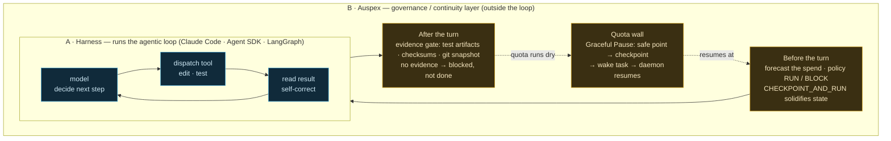

# Auspex

> 🌐 English | [繁體中文](README.zh-TW.md)

Auspex is a governance and continuity layer for AI coding agents. It runs
outside the model loop, around a provider's native harness (Claude Code,
Codex CLI): a pre-turn policy gate, quota and runway monitoring, durable
checkpoints, safe-point pause, and verified resume. It is not a
foundation model, a model–tool reasoning loop, or a general agent
runtime.

Everything runs locally: one static Go binary, one SQLite database under
the OS user-data directory, no cloud services. Raw prompt text and tool
output are never persisted by default — only extracted features and
counts. File paths are never stored in any form, hashes included
(ADR-051/052).

## Not a harness — a layer around one

"Agent harness" and "loop engineering" usually name the code that *runs*
the agentic loop: dispatch a tool, read the result, decide the next step,
repeat until done — plus the context work that keeps that loop alive
(compaction, sub-agents, stop conditions). Claude Code, the Claude Agent
SDK, and frameworks like LangGraph are this. They own the loop.

Auspex is the other layer, and the distinction is deliberate. It does not
dispatch tools or decide the agent's next step, and it is not bound to one
loop implementation. It runs outside whatever harness you already have and
governs it: forecast the spend before a turn, gate the risky ones,
checkpoint state, require evidence before a unit counts as done, and turn
a quota wall into a pause instead of a dead session.

The shape — Auspex (B) wraps the run-loop (A) and touches it only at the
boundary:



The same task, walked through — *add a rate limiter to `/login`*. A owns
the inner loop; Auspex acts only at the edges, and never decides A's next
step:

| When | A · harness runs the loop (owns it) | B · Auspex governs from outside |
| --- | --- | --- |
| **Before the turn** | — (the loop hasn't started) | forecast: ~4.8k tokens, quota is fine → policy **RUN**; `CHECKPOINT_AND_RUN` solidifies the repo so a bad turn can roll back |
| **Loop, rounds 1–4** | read the `login` handler → insert rate-limit middleware → run tests 🔴 → fix → rerun 🟢 — the inner micro-loop, A converges on its own | does not enter the loop; only watches the token / quota burn from outside |
| **After the turn** | claims "rate limiter done" | **evidence gate**: demands test artifacts + a git snapshot; no evidence → **blocked, not marked done**, so a post-compaction regression can't ship silently |
| **2 a.m., quota runs dry** | if it kept going the loop dies mid-task and burns the night | **Graceful Pause**: safe point → checkpoint → wake task in SQLite; when quota returns the daemon revalidates and **resumes** instead of restarting |

> *Status: Graceful Pause's durable persistence, daemon loop, and revalidated resume are wired and tested; the hands-free quota trigger that fires the pause is a current vertical slice, not yet driven end-to-end (details in the Scope and capability sections below).*

Side by side:

| | A · harness / loop engineering | B · Auspex |
| --- | --- | --- |
| **What it does** | runs the agentic loop — dispatch tool → read result → decide next step → repeat until done — plus the context work that keeps it alive (compaction, sub-agents, stop conditions) | governs a loop from outside: forecast → policy gate → checkpoint → evidence gate → turn a quota wall into a pause |
| **Examples** | Claude Code, Claude Agent SDK, LangGraph | Auspex — one Go binary, local, SQLite, no cloud |
| **Relationship to the loop** | **owns** it — it *is* the loop | **does not own** it — wraps it; provider-agnostic (Claude Code or Codex CLI) |
| **In one line** | makes a loop *run* | makes a loop it does not own *accountable* |

The vocabulary overlaps — harness, loop, checkpoint, verify — but the axis
is different. Loop engineering makes a loop *run*; Auspex makes a loop it
does not own *accountable*. That is why it is provider-agnostic: point it
at Claude Code or Codex CLI and it governs either without replacing
either.

## Scope: what native compaction handles, and what Auspex adds

Agents already manage their own context, and the mechanisms are good.
Claude Code runs layered compaction: bulky tool outputs offload to disk
early, the conversation auto-summarizes near the context limit, recent
files and todos rehydrate afterward. Codex CLI compacts server-side
through a dedicated endpoint and re-reads recently edited files each
pass. Both vendors expose compaction in their APIs. Recycling a context
window is solved and commoditizing.

Auspex does not compete with that. It covers three things compaction
does not.

**1. Quota is not context.** Compaction keeps a session alive past the
context ceiling. It does nothing when the usage window runs dry at 2 a.m.
The failure mode: the session dies, and every hour until you notice is
wasted. Graceful Pause targets exactly this: checkpoint at a safe point,
persist a wake task to SQLite, and let the daemon revalidate and resume,
surviving crashes and reboots. The durable checkpoint/wake-job path, the
unattended daemon loop, and the four-way revalidated resume are
implemented and tested; the automatic quota-runway trigger and the
provider turn-interrupt that fire the pause hands-free are the current
vertical slice — built and unit-tested, not yet wired end-to-end in the
shipped binary.

**2. Compaction is lossy, and nothing audits the result.** Every
summarization pass drops detail the earlier turns accumulated. That is
inherent to compression, not a bug. The native mechanisms trust their own
summaries; no independent check verifies the agent stayed on course
afterward. Auspex does not try to make the summary perfect. State
Checkpointing requires verifiable evidence — test artifacts, checksums,
Git snapshots — before a work unit can be marked complete. An agent that
drifts after a compaction fails the evidence gate instead of shipping a
regression silently. The gate lives outside the context window, so it
does not forget.

**3. Sessions end; work should not.** Native context management dies with
the process. Auspex persists progress trees, wake tasks, and decisions in
SQLite. An interrupted run — quota exhaustion, crash, reboot — resumes
where it stopped instead of restarting.

Auspex does not do compaction. It supervises it. The agent turns the
page; Auspex solidifies state before the turn (`CHECKPOINT_AND_RUN`),
checks that output after the turn still clears the evidence gate, and
converts quota interruptions into pauses instead of dead sessions. The
better native compaction gets, the longer the tasks people run
unattended — and the more a supervision layer matters.

## What it measures, and what it only estimates

Auspex measures what an agent spends: every token class, every dollar,
every quota window, per turn and per day. It tracks burn rate toward the
quota wall and gates the risky moments — checkpoint before a large
change, pause before the wall, block what policy forbids, resume with
evidence intact.

It also forecasts, but only where forecasting works. We built the
prediction stack first, then measured it against real usage. What one
turn will cost is close to unknowable in advance. How fast a *session*
burns toward its quota wall is knowable, because aggregation averages out
the per-turn noise. So Auspex leads with what it can measure and
extrapolate, and prints per-turn estimates only as wide, labeled
reference bands. The numbers behind this split are in
[What Auspex measures vs. what it predicts](#what-auspex-measures-vs-what-it-predicts).

(The name: Latin *auspex*, the official who read omens before an
undertaking.)

## What it does, in one session

Once wired into Claude Code or Codex CLI (see [Quick start](#quick-start)),
the daily surfaces lead with measured output from this repository's own
development sessions. Auspex dogfoods itself daily.

**Status line** (Claude Code statusline, or `auspex hook codex status`
for tmux) — worst quota window, runway to the wall, today's spend and
pace:

```text
ax» Opus 4.1 │ ◷ 5h ~62% (resets 18:00) │ ⏳ runway ~38m │ today $62.19 · pace → ~$312 by 24:00 │ context [████··] 21.9% │ ✓ RUN
```

**Weekly report** — `auspex report --window 7d`: exact totals by token
class, spend by model × effort, cache hygiene, quota incidents, and the
five costliest turns. This is the Friday self-review tool: were those
five turns worth their price, is routine work running on the expensive
model, which sessions thrash the cache.

```text
turns 228 · sessions 22 · cost $1,189.66 (205/228 attributed; the rest say unknown, not $0)
tokens: fresh 158k / cache read 167.5M / cache creation 4.1M / output 746k
claude opus/xhigh 141 turns $648.53 · fable/xhigh 71 turns $528.42
cache read/fresh ratio 1057.9× · 2 sessions flagged for creation churn
top turn: $43.94
```

**Pre-turn gate** — every prompt is evaluated before it runs. The
estimate prints as what it is: a wide, uncalibrated reference band
feeding a policy decision, not a promise.

```text
Auspex forecast (uncalibrated estimate — scores are not probabilities):
  scope: ~1–4 files changed, ~30–180 lines (P50–P90)
  tokens: P50 3782 / P90 7564 · cost: ~$0.04–$0.38 (reference band)
  risk: 0.50/1.00 — QUOTA_UNKNOWN, PREDICTION_COLD_START
  policy: WARN
```

The evaluation feeds a policy engine with eight frozen actions (`RUN`,
`WARN`, `REQUIRE_CONFIRMATION`, `CHECKPOINT_AND_RUN`, `SPLIT`, `PAUSE`,
`PAUSE_AND_AUTO_RESUME`, `BLOCK`). The decision returns to the agent
through the hook response: an allowed prompt passes through, a blocked one
carries a machine-readable reason the agent can act on. Alongside the
per-prompt gate, Auspex maintains:

- **Progress Tree** — the canonical, durable task state. A node cannot be
  marked complete without validator-checked evidence (a file, DB record,
  checksum, or Git snapshot). "The agent said it's done" never counts.
- **State + repository checkpoints** — every node completion writes a
  state checkpoint atomically. Repository checkpoints capture the worktree
  with secret redaction, and never commit your branch.
- **Graceful Pause** — checkpoint at a safe point, persist a durable wake
  job to SQLite, and let the daemon (`auspex daemon`) execute due wake jobs
  unattended, re-verifying repository, quota, session, and authorization
  before resuming. *Status: the durable persistence, the unattended daemon
  loop, and the four-way resume revalidation are implemented and tested;
  the automatic quota-runway trigger and the provider turn-interrupt that
  fire the pause hands-free are the current vertical slice — not yet wired
  end-to-end in the shipped binary.*

## What Auspex measures vs. what it predicts

The split comes from our own field data, and it matches external research
(Bai et al., [arXiv:2604.22750](https://arxiv.org/abs/2604.22750): token
use varies up to 30× across identical runs; models predict their own cost
with correlation ≤ 0.39):

| Surface | Nature | Trustworthiness |
|---|---|---|
| Per-turn tokens (4 classes), cost, duration | **Measured** at Stop (transcript / rollout) | Exact — cite it freely |
| Quota windows (5h / weekly), context % | **Measured** per turn | Exact |
| Today's spend and pace | **Aggregated** from measurements | Arithmetic, not modeling |
| File-op aggregates (repeat rate — "is it spinning?") | **Observed** per turn | Fact about the turn, not a guess |
| Session runway to the quota wall | **Extrapolated** burn rate | The tractable prediction — aggregation averages out per-turn noise; calibration (M13) targets this first |
| Per-turn scope/token/cost estimate | **Predicted** | A wide reference band, labeled uncalibrated — our first field dataset showed cold-start cost off ~7–9× at the median ([#90](https://github.com/huaiche94/auspex/issues/90)); treat it as context, never as a number to plan around |

The ordering is a product decision, not an accident
([#90](https://github.com/huaiche94/auspex/issues/90)). Measured and
aggregated surfaces lead — exact usage, spend pacing, quota runway, spin
observation. The per-turn point estimate sits last, labeled uncalibrated.

## Quick start

Requires Go 1.26.5 (pinned in `go.mod`); no CGO, no external services.

```bash
go build -o auspex ./cmd/auspex
./auspex version
./auspex doctor      # creates + migrates the SQLite DB, then verifies it
```

Run `doctor` immediately after building. The first run creates the
database under the OS user-data directory (macOS:
`~/Library/Application Support/auspex/`, Linux: `$XDG_DATA_HOME/auspex/`)
and reports each check (`database`, `config`, capture health, …) with a
per-check status. That includes **token-capture coverage**, so a silently
broken capture fails loudly instead of starving the dataset.

To wire it into Claude Code, follow
[`integrations/claude/`](integrations/claude/README.md). It ships the
`hooks.json`/`plugin.json` examples that route Claude Code's
UserPromptSubmit / Stop / StopFailure / PostToolUse / statusline events
through `auspex hook claude <event>`, plus `auspex init` to register the
current repository. Codex CLI wires the same way:
[`integrations/codex/hooks.json`](integrations/codex/hooks.json) routes
its SessionStart / UserPromptSubmit / Stop events through
`auspex hook codex <event>` (hook argv is kebab-case, ADR-050). In both
cases the Stop-side capture records exact per-turn token usage — all four
token classes, Claude from the session transcript (ADR-051), Codex from
the session rollout JSONL — numbers only, never prompt or output text.
The hooks fail open: an Auspex crash never blocks your session. Run
`auspex evaluate` directly to surface real errors.

### The command tree

```text
auspex report                 your usage, mirrored back: spend, tokens by class,
                              model×effort split, cache hygiene, quota incidents,
                              costliest turns (--window 7d, --json)
auspex evaluate               estimate a prompt before running it (--json)
auspex decision allow|deny    consume a one-time authorization (replays rejected)
auspex checkpoint create      state + repository checkpoint (never commits your branch)
auspex progress ...           inspect the Progress Tree; evidence-gated completion
auspex pause request|cancel   safe-point pause with a durable wake job
auspex resume                 re-verified resume
auspex scheduler run-once     execute due wake jobs without the daemon
auspex daemon ...             background daemon + authenticated loopback HTTP API
auspex run ...                one-shot prompt under the managed gate (claude|codex)
auspex init                   register the current repository/session
auspex status | doctor        session/checkpoint/pause state; capture health
auspex gc                     tiered telemetry retention (90-day default, ADR-046)
auspex export                 de-identified datasets for offline analysis
auspex hook claude <event>    the hook entrypoints Claude Code calls
auspex hook codex <event>     the Codex CLI hook entrypoints (same gate)
auspex hook codex status      stdin-less status line for tmux/scripts (--cwd DIR)
```

Every command speaks schema-versioned JSON on stdout (`--json`, FR-160)
and fails with one typed error shape, so both humans and agents can
consume it:

```json
{"schema_version":"auspex.error.v1","code":"validation",
 "message":"pause request: --reason must be one of \"calibrated_hit_probability\", \"emergency_uncalibrated\"",
 "retryable":false,"details":{"reason":"quota_hit"}}
```

A VS Code companion extension ([`vscode/`](vscode/README.md)) renders the
daemon's per-session status view — risk, runway, quota freshness,
progress, checkpoints, and pause state, where unknown renders as
"unknown", never as a fabricated zero — plus the wake-job queue with an
inline cancel button for scheduled resumes. It runs from source or a
locally packaged VSIX until the marketplace publisher is registered
([#18](https://github.com/huaiche94/auspex/issues/18)).

## Project status

The full vertical slice — 85/85 DAG nodes across seven roles, Bootstrap
through the Stage-5 integration gate — is integrated on `main`. On top of
it sits the post-slice backlog: the daemon with its authenticated
loopback API ([#7](https://github.com/huaiche94/auspex/issues/7)),
native-hook session bootstrap
([#17](https://github.com/huaiche94/auspex/issues/17)), the per-prompt
forecast surface ([#14](https://github.com/huaiche94/auspex/issues/14)),
tiered telemetry retention (ADR-046), real repository-checkpoint restore
([#6](https://github.com/huaiche94/auspex/issues/6)), and the VS Code
companion ([#10](https://github.com/huaiche94/auspex/issues/10)), now fed
by a daemon session-status API (`GET /v1/session/status`,
`auspex.daemon.session_status.v1`).

Codex CLI is a first-class second provider
([#9](https://github.com/huaiche94/auspex/issues/9)). Both native hooks
(`auspex hook codex <event>`) and the managed one-shot (`auspex run
--provider codex`, over `codex exec --json`) ship. What remains in #9 is
the M7 Phase-2 tail: app-server subscription, graceful interrupt, `codex
exec resume`. Native-hook sessions capture exact per-turn token usage for
both providers. Live runway forecasts computed from that quota telemetry
feed the policy's runway reason codes and the statusline (`⏳ runway ~Ns`,
today's spend and pace). Per-turn file-operation aggregates (ADR-052,
[#67](https://github.com/huaiche94/auspex/issues/67)) accumulate toward
the spin-detection gate. This repository's own sessions feed telemetry
into a local Auspex daily.

**The caveat, now a product decision.** Every per-turn forecast is still
produced by cold-start rules, not calibrated models. Scores are not
probabilities, and every surface says so (Constitution §7 rule 7). Our
first field dataset quantified the gap: the cold-start cost forecast
under-forecasts real cost roughly 7–9× at the median, driven by
cache-read-blind pricing
([#66](https://github.com/huaiche94/auspex/issues/66)). External research
(Bai et al., above) indicates the ceiling is structural, not a temporary
shortfall — identical runs vary up to 30× in token use. We reordered the
product around it
([#90](https://github.com/huaiche94/auspex/issues/90)): measured and
aggregated surfaces lead everywhere; per-turn point estimates are demoted
to labeled reference bands; and the calibration milestone (M13,
[#11](https://github.com/huaiche94/auspex/issues/11)) targets the
prediction that *is* tractable — session-level runway hit-probability —
before it revisits per-turn tokens. The value is in the decisions Auspex
gates and the reality it mirrors — checkpoint, pause, resume, block, and
an exact account of what you spent — not in the precision of a per-turn
guess.

Open roadmap milestones: the Codex M7 Phase-2 tail — app-server
subscription, graceful interrupt, `codex exec resume`
([#9](https://github.com/huaiche94/auspex/issues/9)); the managed shell
mode (M11, [#8](https://github.com/huaiche94/auspex/issues/8)); the
calibration fit-and-feed-back pipeline, runway-first (M13,
[#11](https://github.com/huaiche94/auspex/issues/11)); pre-release
namespace claims ([#18](https://github.com/huaiche94/auspex/issues/18));
the spin-detection gate on the now-accumulating file-op aggregates
([#68](https://github.com/huaiche94/auspex/issues/68), data-gated);
research-derived forecast upgrades
([#65](https://github.com/huaiche94/auspex/issues/65), the forecast half
of [#66](https://github.com/huaiche94/auspex/issues/66),
[#42](https://github.com/huaiche94/auspex/issues/42),
[#20](https://github.com/huaiche94/auspex/issues/20) — data-gated); the
rollout-tailing watcher that captures IDE-plugin and subagent threads
([#92](https://github.com/huaiche94/auspex/issues/92)); and the team
usage rollup ([#91](https://github.com/huaiche94/auspex/issues/91)). The
[issue tracker](https://github.com/huaiche94/auspex/issues) is the live
backlog. Work is milestone-gated: nothing is implemented ahead of its
milestone (`docs/design/Auspex_ADD.md` §31).

Research-grounded additions distilled from Bai et al. (above) — a
cache-aware four-class cost model (its capture half has landed; the
forecast half is open in #66), a repeated-file-operation risk signal that
catches a spinning turn by *observation* instead of prediction (its
capture half landed via ADR-052/#67), and phase-aware conditional
forecasting — are captured as roadmap notes (external priors, never
fitted numbers) in
[`docs/backlog/token-cost-prediction-research.md`](docs/backlog/token-cost-prediction-research.md).

## Validate a change

The local pre-commit bar, and exactly what CI
([`.github/workflows/ci.yml`](.github/workflows/ci.yml)) runs on
ubuntu-latest, macos-latest, and windows-latest — all three
hard-blocking:

```bash
gofmt -l . && go build ./... && go vet ./...
go test ./... -race
golangci-lint run ./...
```

## Repository layout

```text
cmd/auspex/           CLI entrypoint (thin main; wiring in internal/app)
internal/             application core, domain model, adapters (Go)
pkg/protocol/v1/      public wire protocol types
integrations/claude/  Claude Code hook wiring (hooks.json / plugin.json)
integrations/codex/   Codex CLI hook wiring (hooks.json)
vscode/               VS Code companion extension (TypeScript)
schemas/              JSON Schemas for the frozen wire shapes
research/             offline Python analysis — never a runtime dependency
agents/               role definitions from the multi-agent build
docs/                 design docs, ADRs, decision log, build history
testdata/             cross-package fixtures (checkpoints, provider events)
```

Every folder has its own `README.md`, and every documentation file has a
Traditional Chinese sibling (`<name>.zh-TW.md`, ADR-049). The authoring
language is normative: English for everything except
`docs/design/Auspex_ADD.md` and `docs/DECISION_LOG.md`, which are
authored in Traditional Chinese.

## Where to read next

| You want to… | Read |
|---|---|
| Understand the architecture | [`docs/design/Auspex_ADD.md`](docs/design/Auspex_ADD.md) — the single authoritative architecture/requirements spec, authored in Traditional Chinese (normative as written); amended only by ADRs under [`docs/adr/`](docs/adr/) |
| Contribute (human or agent) | [`CONSTITUTION.md`](CONSTITUTION.md) (process authority) → [`CONTRIBUTING.md`](CONTRIBUTING.md) → [`AGENTS.md`](AGENTS.md) |
| See how the predictor works | [`docs/design/Auspex_Predictor_Design_Supplement.md`](docs/design/Auspex_Predictor_Design_Supplement.md) + [`internal/predictor/`](internal/predictor/README.md) |
| Trace how this repo was built | [`docs/implementation/vertical-slice/`](docs/implementation/vertical-slice/README.md) — the execution DAG, wave-by-wave integration history, per-role progress logs |
| Reuse the multi-agent process | [`docs/methodology/`](docs/methodology/README.md) |
| Browse all documentation | [`docs/README.md`](docs/README.md) |

`CONSTITUTION.md` governs process; `docs/design/Auspex_ADD.md` governs
architecture. When any other document disagrees with them, those two win
(Constitution §1–§2).

## Tech stack & license

Go 1.26.5 single static binary with SQLite (WAL) · TypeScript only in the
VS Code extension · Python 3.12+ for offline research only · Apache-2.0
(see [`LICENSE`](LICENSE), [`NOTICE`](NOTICE)).
