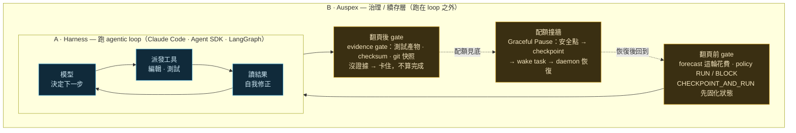

# Auspex

> 🌐 [English](README.md) | 繁體中文
>
> 本文件為非規範翻譯，內容以英文版為準（ADR-049）。

Auspex 是 AI 編碼代理（AI coding agents）的治理與續存層。它跑在 model loop 之外、環繞在 provider 原生 harness（Claude Code、Codex CLI）周圍：把關每一輪的政策閘門（pre-turn policy gate）、配額與跑道監控（quota / runway monitoring）、持久檢查點（durable checkpoints）、安全點暫停（safe-point pause）、經驗證的恢復（verified resume）。它不是 foundation model、不是 model–tool reasoning loop、也不是通用 agent runtime。

一切都在本機執行：一個靜態 Go 二進位檔、一個位於作業系統使用者資料目錄下的 SQLite 資料庫，沒有任何雲端服務。原始 prompt 文字與工具輸出預設永不持久化——只保存萃取出的特徵（extracted features）與計數（counts）。檔案路徑無論任何形式、包括雜湊（hash）在內，都不保存（ADR-051／052）。

## 不是 harness，而是環繞 harness 的一層

「Agent harness」與「loop engineering」通常指的是*驅動* agentic loop 的那段程式：派發一個工具、讀取結果、決定下一步、重複直到完成——外加維持這個 loop 運轉的 context 工作（壓縮、子 agent、停止條件）。Claude Code、Claude Agent SDK，以及 LangGraph 這類框架，做的就是這件事。它們擁有那條 loop。

Auspex 是另一層，而且這個區分是刻意的。它不派發工具、不決定 agent 的下一步，也不綁定任何單一 loop 實作。它跑在你既有的 harness 之外並治理它：在一輪開始前預測花費、對高風險的回合把關、把狀態存成檢查點、在一個工作單元被算作完成前要求證據、並把配額撞牆變成暫停而非死掉的 session。

形狀——Auspex（B）環繞著 run-loop（A），只在邊界上碰它：



同一個任務走一遍——*為 `/login` 加上 rate limiter*。A 擁有內層迴圈；Auspex
只在邊界出手，且從不決定 A 的下一步：

| 時刻 | A · Harness 跑 loop（擁有 loop） | B · Auspex（loop 之外治理） |
| --- | --- | --- |
| **翻頁前** | —（迴圈還沒開始） | forecast：這輪約 **4.8k tokens**、配額還夠 → policy 判 **RUN**；`CHECKPOINT_AND_RUN` 先把 repo 狀態固化，翻壞了能退 |
| **迴圈第 1–4 圈** | 讀 `login` handler → 插入 rate-limit middleware → 跑測試 🔴 → 修 → 再跑 🟢——這圈就是內層 micro-loop，A 自己收斂 | 不介入迴圈內部；只在旁監看 token / 配額的燃燒速率 |
| **翻頁後** | 宣稱「rate limiter 做好了」 | **evidence gate**：要測試產物 + git 快照才算數；拿不出證據 → **擋住，不標記完成**，壓縮後偷送的 regression 出不去 |
| **凌晨 2:00 配額見底** | 若硬跑，迴圈會死在半途、白燒一整夜 | **Graceful Pause**：安全點 → checkpoint → 寫 wake task 進 SQLite；配額回來後 daemon 重驗狀態並**自動恢復**，不是從頭來 |

並排看：

| | A · Harness ／ loop engineering | B · Auspex |
| --- | --- | --- |
| **做什麼** | 跑 agentic loop——派發工具 → 讀結果 → 決定下一步 → 重複到完成——＋維持 loop 的 context 工作（壓縮、子 agent、停止條件） | 跑在 loop 之外治理它：forecast → policy gate → checkpoint → evidence gate → 配額撞牆轉暫停 |
| **代表** | Claude Code、Claude Agent SDK、LangGraph | Auspex —— Go 單一 binary、本機、SQLite，無雲端 |
| **跟 loop 的關係** | **擁有**那條 loop —— 它自己就是 loop | **不擁有**、環繞它；provider-agnostic（Claude Code / Codex CLI 都能罩） |
| **一句話** | 讓一條 loop **跑起來** | 讓一條它**不擁有**的 loop **可問責** |

詞彙是重疊的——harness、loop、checkpoint、verify——但軸線不同。Loop engineering 讓一條 loop *跑起來*；Auspex 讓一條它並不擁有的 loop *可問責（accountable）*。這也是它與 provider 無關（provider-agnostic）的原因：把它指向 Claude Code 或 Codex CLI，它都能治理，而不取代其中任何一個。

## 範圍：原生壓縮已經處理什麼，Auspex 補上什麼

agent 已經會自己管理 context，而且機制做得不錯。Claude Code 有分層壓縮（layered compaction）：龐大的工具輸出提早卸載（offload）到磁碟、對話在接近 context 上限時自動摘要（auto-summarize）、事後再把最近的檔案與 todo 補水（rehydrate）回來。Codex CLI 透過專用端點（endpoint）在伺服器端壓縮，每一輪之後重新讀取最近編輯過的檔案。兩家 vendor 現在都已在各自 API 中開放壓縮能力。「回收一整個 context 視窗」已經是被解決、且正在商品化（commoditizing）的問題。

Auspex 不與上述任何一項競爭。它涵蓋原生壓縮做不到的三件事。

**1. 配額不等於 context。** 壓縮能讓 session 撐過 context 上限。但當用量視窗（usage window）在凌晨兩點見底時，它什麼也做不了。失效模式是：session 死掉，而在你察覺之前的每一個小時都被浪費掉。Graceful Pause（優雅暫停）盯著配額剩餘跑道（quota runway），在撞牆之前找到安全點停下、建立檢查點，並把一個喚醒工作（wake task）寫進 SQLite。daemon 重新驗證配額與 repo 狀態，然後恢復執行——過程中還能挺過 crash 與重開機。

**2. 壓縮是有損的，而且沒有人稽核結果。** 每一次摘要都會丟掉先前回合累積的細節。這是壓縮的本質，不是 bug。原生機制信任它自己產生的摘要；沒有任何獨立檢查去驗證 agent 在壓縮之後是否仍走在正軌上。Auspex 不試圖把摘要做到完美。State Checkpointing（狀態存證）要求在任何工作單元被標記完成之前，先提出可驗證的證據——測試產物、checksum、Git 快照。一個在壓縮後偏離（drift）的 agent 會卡在證據閘門（evidence gate）前，而不是默默把 regression 送出去。這道閘門位於 context 視窗之外，所以它不會遺忘。

**3. session 會結束，工作不該結束。** 原生 context 管理與行程（process）同生共死。Auspex 把進度樹（progress tree）、喚醒工作與決策持久化在 SQLite 中。一個被中斷的執行——配額耗盡、crash、重開機——會從中斷處接續，而不是從頭來過。

Auspex 不做壓縮，它監督壓縮。agent 負責翻頁（page-turn）；Auspex 在翻頁之前把狀態固化（`CHECKPOINT_AND_RUN`）、檢查翻頁之後的輸出仍通得過證據閘門、把配額中斷變成暫停而非死掉的 session。原生壓縮做得愈好，人們愈敢放手讓它無人值守（unattended）跑更長的任務——一層監督（supervision）機制也就愈重要。

## 它量測什麼，又只是估計什麼

Auspex 精確量測 agent 花掉的一切：每一類 token、每一塊錢、每一個配額視窗，逐回合、也逐日。它追蹤朝配額牆逼近的燃燒速率（burn rate），並在高風險時刻把關——大變更之前先建立檢查點、撞牆之前先暫停、阻擋政策所禁止的事、帶著完好的證據恢復執行。

它也做預測，但只在預測行得通的地方。我們先把預測堆疊（prediction stack）建起來，再拿真實用量去量測它。單一回合會花多少，事前幾乎不可知。一個 *session* 朝配額牆燒得多快，卻是可知的，因為彙總（aggregation）會把逐回合的雜訊平均掉。所以 Auspex 以它能量測、能外推（extrapolate）的東西打頭陣，逐回合估計只以寬幅、有標示的參考區間（reference band）印出。這個切分背後的數字見 [Auspex 量測什麼 vs. 預測什麼](#what-auspex-measures-vs-what-it-predicts)。

（名稱由來：拉丁文 *auspex*，在一件事展開之前解讀徵兆的占卜官。）

## 一次 session 就能看到的效果

一旦接上 Claude Code 或 Codex CLI（見[快速開始](#quick-start)），你每天盯著看的呈現介面都以本 repository 自身開發 session 的實際量測輸出打頭陣。Auspex 每天都在對自己做 dogfooding。

**狀態列（status line）**（Claude Code statusline，或供 tmux 使用的 `auspex hook codex status`）——最吃緊的配額視窗、距牆的剩餘跑道（runway）、今日花費與步調（pace）：

```text
ax» Opus 4.1 │ ◷ 5h ~62% (resets 18:00) │ ⏳ runway ~38m │ today $62.19 · pace → ~$312 by 24:00 │ context [████··] 21.9% │ ✓ RUN
```

**每週報告（weekly report）**——`auspex report --window 7d`：各類 token 的精確總量、按模型 × effort 拆分的花費、cache 衛生（cache hygiene）、配額事故（quota incidents），以及最貴的五個回合。這是週五自我檢視（self-review）的工具：那五個回合值得它們的價錢嗎？例行工作是不是跑在昂貴的模型上？哪些 session 在折騰（thrash）cache？

```text
turns 228 · sessions 22 · cost $1,189.66 (205/228 attributed; the rest say unknown, not $0)
tokens: fresh 158k / cache read 167.5M / cache creation 4.1M / output 746k
claude opus/xhigh 141 turns $648.53 · fable/xhigh 71 turns $528.42
cache read/fresh ratio 1057.9× · 2 sessions flagged for creation churn
top turn: $43.94
```

**回合前閘門（pre-turn gate）**——每一個 prompt 在執行前都會先被評估。估計值以它的本來面目印出：一條餵給政策決策的寬幅、未校準參考區間，不是承諾。

```text
Auspex forecast (uncalibrated estimate — scores are not probabilities):
  scope: ~1–4 files changed, ~30–180 lines (P50–P90)
  tokens: P50 3782 / P90 7564 · cost: ~$0.04–$0.38 (reference band)
  risk: 0.50/1.00 — QUOTA_UNKNOWN, PREDICTION_COLD_START
  policy: WARN
```

評估結果餵給一個政策引擎（policy engine），引擎具備**八種凍結（frozen）動作**（`RUN`、`WARN`、`REQUIRE_CONFIRMATION`、`CHECKPOINT_AND_RUN`、`SPLIT`、`PAUSE`、`PAUSE_AND_AUTO_RESUME`、`BLOCK`）。決策透過 hook 回應（response）回傳給 agent：被允許的 prompt 照常通過，被阻擋的 prompt 附帶一個機器可讀（machine-readable）的原因，agent 可據以行動。除了逐一 prompt 的把關，Auspex 還維護：

- **Progress Tree（進度樹）**——具規範性、持久性的任務狀態（canonical, durable task state）。一個節點在沒有驗證器（validator）檢核過的證據（檔案、資料庫紀錄、checksum，或 Git 快照）之前不得標記完成；「agent 自己說完成了」永遠不算數。
- **State（狀態）＋ repository（儲存庫）checkpoint**——每次節點完成都原子性（atomically）寫入一個 State Checkpoint；repository checkpoint 擷取 worktree 內容（並做機密資訊遮蔽／redaction），但絕不提交（commit）你的分支。
- **Graceful Pause（優雅暫停）**——配額視窗即將用盡時，Auspex 建立檢查點、在安全點（safe point）中斷，並在 SQLite 中持久化一個到期喚醒工作（wake job）。daemon（`auspex daemon`）在無人值守（unattended）下執行到期的 wake job；恢復（resume）前重新驗證 repository、配額、session 與授權（authorization）。

<a id="what-auspex-measures-vs-what-it-predicts"></a>
## Auspex 量測什麼 vs. 預測什麼

這份切分來自我們自己的實地資料，也與外部研究一致（Bai 等，
[arXiv:2604.22750](https://arxiv.org/abs/2604.22750)：同一任務的不同執行 token 用量可差到 30×；模型對自身成本的預測相關性 ≤ 0.39）：

| 呈現介面 | 性質 | 可信度 |
|---|---|---|
| 逐回合 token（四類）、成本、時長 | 於 Stop 時**量測**（transcript／rollout） | 精確——可放心引用 |
| 配額視窗（5h／每週）、context % | 逐回合**量測** | 精確 |
| 今日花費與步調（pace） | 由量測值**彙總**（aggregated）而來 | 是算術，不是建模 |
| 檔案操作彙總（重複率——「是否在原地打轉？」） | 逐回合**觀測** | 是關於該回合的事實，不是猜測 |
| session 距配額牆的剩餘跑道（runway） | 由燃燒速率**外推** | 唯一可駕馭（tractable）的預測——彙總會把逐回合的雜訊平均掉；校準（M13）首先瞄準這裡 |
| 逐回合 scope／token／成本估計 | **預測** | 一條寬幅參考區間，且標示為未校準——第一批實地資料顯示 cold-start 成本在中位數偏差約 7–9×（[#90](https://github.com/huaiche94/auspex/issues/90)）；把它當脈絡看待，永遠不要當作可據以規劃的數字 |

這樣的排序是一個產品決策，不是偶然
（[#90](https://github.com/huaiche94/auspex/issues/90)）。量測與彙總的呈現介面居於首位——精確用量、花費步調、配額剩餘跑道、原地打轉觀測。逐回合的點估計放在最後，標示為未校準。

<a id="quick-start"></a>
## 快速開始（Quick start）

需要 Go 1.26.5（版本已固定於 `go.mod`）；不需要 CGO，也不需要任何外部服務。

```bash
go build -o auspex ./cmd/auspex
./auspex version
./auspex doctor      # creates + migrates the SQLite DB, then verifies it
```

建置完成後立即執行 `doctor`。第一次執行會在作業系統使用者資料目錄下建立資料庫（macOS：`~/Library/Application Support/auspex/`；Linux：`$XDG_DATA_HOME/auspex/`），並針對每一項檢查（`database`、`config`、擷取健康狀態……）回報個別狀態。其中包括 **token 擷取覆蓋率（token-capture coverage）**，讓悄悄壞掉的擷取大聲失敗，而不是讓資料默默斷炊。

若要接上 Claude Code，依照
[`integrations/claude/`](integrations/claude/README.md) 操作。裡面提供
`hooks.json`／`plugin.json` 範例，會將 Claude Code 的
UserPromptSubmit / Stop / StopFailure / PostToolUse / statusline 事件導向
`auspex hook claude <event>`，另有 `auspex init` 註冊目前的 repository。Codex CLI 以同樣方式接上：
[`integrations/codex/hooks.json`](integrations/codex/hooks.json) 將它的
SessionStart / UserPromptSubmit / Stop 事件導向
`auspex hook codex <event>`（hook 的 argv 採 kebab-case，ADR-050）。兩者的
Stop 端擷取都記錄精確的逐回合（per-turn）token 用量——完整四類 token，Claude 來自 session transcript（ADR-051）、Codex 來自 session rollout JSONL——僅數字，絕不保存 prompt 或輸出文字。這些 hook **fail open（失效開放）**：Auspex 發生 crash 絕不阻擋你的 session。直接執行 `auspex evaluate` 即可看到真正的錯誤訊息。

### 指令樹（The command tree）

```text
auspex report                 your usage, mirrored back: spend, tokens by class,
                              model×effort split, cache hygiene, quota incidents,
                              costliest turns (--window 7d, --json)
auspex evaluate               estimate a prompt before running it (--json)
auspex decision allow|deny    consume a one-time authorization (replays rejected)
auspex checkpoint create      state + repository checkpoint (never commits your branch)
auspex progress ...           inspect the Progress Tree; evidence-gated completion
auspex pause request|cancel   safe-point pause with a durable wake job
auspex resume                 re-verified resume
auspex scheduler run-once     execute due wake jobs without the daemon
auspex daemon ...             background daemon + authenticated loopback HTTP API
auspex run ...                one-shot prompt under the managed gate (claude|codex)
auspex init                   register the current repository/session
auspex status | doctor        session/checkpoint/pause state; capture health
auspex gc                     tiered telemetry retention (90-day default, ADR-046)
auspex export                 de-identified datasets for offline analysis
auspex hook claude <event>    the hook entrypoints Claude Code calls
auspex hook codex <event>     the Codex CLI hook entrypoints (same gate)
auspex hook codex status      stdin-less status line for tmux/scripts (--cwd DIR)
```

每一個指令都在 stdout 上輸出具 schema 版本（schema-versioned）的 JSON（`--json`，FR-160），並以單一種型別化（typed）的錯誤格式回報失敗，讓人類與 agent 都能消化：

```json
{"schema_version":"auspex.error.v1","code":"validation",
 "message":"pause request: --reason must be one of \"calibrated_hit_probability\", \"emergency_uncalibrated\"",
 "retryable":false,"details":{"reason":"quota_hit"}}
```

VS Code 隨附延伸模組（companion extension，[`vscode/`](vscode/README.md)）呈現
daemon 的逐 session 狀態視圖——風險（risk）、剩餘跑道（runway）、配額新鮮度（quota freshness）、進度、checkpoint 與暫停狀態；未知（unknown）就呈現為「未知」，絕不以捏造的零代替——外加 wake-job 佇列與排程恢復（scheduled resume）的內嵌取消按鈕。在 marketplace 發布者（publisher）完成註冊之前
（[#18](https://github.com/huaiche94/auspex/issues/18)），這個延伸模組僅能從原始碼或本機打包的 VSIX 使用。

## 專案現況

完整的 vertical slice（垂直切片）——涵蓋七個角色（role）共 85/85 個 DAG 節點，從
Bootstrap 一路到 Stage-5 整合閘門（integration gate）——已整合進 `main`。之上是
slice 後續待辦清單（post-slice backlog）：具授權（authenticated）loopback API 的
daemon（[#7](https://github.com/huaiche94/auspex/issues/7)）、native-hook
session bootstrap（[#17](https://github.com/huaiche94/auspex/issues/17)）、逐一 prompt 的預測（forecast）呈現介面
（[#14](https://github.com/huaiche94/auspex/issues/14)）、分層遙測（telemetry）資料保留（ADR-046）、真正的 repository-checkpoint 還原
（[#6](https://github.com/huaiche94/auspex/issues/6)），以及 VS Code
companion 延伸模組（[#10](https://github.com/huaiche94/auspex/issues/10)）——後者現在由
daemon 的 session-status API（`GET /v1/session/status`，
`auspex.daemon.session_status.v1`）供應資料。

Codex CLI 已是第一級（first-class）的第二個 provider
（[#9](https://github.com/huaiche94/auspex/issues/9)）。native hook（`auspex hook codex <event>`）與受管 one-shot（`auspex run --provider codex`，經由 `codex exec --json`）皆已出貨。#9 剩下的是 M7 Phase 2 的尾巴：app-server 訂閱、graceful interrupt、`codex exec resume`。native-hook session 能為兩個 provider 擷取精確的逐回合（per-turn）token 用量。由這些配額遙測算出的即時剩餘跑道（runway）預測，會觸發 policy 的 runway reason code 並顯示於 statusline（`⏳ runway ~Ns`、今日花費與步調）。逐回合的檔案操作彙總（ADR-052，
[#67](https://github.com/huaiche94/auspex/issues/67)）持續累積，朝原地打轉（spin）偵測閘門邁進。本 repository 自身的 session 每天都把遙測資料餵給本機的一個 Auspex。

**但書，如今是一個產品決策。** 每一個逐回合預測目前仍由 cold-start（冷啟動）規則產生，而非經過校準（calibrated）的模型。分數不是機率，每一個呈現介面都這樣標示（Constitution §7 第 7 條）。第一批實地資料已量化差距：cold-start 成本預測在中位數低估實際成本約 7–9×，主因是對 cache-read 視而不見的計價
（[#66](https://github.com/huaiche94/auspex/issues/66)）。外部研究（前述 Bai 等）指出這個上限是結構性的，不是暫時缺口——同一任務的不同執行 token 用量可差到 30×。我們把產品繞著它重新排序
（[#90](https://github.com/huaiche94/auspex/issues/90)）：量測與彙總的呈現介面（精確用量、花費步調、配額剩餘跑道、原地打轉觀測）在每個地方都居首位；逐回合的點估計被降格為有標示的參考區間；校準里程碑（M13，
[#11](https://github.com/huaiche94/auspex/issues/11)）先瞄準那個*確實*可駕馭的預測——session 層級的剩餘跑道命中機率（hit-probability）——之後才回頭處理逐回合 token。Auspex 的價值在於它所把關的決策與它映照回來的現實——checkpoint、pause、resume、block，以及一份你實際花費的精確帳目——而不在於逐回合猜測的精確度。

尚待完成的路線圖里程碑：Codex M7 Phase 2 的尾巴——app-server 訂閱、graceful
interrupt、`codex exec resume`
（[#9](https://github.com/huaiche94/auspex/issues/9)）；受管 shell
模式（M11，[#8](https://github.com/huaiche94/auspex/issues/8)）；校準（calibration）的擬合與回饋（fit-and-feed-back）pipeline，剩餘跑道優先（runway-first）（M13，
[#11](https://github.com/huaiche94/auspex/issues/11)）；發布前的命名空間（namespace）認領
（[#18](https://github.com/huaiche94/auspex/issues/18)）；建立在如今持續累積之檔案操作彙總上的原地打轉（spin）偵測閘門
（[#68](https://github.com/huaiche94/auspex/issues/68)，以資料為閘）；源自研究的預測升級
（[#65](https://github.com/huaiche94/auspex/issues/65)、[#66](https://github.com/huaiche94/auspex/issues/66)
的預測那一半、[#42](https://github.com/huaiche94/auspex/issues/42)、
[#20](https://github.com/huaiche94/auspex/issues/20)——以資料為閘）；尾隨（tail）rollout、能捕捉
IDE 外掛與 subagent 執行緒的監看器（watcher）
（[#92](https://github.com/huaiche94/auspex/issues/92)）；以及團隊用量彙整（team usage rollup，
[#91](https://github.com/huaiche94/auspex/issues/91)）。
[issue tracker](https://github.com/huaiche94/auspex/issues) 是即時更新的待辦清單。所有工作都受里程碑閘控（milestone-gated）：任何功能都不會在其里程碑之前被實作（`docs/design/Auspex_ADD.md` §31）。

從前述 Bai 等論文提煉、以研究為依據的新增項目——cache-aware 四類成本模型（其擷取那一半已落地；預測那一半仍開放於 #66）、以*觀測*而非預測抓出原地打轉 turn 的重複檔案操作 risk 訊號（其擷取那一半已透過 ADR-052／#67 落地），以及 phase-aware 條件式預測——已作為路線圖筆記（僅為外部先驗，絕非擬合數字）記錄於
[`docs/backlog/token-cost-prediction-research.md`](docs/backlog/token-cost-prediction-research.md)。

## 驗證一項變更

以下是本機 pre-commit 的基準線，也正是 CI
（[`.github/workflows/ci.yml`](.github/workflows/ci.yml)）在 ubuntu-latest、
macos-latest、windows-latest 上實際執行的內容——三者皆為硬性阻擋（hard-blocking）：

```bash
gofmt -l . && go build ./... && go vet ./...
go test ./... -race
golangci-lint run ./...
```

## Repository 結構

```text
cmd/auspex/           CLI entrypoint (thin main; wiring in internal/app)
internal/             application core, domain model, adapters (Go)
pkg/protocol/v1/      public wire protocol types
integrations/claude/  Claude Code hook wiring (hooks.json / plugin.json)
integrations/codex/   Codex CLI hook wiring (hooks.json)
vscode/               VS Code companion extension (TypeScript)
schemas/              JSON Schemas for the frozen wire shapes
research/             offline Python analysis — never a runtime dependency
agents/               role definitions from the multi-agent build
docs/                 design docs, ADRs, decision log, build history
testdata/             cross-package fixtures (checkpoints, provider events)
```

每個資料夾都有自己的 `README.md`，而且每一份文件都有一份繁體中文對照文件
（`<name>.zh-TW.md`，ADR-049）。以原著語言為規範文本：除了以繁體中文撰寫的
`docs/design/Auspex_ADD.md` 與 `docs/DECISION_LOG.md` 之外，其餘皆以英文版為準。

## 接下來該讀什麼

| 你想要…… | 請讀 |
|---|---|
| 了解架構 | [`docs/design/Auspex_ADD.md`](docs/design/Auspex_ADD.md)——唯一的權威架構／需求規格文件，以繁體中文撰寫（原文即規範文本）；僅能由 [`docs/adr/`](docs/adr/) 下的 ADR 修訂 |
| 貢獻（無論人類或 agent） | [`CONSTITUTION.md`](CONSTITUTION.md)（流程權威）→ [`CONTRIBUTING.md`](CONTRIBUTING.md) → [`AGENTS.md`](AGENTS.md) |
| 了解預測器（predictor）的運作方式 | [`docs/design/Auspex_Predictor_Design_Supplement.md`](docs/design/Auspex_Predictor_Design_Supplement.md) ＋ [`internal/predictor/`](internal/predictor/README.md) |
| 追溯這個 repository 是如何建置出來的 | [`docs/implementation/vertical-slice/`](docs/implementation/vertical-slice/README.md)——執行 DAG、逐波（wave-by-wave）整合歷史、各角色的進度紀錄 |
| 重用這套多代理（multi-agent）流程 | [`docs/methodology/`](docs/methodology/README.md) |
| 瀏覽所有文件 | [`docs/README.md`](docs/README.md) |

`CONSTITUTION.md` 治理流程；`docs/design/Auspex_ADD.md` 治理架構。當任何其他文件與這兩者不一致時，以這兩者為準（Constitution §1–§2）。

## 技術棧與授權

Go 1.26.5 單一靜態二進位檔搭配 SQLite（WAL）．僅在 VS Code 延伸模組中使用
TypeScript．Python 3.12+ 僅供離線研究使用．
Apache-2.0（詳見 [`LICENSE`](LICENSE)、[`NOTICE`](NOTICE)）。
