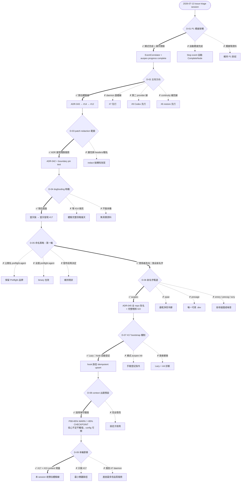

# Decision Log（決策日誌）

| Field | Value |
|---|---|
| Purpose | 記錄每一個**由 repository owner 選擇**的決策：當時的選項、優缺點、選擇結果、後果與可逆性，供日後 review |
| Scope | Owner 層級的產品/架構/流程決策。純架構細節的完整論證在 `docs/adr/`（本文件與其互相連結，不重複內容） |
| Convention | 每個決策一個 `D-##` 條目；新決策**必須**在做成當下追加到本文件（樹 + 條目兩處）。被推翻的決策不刪除——加註 superseded 指向新條目 |
| Started | 2026-07-13（回溯涵蓋當日 issue triage session 起的全部決策） |

## Decision Tree

粗框 = 已選路徑；虛線葉 = 被否決的選項；每個節點對應下方同編號條目。

---

## D-01 — P1 橋接架構（issue #1）

- **日期／情境：** 2026-07-13。qa-09 唯一未解 P1：provider event 與 Progress Tree 完成之間無 production 接線。核心張力：Constitution §6「completed means evidenced」——Stop 事件本身不是完成證據。
- **選項：**
  1. **顯式完成 + 事件關聯（✅ 已選，推薦項）**——完成永遠由顯式呼叫帶 artifacts 觸發、validator 驗證；event 只填 TaskID/NodeID 供 audit/join。優：完全符合 evidence 原則、凍結契約幾乎不動。缺：非全自動。Blast radius：小。
  2. 自動橋接完成——Stop event 自動嘗試 CompleteNode。優：demo 全自動。缺：與 evidence 原則緊張、動五處凍結契約。Blast radius：大。
  3. 擱置到有 dogfooding 資料。優：避免臆測。缺：P1 持續掛著。
- **後果：** `EventCorrelator`（correlate.go）+ `auspex progress complete` CLI，commit `1f43bb6`，#1 關閉。KnownGap 測試翻轉為正向斷言。
- **可逆性：** 高——自動橋接可日後作為 opt-in 疊加，不需拆現有設計。

## D-02 — 大型 roadmap 主攻方向

- **日期／情境：** 2026-07-13。#6–#11/#13/#14 一次只能推一線。
- **選項：** ①**預估體驗線（✅）**：ADR-043 → #14 預估卡 → #12 dogfooding——產品核心、不依賴 daemon、立刻累積校準資料；②daemon 基礎線（解鎖 auto-resume/VS Code 但工程最大）；③第二 provider 線（驗證抽象）；④continuity 補完線（restore）。
- **後果：** ADR-043、#14（commit `68404ce`）、#12 全部落地；#6–#11 依此排序並在各 issue 留言記錄。
- **可逆性：** 高——只是順序，其他線都還在 backlog。

## D-03 — Patch redaction 範圍（issue #5，qa-09 P2）

- **選項：** ①**ADR 接受殘餘風險（✅）**：檔名/binary-diff headers 不改寫（patch 的 git-apply 有效性是 restore 前提、威脅模型不同），加 boundary pin test；②擴充 redaction 掃 headers/檔名（隱私最大化但需解決 patch 結構有效性，工程大）。
- **後果：** ADR-042 + `TestRedactPatchSecrets_ADR042_...` pin test，#5 關閉。
- **重啟條件（寫在 ADR-042）：** 真實洩漏實例出現／redact 具備結構性改寫能力／checkpoint 出現預設外傳路徑。

## D-04 — Dogfooding 安裝時機（issue #12）

- **選項：** ①**現在就裝（✅）**：立即累積真實 turns、首次驗證 install 不破壞既有 hooks；②等 #14 一起裝（第一印象完整）；③不裝本機。
- **後果：** 當天安裝、當天收到真實遙測、**當天發現 #17**（native hook mode 缺 session 登記——dogfooding 的第一個 production bug）。此決策的回報直接證明了選項①的論點。

## D-05 — 命名策略・第一輪（issue #16 稽核後）

- **情境：** preflight 稽核發現：preflight.sh 同賽道活躍競品、`preflight` binary 被 Replicated/Red Hat 佔用 PATH、三網域被註冊、VS Code 顯示名被佔。
- **選項（原提案）：** ①公開名 preflight-agent + binary 保留 preflight（推薦）；②全面 preflight-agent；③發布前再決定。
- **結果：** **使用者未選任一——改向要求「簡短、有預測意涵、無碰撞的全新名字」**→ 進入 D-06。這是一次有價值的提案被推翻：三個選項都預設保留 Preflight 品牌，使用者判斷品牌本身已不值得保。

## D-06 — 新名字甄選

- **候選（全部經 GitHub/npm/Homebrew/.dev 查核）：** auspex（語義冠軍：羅馬鳥卜官，行動前讀兆決定放行——與產品定位一字相承）、spae（最乾淨但冷僻）、presage（唯一可拿 .dev，但有 Rust Signal 庫同名）、orrery（隱喻美、拼寫難）、precog（流行文化直白、鄰近碰撞）、scry（字首噪音大）；vates 出局（XCP-ng 母公司）。
- **選擇：** **auspex（✅）**＋全 repo 改名＋完整稽核。
- **後果：** ADR-045（廢止 ADR-001）、347 檔改名（commit `e1bbc40`）、GitHub repo → huaiche94/auspex、完整稽核 **GO**（詳見 #16 留言）、#18 追蹤佔位與監控（getauspex.com 是唯一需監控項）。
- **可逆性：** 中——1.0 前更名便宜（本次證明一個 session 可完成）、1.0 後昂貴。fallback 已寫進稽核結論。

## D-07 — #17 session bootstrap 機制

- **選項：** ①**Lazy：hook 自動登記（✅）**——idempotent upsert、fail-open、零使用者摩擦；缺點是 hook 多一次 git 呼叫、本機 DB 存 repo 絕對路徑（local-first 可接受）；②顯式 `auspex init`——可預期但多安裝摩擦、忘記 init 就永遠沒預估卡；③兩者都做——工作量最大。
- **既定約束（無選項）：** 非 git 目錄的 session 因 schema 外鍵一律降級為現狀。
- **後果：** 實作進行中（本條目在 merge 後補 commit SHA）。

## D-08 — Context window 升格後的出廠預設（issue #13 增量 2）

- **前提（不重議）：** 金錢預算依 ADR-043 定案「未設定即不啟用」。context 不同——它非使用者宣告、有客觀上限、撞上即災難。
- **選項：** ①**出廠即啟用保守閾值（✅）**：投影 P90 context >85% → WARN、>95% → CHECKPOINT_AND_RUN 建議；cold-start 信心不足不觸發（沿用 Confidence 紀律）；config 可關可調。風險：未校準投影可能誤報。②完全惰性——零驚訝但核心保護形同虛設。
- **後果：** 實作排在 #17 之後（本條目在 merge 後補 commit SHA）。
- **重審條件：** 校準資料（#11）就緒後重新檢視閾值；若誤報率高於預期，降級為惰性是一行 config 預設值的事。

## D-09 — 本輪推進節奏

- **選項：** ①**#17 + #13 context 增量（✅）**——預估體驗線一次收乾淨；②只做 #17——最小關鍵路徑；③一路推到 #7 daemon——不建議（安全敏感大工程塞在長 session 尾端）。
- **後果：** 本 session 範圍鎖定；#7 daemon 為下一 session 的第一優先。

---

## Lead 自行判斷（未開選項、已知會）

這些是 lead 依既有原則直接執行、事後報告的判斷，列出供 review：

| 判斷 | 依據 | 位置 |
|---|---|---|
| `docs/archive/` 與 git 歷史在兩次全域改名（Day-1、Auspex）中均不改寫 | 封存文件是歷史紀錄；改寫等於竄改 | Day-1 rename commit `6c7c99d`、ADR-045 §Decision 6 |
| ADR-001 的 §33 條目保留歷史原文＋廢止註記，而非 sed 成新名 | 不假裝產品一直叫 Auspex | `Auspex_ADD.md` §33 |
| ADR-044 將 evaluation.DataSource **原樣**升格凍結（不重設計） | 形狀已經過真實使用驗證；無驅動需求的重設計是投機抽象 | ADR-044 §Alternatives |
| schema-version 字串更名只在 pre-release 窗口允許 | 零外部使用者是唯一可行時機 | CONTRACT_FREEZE.md Amendments |
| 實作 agent 的產出一律不 commit、lead 審查後才進 main | 品質閘門 | 工作慣例（記錄於 memory） |

## 待決（尚未成為決策點）

- **#7 daemon 的形態**：launchd/systemd 自啟 vs 手動啟動、loopback auth token 的存放——開工前會以選項形式提問。
- **#18 佔位動作**：需要 owner 本人註冊（auspex.tools、VS Code publisher、Open VSX）。
- **校準閾值重審**（D-08 的重審條件觸發時）。
