# Preflight Day-1 Execution DAG

> **STALE — pending regeneration.** This DAG was built against the old
> nine-role (`A00`–`A08`) structure and `agent-packets/`. The repository
> owner has since consolidated to seven semantically-named roles under
> `agents/` (`checkpoint` = old `A03`+`A04`; `runtime` = old `A06`+`A07`;
> see `agents/README.md`). Task IDs, the Mermaid graph, the topological
> list, and the summary stats below all still reference the old scheme and
> need a fresh pass before anyone is spawned against them. Per the owner's
> preferred process order (Inventory → Normalize → DAG → **Dependency
> Review** → Spawn Team → ...), regenerating this file is the explicit next
> step, done deliberately rather than folded into the restructuring commit.

| Field | Value |
|---|---|
| Source | `Preflight_ADD.md` + `Preflight_Day1_Parallel_Execution_Plan.md` (+ `agent-packets/0X-*.md`, canonical per those docs **at the time this was generated** — now `agents/*.md`, see banner above) |
| Scope | Full task-level breakdown of the Day-1 nine-agent (A00–A08) vertical slice — **pre-consolidation** |
| Status | **Stale. Superseded pending regeneration. No teammates created. No code written.** |
| Generated | 2026-07-12 (superseded same day by the `agents/` restructuring) |

---

## 1. Method

Each agent packet's deliverables/required-tests lists were decomposed into
individually-mergeable tasks (`<Agent>-<seq>`), matching the node-ID
convention the Day-1 plan already uses in its coordination-artifact example
(`node: A05-03`, §9). 83 tasks total, plus one final integration task.

**Merge order** below is the *stage* number from the Day-1 plan §10 merge
order (0 = A00 contract freeze, 1 = A01 foundation, 2 = A02/A03/A04/A05
parallel, 3 = A06, 4 = A07, 5 = A08, 6 = A00 final integration). Ties within
a stage are broken by the intra-agent dependency chain — see §4 for the
fully flattened order.

**Dependencies** are the true blocking dependencies for a *mergeable,
tested* result. Per Day-1 plan §4 ("A06 and A07 may start immediately
against frozen interfaces and fakes"), some tasks marked with a dependency
on a not-yet-real A02/A03/A04/A05 component may begin coding earlier against
`internal/testutil/fakes`; this is called out in that task's **Blockers**
column rather than changing the dependency edge, because the edge reflects
what is required to *merge*, not what is required to *start typing code*.

**Complexity scale:** XS (glue/config, <100 LOC) · S (100–200) · M (200–350)
· L (350–500) · XL (500+, usually a concurrency/integrity boundary).

---

## 2. Task tables

### A00 — Contract Freeze and Integration

| ID | Owner | Dependencies | Complexity | Est. LOC | Est. Files | Validation command | Merge order | Risk | Blockers |
|---|---|---|---|---|---|---|---|---|---|
| A00-01 | A00 | — | M | 250 | 6 | `go build ./internal/domain/...` | 0 | Low — pure types | None; first task in the repo |
| A00-02 | A00 | A00-01 | M | 300 | 3 | `go build ./internal/app/...` | 0 | Medium — interface shape locks every agent | Must avoid "God interfaces" per packet |
| A00-03 | A00 | A00-01 | M | 250 | 4 | `go build ./internal/domain/... ./pkg/protocol/...` | 0 | Medium — provider capability model is speculative until A02 exercises it | May need revision after A02 first integration |
| A00-04 | A00 | A00-01 | M | 300 | 5 | `go test ./pkg/protocol/v1/...` | 0 | Medium — schema-version strings are a compatibility commitment | None |
| A00-05 | A00 | A00-01 | S | 150 | 5 | `go build ./internal/clock/... ./internal/idgen/...` | 0 | Low | None |
| A00-06 | A00 | A00-02, A00-03, A00-04, A00-05 | S | 400 (doc) | 1 | manual doc review against packet §"Write CONTRACT_FREEZE.md" checklist | 0 | High — every other agent rebases onto this commit | Nothing may start production code before this lands (Day-1 plan §8) |
| A00-07 | A00 | A00-06 | XS | 0 | 0 | `gofmt -w internal/domain internal/app pkg/protocol && go test ./internal/domain/... ./pkg/protocol/...` | 0 | Low | Gate for every other agent's first task |
| A00-INT | A00 | A08-09 | L | 0 (integration) | 0 new | `go test ./... -race` + Fable race/security review per packet | 6 | High — last chance to catch cross-agent contradictions | Cannot start until A08's final report exists |

### A01 — Foundation, Configuration, Paths, Core SQLite

| ID | Owner | Dependencies | Complexity | Est. LOC | Est. Files | Validation command | Merge order | Risk | Blockers |
|---|---|---|---|---|---|---|---|---|---|
| A01-01 | A01 | A00-07 | S | 120 | 4 | `go build ./cmd/preflight && ./preflight version` | 1 | Low | Go module path decision (`Preflight_ADD.md` §10.2) if no Git remote yet |
| A01-02 | A01 | A01-01 | S | 180 | 3 | `go test ./internal/paths/...` | 1 | Low | Windows path behavior needs CI matrix, not just local run |
| A01-03 | A01 | A01-01 | M | 250 | 4 | `go test ./internal/config/...` | 1 | Low | None |
| A01-04 | A01 | A01-01, A00-05 | S | 150 | 6 | `go test ./internal/clock/... ./internal/idgen/... ./internal/lock/...` | 1 | Low | None |
| A01-05 | A01 | A01-01 | M | 350 | 5 | `go test ./internal/storage/sqlite/...` | 1 | Medium — WAL/busy-timeout/FK pragmas are load-bearing for every later agent | None |
| A01-06 | A01 | A01-05, A00-01 | M | 300 | 10 | `go test ./internal/storage/sqlite/... -run Migration` | 1 | High — every feature agent's migrations FK into these tables | Schema mistakes here cascade to A02–A06 migration ranges |
| A01-07 | A01 | A01-06 | M | 300 | 4 | `go test ./internal/storage/sqlite/... -run TestMigration -race` | 1 | Medium — crash/corruption paths are hard to simulate reliably | None |
| A01-08 | A01 | A01-02, A01-03 | S | 200 | 4 | `go test ./internal/paths/... ./internal/config/... -run Precedence` | 1 | Low | Needs Windows/macOS/Linux CI runners (A08-01) for full signal |
| A01-09 | A01 | A01-01 | XS | 150 | 6 | `task lint && task build` | 1 | Low | None |

### A02 — Claude Telemetry, Hooks, Provider Normalization

| ID | Owner | Dependencies | Complexity | Est. LOC | Est. Files | Validation command | Merge order | Risk | Blockers |
|---|---|---|---|---|---|---|---|---|---|
| A02-01 | A02 | A00-07 | M | 300 | 8 | `go test ./internal/providers/claude/... -run StatusLine` | 2 | Medium — depends on real Claude status-line field behavior (nullable fields) | Needs representative fixtures; source is Appendix H doc links, not a live account |
| A02-02 | A02 | A00-07 | M | 300 | 6 | `go test ./internal/hooks/claude/... -run UserPromptSubmit` | 2 | Medium — hook response must stay provider-compatible even on internal failure | None |
| A02-03 | A02 | A00-07 | M | 250 | 6 | `go test ./internal/hooks/claude/... -run 'Stop|StopFailure'` | 2 | Medium — rate-limit failure classification affects A05/A06 later | None |
| A02-04 | A02 | A02-01, A02-02, A02-03, A00-04 | L | 400 | 6 | `go test ./internal/telemetry/claude/...` | 2 | High — this is the sole path from raw provider payloads into the frozen event envelope | Any A00-04 envelope change forces rework here |
| A02-05 | A02 | A01-06, A02-04 | M | 300 | 6 | `go test ./internal/telemetry/claude/... -run Idempotent` | 2 | Medium — idempotency key design must survive out-of-order delivery | None |
| A02-06 | A02 | A02-02 | S | 100 | 3 | manual: `preflight hook claude user-prompt-submit < fixture` returns valid JSON | 2 | Low | Needs A07-01 CLI skeleton to actually invoke end-to-end (stub acceptable before then) |
| A02-07 | A02 | A02-04, A02-05 | M | 300 | 10 | `go test ./internal/providers/claude/... ./internal/telemetry/claude/... -run Fixture` | 2 | Medium — raw-prompt-absence assertion is a hard privacy gate | Feeds A08-05 leakage scanner |

### A03 — Progress Tree and State Checkpointing

| ID | Owner | Dependencies | Complexity | Est. LOC | Est. Files | Validation command | Merge order | Risk | Blockers |
|---|---|---|---|---|---|---|---|---|---|
| A03-01 | A03 | A01-06, A00-07 | M | 250 | 6 | `go test ./internal/storage/sqlite/... -run Migration0020` | 2 | Low | None |
| A03-02 | A03 | A03-01, A00-02 | L | 450 | 6 | `go test ./internal/progress/...` | 2 | High — node state machine is the canonical task-state boundary | None |
| A03-03 | A03 | A03-01 | M | 300 | 5 | `go test ./internal/artifacts/...` | 2 | Medium | Markdown fence/heading validator needs real ADD-section fixtures |
| A03-04 | A03 | A03-02, A03-03, A00-04 | XL | 500 | 4 | `go test ./internal/progress/... -run CompleteNode -race` | 2 | **High — product-defining integrity boundary per packet** | This is the single most consequential task in the whole DAG; a bug here silently breaks "completed means evidenced" |
| A03-05 | A03 | A03-04 | M | 300 | 4 | `go test ./internal/statecheckpoint/...` | 2 | High — consumed directly by A06 pause persist phase | None |
| A03-06 | A03 | A03-05 | L | 350 | 3 | `go test ./internal/statecheckpoint/... -run Reconcile` | 2 | High — crash-window reconciliation is hard to exhaustively test | Needs crash-injection harness |
| A03-07 | A03 | A03-04 | M | 250 | 3 | `go test ./internal/progress/... -run Idempotency` | 2 | Medium | Feeds A08-04 duplicate/out-of-order test |
| A03-08 | A03 | A03-05 | M | 250 | 3 | `go test ./internal/statecheckpoint/... -run 'Snapshot|LoadLatest|Verify'` | 2 | Low | None |
| A03-09 | A03 | A03-04, A03-05, A03-06, A03-07, A03-08 | L | 500 | 8 | `go test ./internal/progress/... ./internal/statecheckpoint/... -race` | 2 | High — includes the "100 sequential nodes → 100 checkpoints" and concurrent-completion-race tests | Gate for A08-02 E2E test |

### A04 — Git Observation and Repository Checkpoint

| ID | Owner | Dependencies | Complexity | Est. LOC | Est. Files | Validation command | Merge order | Risk | Blockers |
|---|---|---|---|---|---|---|---|---|---|
| A04-01 | A04 | A01-06, A00-07 | S | 150 | 3 | `go test ./internal/storage/sqlite/... -run Migration0030` | 2 | Low | None |
| A04-02 | A04 | A00-07 | L | 400 | 5 | `go test ./internal/gitx/... -run Porcelain` | 2 | Medium — must use argv-only process calls, never a shell string | Depends on A00's `ProcessRunner` interface shape |
| A04-03 | A04 | A04-02 | M | 250 | 3 | `go test ./internal/gitx/... -run Fingerprint` | 2 | Low | None |
| A04-04 | A04 | A04-01, A04-03 | L | 450 | 5 | `go test ./internal/repocheckpoint/...` | 2 | High — must never mutate the active branch | Consumed by A06 persist phase and A07 checkpoint-create |
| A04-05 | A04 | A04-04 | M | 300 | 3 | `go test ./internal/repocheckpoint/... -run Patch` | 2 | Medium — binary-safety edge cases | None |
| A04-06 | A04 | A04-04 | M | 300 | 4 | `go test ./internal/repocheckpoint/... ./internal/redact/... -run Untracked` | 2 | High — secret/path filtering is a security control, not a nicety | Feeds A08-05 leakage scanner |
| A04-07 | A04 | A04-04, A04-05, A04-06 | M | 250 | 3 | `go test ./internal/repocheckpoint/... -run Atomic -race` | 2 | Medium | None |
| A04-08 | A04 | A04-07 | M | 250 | 3 | `go test ./internal/repocheckpoint/... -run RestoreDryRun` | 2 | Low — actual restore is explicitly stretch/deferred | Real restore is out of Day-1 scope per plan §2 |
| A04-09 | A04 | A04-07, A04-08 | L | 450 | 10 | `go test ./internal/repocheckpoint/... ./internal/gitx/... -race` | 2 | High — path traversal / symlink escape tests are a security gate | Feeds A08-06 |

### A05 — Scope Estimator, Predictor, Risk, Policy, Authorization

| ID | Owner | Dependencies | Complexity | Est. LOC | Est. Files | Validation command | Merge order | Risk | Blockers |
|---|---|---|---|---|---|---|---|---|---|
| A05-01 | A05 | A01-06, A00-07 | S | 150 | 3 | `go test ./internal/storage/sqlite/... -run Migration0040` | 2 | Low | None |
| A05-02 | A05 | A00-07 | S | 150 | 3 | `go test ./internal/features/... -run PromptFeatures` | 2 | Medium — must never retain raw prompt text | Feeds A08-05 leakage scanner |
| A05-03 | A05 | A00-02 | M | 300 | 5 | `go test ./internal/features/... -run Classifier` | 2 | Low | None |
| A05-04 | A05 | A00-07 | M | 250 | 4 | `go test ./internal/predictor/... -run QuantileMonotonic` | 2 | Medium — property tests must hold for all inputs, including degenerate ones | None |
| A05-05 | A05 | A05-03, A05-04 | M | 300 | 4 | `go test ./internal/predictor/... -run Scope` | 2 | Low | None |
| A05-06 | A05 | A05-04 | L | 350 | 4 | `go test ./internal/predictor/runway/...` | 2 | High — consumed directly by A06 Observe; a bad score risks false pause triggers | None |
| A05-07 | A05 | A05-05, A05-06 | L | 400 | 5 | `go test ./internal/predictor/... -run RiskComponents` | 2 | Medium | None |
| A05-08 | A05 | A05-07 | L | 400 | 5 | `go test ./internal/policy/... -run ColdStart` | 2 | **High — must never label an uncalibrated score a probability** | Immutable day-one rule #2; any violation blocks merge |
| A05-09 | A05 | A05-01, A05-08 | M | 300 | 4 | `go test ./internal/evaluation/...` | 2 | Medium | If `internal/evaluation` path differs in the frozen layout, must match A00's exact path (packet note) |
| A05-10 | A05 | A05-09 | M | 350 | 4 | `go test ./internal/evaluation/... -run Authorization` | 2 | High — replay protection is a security control | Consumed by A06-08 resume validation and A07-06 |
| A05-11 | A05 | A05-08, A05-10 | L | 450 | 8 | `go test ./internal/predictor/... ./internal/policy/... ./internal/evaluation/... -race -bench=. -benchmem` | 2 | High — includes fail-open/fail-closed policy-priority tests | Gate for A08-02 E2E test |

### A06 — Graceful Pause, Safe Points, Durable Scheduler

| ID | Owner | Dependencies | Complexity | Est. LOC | Est. Files | Validation command | Merge order | Risk | Blockers |
|---|---|---|---|---|---|---|---|---|---|
| A06-01 | A06 | A01-06, A00-07 | S | 150 | 3 | `go test ./internal/storage/sqlite/... -run Migration0050` | 3 | Low | None |
| A06-02 | A06 | A06-01, A00-02 | L | 400 | 4 | `go test ./internal/pause/... -run StateTransition` | 3 | High — this state machine is the pause/resume integrity boundary | None |
| A06-03 | A06 | A06-02 | M | 300 | 3 | `go test ./internal/pause/... -run Observe` | 3 | Medium | Can code against A05's port/fake immediately per plan §4; needs real `A05-06` before merge |
| A06-04 | A06 | A06-02 | M | 300 | 4 | `go test ./internal/pause/... -run 'RequestPause|SafePoint'` | 3 | Medium | Can start against fakes; A03/A04 concrete stores not required to begin |
| A06-05 | A06 | A06-04 | XL | 500 | 4 | `go test ./internal/pause/... -run PersistPhase -race` | 3 | **High — orchestrates 5 durable writes across 3 other agents' stores** | Needs real `A03-05` and `A04-04` by merge time, not by coding start |
| A06-06 | A06 | A06-01 | L | 400 | 4 | `go test ./internal/scheduler/... -run Lease` | 3 | High — lease correctness under concurrent workers is the whole point | None |
| A06-07 | A06 | A06-06 | M | 300 | 3 | `go test ./internal/scheduler/... -run Restart` | 3 | Medium | None |
| A06-08 | A06 | A06-05 | L | 350 | 3 | `go test ./internal/pause/... -run ResumeValidation` | 3 | High — quota/repo/session/authorization checks are the last line before unattended code execution | Needs real `A05-10` by merge time |
| A06-09 | A06 | A06-07, A06-08 | M | 300 | 3 | `go test ./internal/scheduler/... ./internal/pause/... -run 'DuplicateWake|Cancel' -race` | 3 | High | Feeds A08-07 |
| A06-10 | A06 | A06-08 | S | 200 | 3 | `go test ./internal/testutil/fakes/... -run ProviderContract` | 3 | Low | None |
| A06-11 | A06 | A06-09, A06-10 | XL | 550 | 10 | `go test ./internal/pause/... ./internal/scheduler/... -race` | 3 | High — includes crash-after-every-phase and expired-lease-reclaim tests | Gate for A08-02 E2E test |

### A07 — Application Orchestration, CLI, Local API

| ID | Owner | Dependencies | Complexity | Est. LOC | Est. Files | Validation command | Merge order | Risk | Blockers |
|---|---|---|---|---|---|---|---|---|---|
| A07-01 | A07 | A00-07, A01-01 | M | 350 | 6 | `go build ./internal/cli/... && preflight --help` | 4 | Low | None |
| A07-02 | A07 | A00-02, A01-06 | M | 300 | 4 | `go test ./internal/app/wiring/...` | 4 | Medium — wrong wiring here silently breaks every downstream command | Can start against A02–A06 fakes |
| A07-03 | A07 | A07-02 | M | 300 | 3 | `go test ./internal/orchestrator/... -run Evaluate` | 4 | Medium | Needs real `A05-08`/`A05-09` by merge time |
| A07-04 | A07 | A07-02 | M | 350 | 5 | `go test ./internal/orchestrator/... -run HookHandlers` | 4 | Medium | Needs real `A02-04` by merge time |
| A07-05 | A07 | A07-02 | M | 300 | 3 | `go test ./internal/orchestrator/... -run CheckpointCreate` | 4 | High — must call A03 then A04 per the frozen transaction contract, in order | Needs real `A03-04` and `A04-04` by merge time |
| A07-06 | A07 | A07-03, A05-10 | M | 300 | 3 | `go test ./internal/orchestrator/... -run 'DecisionAllow|ReplayRejected'` | 4 | High — second-authorization-replay-rejected is a required test | Hard dependency (not fake-able): real authorization semantics |
| A07-07 | A07 | A07-02 | M | 300 | 4 | `go test ./internal/orchestrator/... -run 'PauseRequest|Resume|SchedulerRunOnce'` | 4 | Medium | Needs real `A06-04`/`A06-06` by merge time |
| A07-08 | A07 | A07-02 | S | 200 | 3 | `go test ./internal/cli/... -run 'Status|Doctor'` | 4 | Low | None |
| A07-09 | A07 | A07-01, A07-03, A07-04, A07-05, A07-06, A07-07, A07-08 | M | 250 | 3 | `go test ./internal/httpapi/... ./internal/cli/... -run ErrorContract` | 4 | Medium — "no raw prompt in logs/errors" is a hard privacy gate here too | None |
| A07-10 | A07 | A07-09 | L | 450 | 8 | `go test ./internal/cli/... ./internal/orchestrator/... -race` | 4 | High — includes in-process-restart-same-SQLite-file test | Gate for A08-02 and A08-03 |

### A08 — Cross-component QA, Security, Reliability, CI

| ID | Owner | Dependencies | Complexity | Est. LOC | Est. Files | Validation command | Merge order | Risk | Blockers |
|---|---|---|---|---|---|---|---|---|---|
| A08-01 | A08 | A01-09, A00-07 | S | 200 | 4 | CI green on a trivial PR (Ubuntu/macOS/Windows) | 5 | Low | None |
| A08-02 | A08 | A02-07, A03-09, A04-09, A05-11, A06-11, A07-10 | L | 400 | 6 | `go test ./internal/integrationtest/... -run E2EHighRisk` | 5 | High — this is the literal Day-1 demo (`Preflight_Day1_Parallel_Execution_Plan.md` §11) | Cannot start meaningfully until all six upstream tasks are real |
| A08-03 | A08 | A01-07, A07-10 | M | 200 | 2 | `go test ./internal/integrationtest/... -run RestartSameDB` | 5 | Medium | None |
| A08-04 | A08 | A02-05, A03-07 | M | 200 | 2 | `go test ./internal/integrationtest/... -run 'Duplicate|OutOfOrder'` | 5 | Medium | None |
| A08-05 | A08 | A02-07, A04-06 | M | 250 | 3 | `go test ./internal/integrationtest/... -run LeakageScanner` | 5 | **High — scans DB export/logs/manifests for raw prompt and secrets** | Immutable day-one rule #1; any hit blocks merge |
| A08-06 | A08 | A04-09 | M | 250 | 4 | `go test ./internal/integrationtest/... -run 'PathTraversal|Symlink|MaliciousFixture'` | 5 | High | None |
| A08-07 | A08 | A06-09 | M | 250 | 2 | `go test ./internal/scheduler/... -run DoubleWorkerRace -race -count=20` | 5 | High — flaky-by-nature; needs repeated runs | None |
| A08-08 | A08 | — | S | 300 (doc) | 4 | manual doc review (`SECURITY.md`, `CONTRIBUTING.md`, `CODE_OF_CONDUCT.md`, `GOVERNANCE.md`) | 5 | Low | None — can run in parallel with everything, no code dependency |
| A08-09 | A08 | A08-02, A08-03, A08-04, A08-05, A08-06, A08-07, A08-08 | S | 0 (report) | 1 | `go test ./... -race` + produce P0/P1/P2 severity report | 5 | High — this is the gate for A00's final integration | None beyond its inputs |

---

## 3. Mermaid dependency graph

```mermaid
flowchart TD
    subgraph S0["Stage 0 — A00 Contract Freeze"]
        A00_01["A00-01 Domain IDs & enums"]
        A00_02["A00-02 Service ports §9.9"]
        A00_03["A00-03 Provider capability types §9.10"]
        A00_04["A00-04 Event envelope & typed errors"]
        A00_05["A00-05 Clock/IDGenerator/ProcessRunner"]
        A00_06["A00-06 CONTRACT_FREEZE.md"]
        A00_07["A00-07 Contract commit accepted"]
        A00_01 --> A00_02 & A00_03 & A00_04 & A00_05
        A00_02 & A00_03 & A00_04 & A00_05 --> A00_06 --> A00_07
    end

    subgraph S1["Stage 1 — A01 Foundation"]
        A01_01["A01-01 Go module + version"]
        A01_02["A01-02 OS paths"]
        A01_03["A01-03 YAML config"]
        A01_04["A01-04 Clock/IDGen/lock impls"]
        A01_05["A01-05 SQLite engine"]
        A01_06["A01-06 Core migrations 0000-0009"]
        A01_07["A01-07 Migration test harness"]
        A01_08["A01-08 Path/config tests"]
        A01_09["A01-09 Makefile/Taskfile/lint"]
        A01_01 --> A01_02 & A01_03 & A01_05 & A01_09
        A01_01 --> A01_04
        A01_05 --> A01_06 --> A01_07
        A01_02 & A01_03 --> A01_08
    end

    subgraph S2A["Stage 2 — A02 Claude Telemetry"]
        A02_01["A02-01 Status-line parser"]
        A02_02["A02-02 UserPromptSubmit parser"]
        A02_03["A02-03 Stop/StopFailure parsers"]
        A02_04["A02-04 Normalize -> event envelope"]
        A02_05["A02-05 Migrations 0010-0019 + persist"]
        A02_06["A02-06 Claude plugin example"]
        A02_07["A02-07 Fixture suite + privacy"]
        A02_01 & A02_02 & A02_03 --> A02_04 --> A02_05 --> A02_07
        A02_02 --> A02_06
    end

    subgraph S2B["Stage 2 — A03 Progress/State Checkpoint"]
        A03_01["A03-01 Migrations 0020-0029"]
        A03_02["A03-02 Progress Tree + state machine"]
        A03_03["A03-03 Artifact validators"]
        A03_04["A03-04 CompleteNode atomic protocol"]
        A03_05["A03-05 State Checkpoint manifest"]
        A03_06["A03-06 Startup reconciliation"]
        A03_07["A03-07 Completion idempotency"]
        A03_08["A03-08 Snapshot/verify APIs"]
        A03_09["A03-09 Required tests"]
        A03_01 --> A03_02 & A03_03
        A03_02 & A03_03 --> A03_04
        A03_04 --> A03_05 & A03_07
        A03_05 --> A03_06 & A03_08
        A03_04 & A03_05 & A03_06 & A03_07 & A03_08 --> A03_09
    end

    subgraph S2C["Stage 2 — A04 Repository Checkpoint"]
        A04_01["A04-01 Migrations 0030-0039"]
        A04_02["A04-02 Repo resolver + porcelain parser"]
        A04_03["A04-03 Snapshot fingerprint"]
        A04_04["A04-04 Repo Checkpoint create/verify"]
        A04_05["A04-05 Binary-safe patch"]
        A04_06["A04-06 Untracked archive + redact"]
        A04_07["A04-07 Atomic write + race detect"]
        A04_08["A04-08 Restore dry-run"]
        A04_09["A04-09 Required tests"]
        A04_02 --> A04_03
        A04_01 & A04_03 --> A04_04
        A04_04 --> A04_05 & A04_06
        A04_04 & A04_05 & A04_06 --> A04_07 --> A04_08
        A04_07 & A04_08 --> A04_09
    end

    subgraph S2D["Stage 2 — A05 Predictor/Policy"]
        A05_01["A05-01 Migrations 0040-0049"]
        A05_02["A05-02 Prompt feature extractor"]
        A05_03["A05-03 Feature DTOs + classifier"]
        A05_04["A05-04 Empirical quantile utils"]
        A05_05["A05-05 Scope estimator"]
        A05_06["A05-06 Runway score"]
        A05_07["A05-07 Risk combiner"]
        A05_08["A05-08 Policy engine"]
        A05_09["A05-09 Evaluation persistence"]
        A05_10["A05-10 One-time authorization"]
        A05_11["A05-11 Required tests + benchmarks"]
        A05_03 & A05_04 --> A05_05
        A05_04 --> A05_06
        A05_05 & A05_06 --> A05_07 --> A05_08
        A05_01 & A05_08 --> A05_09 --> A05_10
        A05_08 & A05_10 --> A05_11
    end

    subgraph S3["Stage 3 — A06 Pause + Scheduler"]
        A06_01["A06-01 Migrations 0050-0059"]
        A06_02["A06-02 Pause state machine"]
        A06_03["A06-03 Observe (debounce/hysteresis)"]
        A06_04["A06-04 RequestPause + safe-point coord"]
        A06_05["A06-05 Persist phase orchestration"]
        A06_06["A06-06 Scheduler lease"]
        A06_07["A06-07 Restart recovery"]
        A06_08["A06-08 Resume validation"]
        A06_09["A06-09 Duplicate-wake + cancel"]
        A06_10["A06-10 Provider fakes contract tests"]
        A06_11["A06-11 Required tests"]
        A06_01 --> A06_02 --> A06_03 & A06_04
        A06_04 --> A06_05 --> A06_08 --> A06_10
        A06_01 --> A06_06 --> A06_07
        A06_07 & A06_08 --> A06_09
        A06_09 & A06_10 --> A06_11
    end

    subgraph S4["Stage 4 — A07 Orchestration/CLI/API"]
        A07_01["A07-01 CLI skeleton"]
        A07_02["A07-02 App wiring"]
        A07_03["A07-03 Evaluate pipeline"]
        A07_04["A07-04 Hook command handlers"]
        A07_05["A07-05 checkpoint create"]
        A07_06["A07-06 decision allow/deny"]
        A07_07["A07-07 pause/resume/scheduler CLI"]
        A07_08["A07-08 status/doctor"]
        A07_09["A07-09 JSON/error contract"]
        A07_10["A07-10 Required tests"]
        A07_02 --> A07_03 & A07_04 & A07_05 & A07_07 & A07_08
        A07_03 --> A07_06
        A07_01 & A07_03 & A07_04 & A07_05 & A07_06 & A07_07 & A07_08 --> A07_09 --> A07_10
    end

    subgraph S5["Stage 5 — A08 QA/Security/CI"]
        A08_01["A08-01 CI workflow scaffolding"]
        A08_02["A08-02 E2E fixture flow"]
        A08_03["A08-03 Restart same DB"]
        A08_04["A08-04 Duplicate/out-of-order test"]
        A08_05["A08-05 Leakage scanner"]
        A08_06["A08-06 Path traversal/security tests"]
        A08_07["A08-07 Scheduler race test"]
        A08_08["A08-08 Governance/security docs"]
        A08_09["A08-09 Final severity report"]
        A08_02 & A08_03 & A08_04 & A08_05 & A08_06 & A08_07 & A08_08 --> A08_09
    end

    A00_07 --> A01_01
    A00_07 --> A02_01 & A02_02 & A02_03
    A00_07 --> A03_01 & A04_02 & A05_01 & A05_02 & A05_04 & A06_01
    A00_07 --> A07_01
    A00_07 --> A08_01
    A00_02 --> A03_02 & A05_03 & A06_02 & A07_02
    A00_04 --> A02_04 & A03_04
    A00_05 --> A01_04
    A01_01 --> A07_01
    A01_06 --> A02_05 & A03_01 & A04_01 & A05_01 & A06_01 & A07_02
    A01_07 --> A08_03
    A01_09 --> A08_01

    A02_04 -.soft.-> A07_04
    A02_05 --> A08_04
    A02_07 --> A08_02 & A08_05

    A03_04 -.soft.-> A07_05
    A03_05 -.soft.-> A06_05
    A03_07 --> A08_04
    A03_09 --> A08_02

    A04_04 -.soft.-> A06_05 & A07_05
    A04_06 --> A08_05
    A04_09 --> A08_02 & A08_06

    A05_06 -.soft.-> A06_03
    A05_08 -.soft.-> A07_03
    A05_09 -.soft.-> A07_03
    A05_10 -.soft.-> A06_08
    A05_10 --> A07_06
    A05_11 --> A08_02

    A06_04 -.soft.-> A07_07
    A06_06 -.soft.-> A07_07
    A06_09 --> A08_07
    A06_11 --> A08_02

    A07_10 --> A08_02 & A08_03

    A08_09 --> A00_INT["A00-INT Final integration"]
```

*Solid arrows = hard merge-blocking dependency. Dotted arrows labeled
"soft" = the downstream task may begin against `internal/testutil/fakes`
per Day-1 plan §4, but needs the real upstream component before it can
merge/pass integration tests.*

---

## 4. Topologically sorted execution list

Tasks within the same numbered stage are mutually independent (can run in
parallel across agents); order within a stage below follows each agent's own
dependency chain.

**Stage 0 — A00 (sequential):**
1. A00-01
2. A00-02, A00-03, A00-04, A00-05 *(parallel within A00)*
3. A00-06
4. A00-07 — **hard gate: nothing else may begin production code before this**

**Stage 1 — A01 (sequential-ish, single agent):**
5. A01-01
6. A01-02, A01-03, A01-04, A01-05, A01-09 *(parallel within A01)*
7. A01-06
8. A01-07, A01-08 *(parallel)*

**Stage 2 — A02, A03, A04, A05 (four agents run fully in parallel; order below is per-agent):**

*A02:*
9. A02-01, A02-02, A02-03 *(parallel)*
10. A02-04
11. A02-05, A02-06 *(parallel)*
12. A02-07

*A03:*
13. A03-01
14. A03-02, A03-03 *(parallel)*
15. A03-04
16. A03-05, A03-07 *(parallel)*
17. A03-06, A03-08 *(parallel)*
18. A03-09

*A04:*
19. A04-01, A04-02 *(parallel)*
20. A04-03
21. A04-04
22. A04-05, A04-06 *(parallel)*
23. A04-07
24. A04-08
25. A04-09

*A05:*
26. A05-01, A05-02, A05-03, A05-04 *(parallel)*
27. A05-05, A05-06 *(parallel)*
28. A05-07
29. A05-08
30. A05-09
31. A05-10
32. A05-11

**Stage 3 — A06 (single agent, may start coding early against fakes; listed here at its merge position):**
33. A06-01
34. A06-02
35. A06-03, A06-04 *(parallel)*
36. A06-05
37. A06-06
38. A06-07, A06-08 *(parallel)*
39. A06-09, A06-10 *(parallel)*
40. A06-11

**Stage 4 — A07 (single agent, may start coding early against fakes):**
41. A07-01
42. A07-02
43. A07-03, A07-04, A07-05, A07-07, A07-08 *(parallel)*
44. A07-06
45. A07-09
46. A07-10

**Stage 5 — A08 (A08-01 and A08-08 can start as early as Stage 0/1; the rest gate on Stage 2–4 outputs):**
47. A08-01, A08-08 *(can start immediately after A00-07/A01-09 — do not wait for Stage 2-4)*
48. A08-03, A08-04 *(after A01-07/A02-05/A03-07/A07-10)*
49. A08-05, A08-06, A08-07 *(after A02-07/A04-06/A04-09/A06-09)*
50. A08-02 *(last — needs every feature agent's Required-Tests task green)*
51. A08-09

**Stage 6 — A00 final integration:**
52. A00-INT

---

## 5. Summary

| Metric | Value |
|---|---|
| Total tasks | 83 (+ 1 final integration) |
| Estimated total LOC (impl + test, all tasks) | ≈ 23,850 |
| Estimated total new files | ≈ 359 |
| Longest single-agent critical-path (task count) | A05 or A06, 11 tasks each |
| Approximate end-to-end critical path (task count, Stage 0→6, worst single branch) | ≈ 7 (A00) + 9 (A01) + 11 (A05 or A06's own chain) + 11 (A06) + 10 (A07) + 9 (A08) + 1 (A00-INT) ≈ 58 |
| Tasks flagged **High** risk | 24 |
| Immutable day-one rules with a direct enforcing test task | Rule 1 (no raw prompt) → A08-05; Rule 2 (uncalibrated ≠ probability) → A05-08 |

**Single highest-risk task in the whole DAG:** `A03-04` (CompleteNode atomic
protocol) — it is the sole enforcement point for "completed means
evidenced," touches a DB transaction boundary, and every downstream
continuity guarantee (State Checkpoint, Repository Checkpoint linkage,
Graceful Pause persist phase) assumes it is correct.

**Second highest-risk task:** `A06-05` (persist phase orchestration) —
orchestrates five durable writes spanning three other agents' stores inside
one logical operation; a partial failure here is exactly the scenario
"Graceful Pause must be recoverable" (`Preflight_ADD.md` §1.6 rule 6) exists
to prevent.

---

**Waiting for approval before any task begins execution.**
