# Auspex Execution DAG

> 🌐 English | [繁體中文](EXECUTION_DAG.zh-TW.md)

| Field | Value |
|---|---|
| Source | `Auspex_ADD.md` + `Auspex_Parallel_Execution_Plan.md` + `agents/*.md` (canonical per those docs) |
| Scope | Full task-level breakdown of the seven-role vertical slice |
| Status | **Wave 1 integrated (`main` @ `3fb37ce`). Amended 2026-07-12 per ADR-041 (predictor forecast layer) before Wave 2 implementation begins.** |
| Supersedes | The earlier nine-role (`A00`–`A08`) version of this document, archived in git history at commit `f1d9065` and referenced from `docs/archive/agent-packets-v1/`. |
| Amendments | `docs/adr/0041-predictor-forecast-layer.md` — inserted `predictor-05b`/`predictor-05c`, corrected `predictor-07`/`predictor-08`/`predictor-11` dependency edges. See §5 Summary for the resulting task-count delta. |
| Generated | 2026-07-12 (regenerated after the `agents/` restructuring; amended same day per ADR-041) |

---

## 1. Method

Unchanged from the prior version: each role's deliverables/required-tests
list was decomposed into individually-mergeable tasks
(`<role>-<seq>`, or `<role>-<part><seq>` for the two roles that internally
keep a Part A / Part B split). Task IDs now match the coordination-artifact
convention already established in `Auspex_Parallel_Execution_Plan.md`
§9 (`node: predictor-03`) instead of the old `A05-03` form.

**Two roles carry two internal parts** — `checkpoint` (Part A = Progress
Tree/State Checkpointing, Part B = Repository Checkpoint) and `runtime`
(Part A = Graceful Pause/Scheduler, Part B = CLI/API/Orchestration). Each
part keeps its own task sequence, exclusive paths, and migration range (see
`agents/checkpoint.md` and `agents/runtime.md`), because one role owning
both does not mean the two halves should blur together — it means one
worktree/branch delivers both, in the order given below.

**What changed from the 9-role version, substantively:**

1. Stage 2 now fans out to **3** parallel branches (`claude-provider`,
   `checkpoint`, `predictor`), not 4 — `checkpoint` absorbed what were two
   separate parallel branches (`A03`, `A04`) into one.
2. What were **soft** (fake-able) dependencies between `A06` and `A07`
   are now **hard** dependencies between `runtime` Part A and Part B,
   because they are the same role/branch — there is no longer a
   cross-team coordination reason to fake them. Soft/fake-able
   dependencies are now only used where a task genuinely crosses a
   role/branch boundary (`checkpoint`, `claude-provider`, `predictor` →
   `runtime`).
3. Total task count, total LOC, and total file count are **unchanged**
   (84 tasks + 1 final integration; ≈24,550 LOC; ≈367 files) — this is a
   regrouping of who does the same work in what sequence, not a scope
   change.

**Merge order** below is the stage number from
`Auspex_Parallel_Execution_Plan.md` §10 (0 = `contract-integrator`
contract freeze, 1 = `foundation`, 2 = `claude-provider`/`checkpoint`/
`predictor` parallel, 3 = `runtime`, 4 = `qa`, 5 = `contract-integrator`
final integration).

**Complexity scale:** XS (glue/config, <100 LOC) · S (100–200) · M (200–350)
· L (350–500) · XL (500+, usually a concurrency/integrity boundary).

---

## 2. Task tables

### contract-integrator (Stage 0)

| ID | Dependencies | Complexity | Est. LOC | Est. Files | Validation command | Merge order | Risk | Blockers |
|---|---|---|---|---|---|---|---|---|
| contract-integrator-01 | — | M | 250 | 6 | `go build ./internal/domain/...` | 0 | Low — pure types | None; first task in the repo |
| contract-integrator-02 | contract-integrator-01 | M | 300 | 3 | `go build ./internal/app/...` | 0 | Medium — interface shape locks every role | Must avoid "God interfaces" per role file |
| contract-integrator-03 | contract-integrator-01 | M | 250 | 4 | `go build ./internal/domain/... ./pkg/protocol/...` | 0 | Medium — provider capability model is speculative until `claude-provider` exercises it | May need revision after first integration |
| contract-integrator-04 | contract-integrator-01 | M | 300 | 5 | `go test ./pkg/protocol/v1/...` | 0 | Medium — schema-version strings are a compatibility commitment | None |
| contract-integrator-05 | contract-integrator-01 | S | 150 | 5 | `go build ./internal/clock/... ./internal/idgen/...` | 0 | Low | None |
| contract-integrator-06 | contract-integrator-02, -03, -04, -05 | S | 400 (doc) | 1 | manual doc review against `CONTRACT_FREEZE.md` checklist | 0 | High — every other role rebases onto this commit | Nothing may start production code before this lands |
| contract-integrator-07 | contract-integrator-06 | XS | 0 | 0 | `gofmt -w internal/domain internal/app pkg/protocol && go test ./internal/domain/... ./pkg/protocol/...` | 0 | Low | Gate for every other role's first task |
| contract-integrator-final | qa-09 | L | 0 (integration) | 0 new | `go test ./... -race` + Fable race/security review | 5 | High — last chance to catch cross-role contradictions | Cannot start until `qa`'s final report exists |

### foundation (Stage 1)

| ID | Dependencies | Complexity | Est. LOC | Est. Files | Validation command | Merge order | Risk | Blockers |
|---|---|---|---|---|---|---|---|---|
| foundation-01 | contract-integrator-07 | S | 120 | 4 | `go build ./cmd/auspex && ./auspex version` | 1 | Low | Go module path decision if no Git remote yet |
| foundation-02 | foundation-01 | S | 180 | 3 | `go test ./internal/paths/...` | 1 | Low | Windows path behavior needs CI matrix |
| foundation-03 | foundation-01 | M | 250 | 4 | `go test ./internal/config/...` | 1 | Low | None |
| foundation-04 | foundation-01, contract-integrator-05 | S | 150 | 6 | `go test ./internal/clock/... ./internal/idgen/... ./internal/lock/...` | 1 | Low | None |
| foundation-05 | foundation-01 | M | 350 | 5 | `go test ./internal/storage/sqlite/...` | 1 | Medium — WAL/busy-timeout/FK pragmas are load-bearing for every later role | None |
| foundation-06 | foundation-05, contract-integrator-01 | M | 300 | 10 | `go test ./internal/storage/sqlite/... -run Migration` | 1 | High — every feature role's migrations FK into these tables | Schema mistakes cascade to `claude-provider`/`checkpoint`/`predictor`/`runtime` migration ranges |
| foundation-07 | foundation-06 | M | 300 | 4 | `go test ./internal/storage/sqlite/... -run TestMigration -race` | 1 | Medium | None |
| foundation-08 | foundation-02, foundation-03 | S | 200 | 4 | `go test ./internal/paths/... ./internal/config/... -run Precedence` | 1 | Low | Needs Windows/macOS/Linux CI (`qa-01`) for full signal |
| foundation-09 | foundation-01 | XS | 150 | 6 | `task lint && task build` | 1 | Low | None |

### claude-provider (Stage 2)

| ID | Dependencies | Complexity | Est. LOC | Est. Files | Validation command | Merge order | Risk | Blockers |
|---|---|---|---|---|---|---|---|---|
| claude-provider-01 | contract-integrator-07 | M | 300 | 8 | `go test ./internal/providers/claude/... -run StatusLine` | 2 | Medium — depends on real Claude status-line field behavior | Needs representative fixtures |
| claude-provider-02 | contract-integrator-07 | M | 300 | 6 | `go test ./internal/hooks/claude/... -run UserPromptSubmit` | 2 | Medium — hook response must stay provider-compatible even on internal failure | None |
| claude-provider-03 | contract-integrator-07 | M | 250 | 6 | `go test ./internal/hooks/claude/... -run 'Stop|StopFailure'` | 2 | Medium — rate-limit failure classification affects `predictor`/`runtime` later | None |
| claude-provider-04 | claude-provider-01, -02, -03, contract-integrator-04 | L | 400 | 6 | `go test ./internal/telemetry/claude/...` | 2 | High — sole path from raw provider payloads into the frozen event envelope | Any `contract-integrator-04` envelope change forces rework here |
| claude-provider-05 | foundation-06, claude-provider-04 | M | 300 | 6 | `go test ./internal/telemetry/claude/... -run Idempotent` | 2 | Medium — idempotency key design must survive out-of-order delivery | None |
| claude-provider-06 | claude-provider-02 | S | 100 | 3 | manual: `auspex hook claude user-prompt-submit < fixture` returns valid JSON | 2 | Low | Needs `runtime-b01` CLI skeleton for true end-to-end (stub acceptable before then) |
| claude-provider-07 | claude-provider-04, claude-provider-05 | M | 300 | 10 | `go test ./internal/providers/claude/... ./internal/telemetry/claude/... -run Fixture` | 2 | Medium — raw-prompt-absence assertion is a hard privacy gate | Feeds `qa-05` leakage scanner |

### checkpoint — Part A: Progress Tree & State Checkpointing (Stage 2)

| ID | Dependencies | Complexity | Est. LOC | Est. Files | Validation command | Merge order | Risk | Blockers |
|---|---|---|---|---|---|---|---|---|
| checkpoint-a01 | foundation-06, contract-integrator-07 | M | 250 | 6 | `go test ./internal/storage/sqlite/... -run Migration0020` | 2 | Low | None |
| checkpoint-a02 | checkpoint-a01, contract-integrator-02 | L | 450 | 6 | `go test ./internal/progress/...` | 2 | High — node state machine is the canonical task-state boundary | None |
| checkpoint-a03 | checkpoint-a01 | M | 300 | 5 | `go test ./internal/artifacts/...` | 2 | Medium | Needs real ADD-section fixtures |
| checkpoint-a04 | checkpoint-a02, checkpoint-a03, contract-integrator-04 | XL | 500 | 4 | `go test ./internal/progress/... -run CompleteNode -race` | 2 | **High — product-defining integrity boundary** | Single most consequential task in the whole DAG |
| checkpoint-a05 | checkpoint-a04 | M | 300 | 4 | `go test ./internal/statecheckpoint/...` | 2 | High — consumed directly by `runtime` Part A persist phase | None |
| checkpoint-a06 | checkpoint-a05 | L | 350 | 3 | `go test ./internal/statecheckpoint/... -run Reconcile` | 2 | High — crash-window reconciliation is hard to exhaustively test | Needs crash-injection harness |
| checkpoint-a07 | checkpoint-a04 | M | 250 | 3 | `go test ./internal/progress/... -run Idempotency` | 2 | Medium | Feeds `qa-04` duplicate/out-of-order test |
| checkpoint-a08 | checkpoint-a05 | M | 250 | 3 | `go test ./internal/statecheckpoint/... -run 'Snapshot|LoadLatest|Verify'` | 2 | Low | None |
| checkpoint-a09 | checkpoint-a04, -a05, -a06, -a07, -a08 | L | 500 | 8 | `go test ./internal/progress/... ./internal/statecheckpoint/... -race` | 2 | High — includes 100-node and concurrent-completion-race tests | Gate for `qa-02` E2E test |

### checkpoint — Part B: Repository Checkpoint (Stage 2)

| ID | Dependencies | Complexity | Est. LOC | Est. Files | Validation command | Merge order | Risk | Blockers |
|---|---|---|---|---|---|---|---|---|
| checkpoint-b01 | foundation-06, contract-integrator-07 | S | 150 | 3 | `go test ./internal/storage/sqlite/... -run Migration0030` | 2 | Low | None |
| checkpoint-b02 | contract-integrator-07 | L | 400 | 5 | `go test ./internal/gitx/... -run Porcelain` | 2 | Medium — must use argv-only process calls, never a shell string | Depends on `contract-integrator`'s `ProcessRunner` interface shape |
| checkpoint-b03 | checkpoint-b02 | M | 250 | 3 | `go test ./internal/gitx/... -run Fingerprint` | 2 | Low | None |
| checkpoint-b04 | checkpoint-b01, checkpoint-b03 | L | 450 | 5 | `go test ./internal/repocheckpoint/...` | 2 | High — must never mutate the active branch | Consumed by `runtime` Part A persist phase and `runtime` Part B checkpoint-create |
| checkpoint-b05 | checkpoint-b04 | M | 300 | 3 | `go test ./internal/repocheckpoint/... -run Patch` | 2 | Medium — binary-safety edge cases | None |
| checkpoint-b06 | checkpoint-b04 | M | 300 | 4 | `go test ./internal/repocheckpoint/... ./internal/redact/... -run Untracked` | 2 | High — secret/path filtering is a security control | Feeds `qa-05` leakage scanner |
| checkpoint-b07 | checkpoint-b04, -b05, -b06 | M | 250 | 3 | `go test ./internal/repocheckpoint/... -run Atomic -race` | 2 | Medium | None |
| checkpoint-b08 | checkpoint-b07 | M | 250 | 3 | `go test ./internal/repocheckpoint/... -run RestoreDryRun` | 2 | Low — actual restore is stretch/deferred | Real restore is out of vertical-slice scope |
| checkpoint-b09 | checkpoint-b07, checkpoint-b08 | L | 450 | 10 | `go test ./internal/repocheckpoint/... ./internal/gitx/... -race` | 2 | High — path traversal/symlink escape tests are a security gate | Feeds `qa-06` |

### predictor (Stage 2)

| ID | Dependencies | Complexity | Est. LOC | Est. Files | Validation command | Merge order | Risk | Blockers |
|---|---|---|---|---|---|---|---|---|
| predictor-01 | foundation-06, contract-integrator-07 | S | 150 | 3 | `go test ./internal/storage/sqlite/... -run Migration0040` | 2 | Low | None |
| predictor-02 | contract-integrator-07 | S | 150 | 3 | `go test ./internal/features/... -run PromptFeatures` | 2 | Medium — must never retain raw prompt text | Feeds `qa-05` leakage scanner |
| predictor-03 | contract-integrator-02 | M | 300 | 5 | `go test ./internal/features/... -run Classifier` | 2 | Low | None |
| predictor-04 | contract-integrator-07 | M | 250 | 4 | `go test ./internal/predictor/... -run QuantileMonotonic` | 2 | Medium — property tests must hold for all inputs, including degenerate ones | None |
| predictor-05 | predictor-03, predictor-04 | M | 300 | 4 | `go test ./internal/predictor/... -run Scope` | 2 | Low | None |
| predictor-05b **(new, ADR-041)** | predictor-05 | L | 400 | 4 | `go test ./internal/predictor/... -run TokenForecast` | 2 | High — feeds `RiskCombiner`'s quota/context risk terms; a systematic bias here propagates into every downstream policy decision | None |
| predictor-05c **(new, ADR-041)** | predictor-05b | M | 300 | 4 | `go test ./internal/predictor/... -run QuotaForecast` | 2 | Medium — cold-start deterministic estimate acceptable this wave; full empirical calibration needs `claude-provider-05`/`foundation-06` (later wave) | None |
| predictor-06 | predictor-04 | L | 350 | 4 | `go test ./internal/predictor/runway/...` | 2 | High — consumed directly by `runtime` Part A Observe; a bad score risks false pause triggers | None |
| predictor-07 | predictor-05, predictor-05c **(was: predictor-05, predictor-06 — corrected, ADR-041)** | L | 400 | 5 | `go test ./internal/predictor/... -run RiskComponents` | 2 | Medium | None |
| predictor-08 | predictor-07, predictor-06 **(was: predictor-07 only — corrected, ADR-041: Policy consumes Runway directly)** | L | 400 | 5 | `go test ./internal/policy/... -run ColdStart` | 2 | **High — must never label an uncalibrated score a probability** | Constitution §6/§7 invariant; any violation blocks merge |
| predictor-09 | predictor-01, predictor-08 | M | 300 | 4 | `go test ./internal/evaluation/...` | 2 | Medium | Path must match contract-integrator's frozen layout |
| predictor-10 | predictor-09 | M | 350 | 4 | `go test ./internal/evaluation/... -run Authorization` | 2 | High — replay protection is a security control | Consumed by `runtime` Part A resume validation and Part B decision allow/deny |
| predictor-11 | predictor-08, predictor-10, predictor-05b, predictor-05c **(extended, ADR-041)** | L | 450 | 8 | `go test ./internal/predictor/... ./internal/policy/... ./internal/evaluation/... -race -bench=. -benchmem` | 2 | High — includes fail-open/fail-closed policy-priority tests | Gate for `qa-02` E2E test |

### runtime — Part A: Graceful Pause & Durable Scheduler (Stage 3)

| ID | Dependencies | Complexity | Est. LOC | Est. Files | Validation command | Merge order | Risk | Blockers |
|---|---|---|---|---|---|---|---|---|
| runtime-a01 | foundation-06, contract-integrator-07 | S | 150 | 3 | `go test ./internal/storage/sqlite/... -run Migration0050` | 3 | Low | None |
| runtime-a02 | runtime-a01, contract-integrator-02 | L | 400 | 4 | `go test ./internal/pause/... -run StateTransition` | 3 | High — this state machine is the pause/resume integrity boundary | None |
| runtime-a03 | runtime-a02 | M | 300 | 3 | `go test ./internal/pause/... -run Observe` | 3 | Medium | Soft/fake-able on `predictor-06`; needs the real score before merge |
| runtime-a04 | runtime-a02 | M | 300 | 4 | `go test ./internal/pause/... -run 'RequestPause|SafePoint'` | 3 | Medium | Can start against fakes for `checkpoint`; no concrete store required to begin |
| runtime-a05 | runtime-a04 | XL | 500 | 4 | `go test ./internal/pause/... -run PersistPhase -race` | 3 | **High — orchestrates 5 durable writes across `checkpoint` Part A and Part B stores** | Soft/fake-able; needs real `checkpoint-a05` and `checkpoint-b04` by merge time |
| runtime-a06 | runtime-a01 | L | 400 | 4 | `go test ./internal/scheduler/... -run Lease` | 3 | High — lease correctness under concurrent workers is the whole point | None |
| runtime-a07 | runtime-a06 | M | 300 | 3 | `go test ./internal/scheduler/... -run Restart` | 3 | Medium | None |
| runtime-a08 | runtime-a05 | L | 350 | 3 | `go test ./internal/pause/... -run ResumeValidation` | 3 | High — quota/repo/session/authorization checks are the last line before unattended code execution | Soft/fake-able on `predictor-10`; needs the real thing by merge time |
| runtime-a09 | runtime-a07, runtime-a08 | M | 300 | 3 | `go test ./internal/scheduler/... ./internal/pause/... -run 'DuplicateWake|Cancel' -race` | 3 | High | Feeds `qa-07` |
| runtime-a10 | runtime-a08 | S | 200 | 3 | `go test ./internal/testutil/fakes/... -run ProviderContract` | 3 | Low | None |
| runtime-a11 | runtime-a09, runtime-a10 | XL | 550 | 10 | `go test ./internal/pause/... ./internal/scheduler/... -race` | 3 | High — includes crash-after-every-phase and expired-lease-reclaim tests | Gate for `qa-02` E2E test |

### runtime — Part B: Application Orchestration, CLI, Local API (Stage 3)

Part B starts *after* enough of Part A exists to wire against — within one
role/branch, this is a real sequencing dependency now, not a soft one.

| ID | Dependencies | Complexity | Est. LOC | Est. Files | Validation command | Merge order | Risk | Blockers |
|---|---|---|---|---|---|---|---|---|
| runtime-b01 | contract-integrator-07, foundation-01 | M | 350 | 6 | `go build ./internal/cli/... && auspex --help` | 3 | Low | None |
| runtime-b02 | contract-integrator-02, foundation-06 | M | 300 | 4 | `go test ./internal/app/wiring/...` | 3 | Medium — wrong wiring here silently breaks every downstream command | Can start against `claude-provider`/`checkpoint`/`predictor` fakes |
| runtime-b03 | runtime-b02 | M | 300 | 3 | `go test ./internal/orchestrator/... -run Evaluate` | 3 | Medium | Soft/fake-able on `predictor-08`/`predictor-09`; needs the real thing by merge time |
| runtime-b04 | runtime-b02 | M | 350 | 5 | `go test ./internal/orchestrator/... -run HookHandlers` | 3 | Medium | Soft/fake-able on `claude-provider-04`; needs the real thing by merge time |
| runtime-b05 | runtime-b02 | M | 300 | 3 | `go test ./internal/orchestrator/... -run CheckpointCreate` | 3 | High — must call `checkpoint` Part A then Part B in order, per the frozen transaction contract | Soft/fake-able on `checkpoint-a04`/`checkpoint-b04`; needs the real thing by merge time |
| runtime-b06 | runtime-b03, predictor-10 | M | 300 | 3 | `go test ./internal/orchestrator/... -run 'DecisionAllow|ReplayRejected'` | 3 | High — second-authorization-replay-rejected is a required test | Hard dependency (not fake-able): real authorization semantics |
| runtime-b07 | runtime-b02, runtime-a04, runtime-a06 | M | 300 | 4 | `go test ./internal/orchestrator/... -run 'PauseRequest|Resume|SchedulerRunOnce'` | 3 | Medium | **Now a hard dependency** (was soft when Part A/B were separate roles) — same branch, no fake needed |
| runtime-b08 | runtime-b02 | S | 200 | 3 | `go test ./internal/cli/... -run 'Status|Doctor'` | 3 | Low | None |
| runtime-b09 | runtime-b01, runtime-b03, runtime-b04, runtime-b05, runtime-b06, runtime-b07, runtime-b08 | M | 250 | 3 | `go test ./internal/httpapi/... ./internal/cli/... -run ErrorContract` | 3 | Medium — "no raw prompt in logs/errors" is a hard privacy gate here too | None |
| runtime-b10 | runtime-b09 | L | 450 | 8 | `go test ./internal/cli/... ./internal/orchestrator/... -race` | 3 | High — includes in-process-restart-same-SQLite-file test | Gate for `qa-02` and `qa-03` |

### qa (Stage 4)

| ID | Dependencies | Complexity | Est. LOC | Est. Files | Validation command | Merge order | Risk | Blockers |
|---|---|---|---|---|---|---|---|---|
| qa-01 | foundation-09, contract-integrator-07 | S | 200 | 4 | CI green on a trivial PR (Ubuntu/macOS/Windows) | 4 | Low | None |
| qa-02 | claude-provider-07, checkpoint-a09, checkpoint-b09, predictor-11, runtime-a11, runtime-b10 | L | 400 | 6 | `go test ./internal/integrationtest/... -run E2EHighRisk` | 4 | High — this is the literal vertical-slice demo | Cannot start meaningfully until all six upstream tasks are real |
| qa-03 | foundation-07, runtime-b10 | M | 200 | 2 | `go test ./internal/integrationtest/... -run RestartSameDB` | 4 | Medium | None |
| qa-04 | claude-provider-05, checkpoint-a07 | M | 200 | 2 | `go test ./internal/integrationtest/... -run 'Duplicate|OutOfOrder'` | 4 | Medium | None |
| qa-05 | claude-provider-07, checkpoint-b06 | M | 250 | 3 | `go test ./internal/integrationtest/... -run LeakageScanner` | 4 | **High — scans DB export/logs/manifests for raw prompt and secrets** | Constitution §7 invariant; any hit blocks merge |
| qa-06 | checkpoint-b09 | M | 250 | 4 | `go test ./internal/integrationtest/... -run 'PathTraversal|Symlink|MaliciousFixture'` | 4 | High | None |
| qa-07 | runtime-a09 | M | 250 | 2 | `go test ./internal/scheduler/... -run DoubleWorkerRace -race -count=20` | 4 | High — flaky-by-nature; needs repeated runs | None |
| qa-08 | — | S | 300 (doc) | 4 | manual doc review (`SECURITY.md`, `CONTRIBUTING.md`, `CODE_OF_CONDUCT.md`, `GOVERNANCE.md`) | 4 | Low | None — can run in parallel with everything, no code dependency |
| qa-09 | qa-02, qa-03, qa-04, qa-05, qa-06, qa-07, qa-08 | S | 0 (report) | 1 | `go test ./... -race` + produce P0/P1/P2 severity report | 4 | High — this is the gate for final integration | None beyond its inputs |

---

## 3. Mermaid dependency graph

```mermaid
flowchart TD
    subgraph S0["Stage 0 — contract-integrator"]
        ci01["contract-integrator-01 Domain IDs & enums"]
        ci02["contract-integrator-02 Service ports"]
        ci03["contract-integrator-03 Provider capability types"]
        ci04["contract-integrator-04 Event envelope & typed errors"]
        ci05["contract-integrator-05 Clock/IDGenerator/ProcessRunner"]
        ci06["contract-integrator-06 CONTRACT_FREEZE.md"]
        ci07["contract-integrator-07 Contract commit accepted"]
        ci01 --> ci02 & ci03 & ci04 & ci05
        ci02 & ci03 & ci04 & ci05 --> ci06 --> ci07
    end

    subgraph S1["Stage 1 — foundation"]
        f01["foundation-01 Go module + version"]
        f02["foundation-02 OS paths"]
        f03["foundation-03 YAML config"]
        f04["foundation-04 Clock/IDGen/lock impls"]
        f05["foundation-05 SQLite engine"]
        f06["foundation-06 Core migrations 0000-0009"]
        f07["foundation-07 Migration test harness"]
        f08["foundation-08 Path/config tests"]
        f09["foundation-09 Makefile/Taskfile/lint"]
        f01 --> f02 & f03 & f05 & f09
        f01 --> f04
        f05 --> f06 --> f07
        f02 & f03 --> f08
    end

    subgraph S2A["Stage 2 — claude-provider"]
        cp01["claude-provider-01 Status-line parser"]
        cp02["claude-provider-02 UserPromptSubmit parser"]
        cp03["claude-provider-03 Stop/StopFailure parsers"]
        cp04["claude-provider-04 Normalize -> event envelope"]
        cp05["claude-provider-05 Migrations 0010-0019 + persist"]
        cp06["claude-provider-06 Claude plugin example"]
        cp07["claude-provider-07 Fixture suite + privacy"]
        cp01 & cp02 & cp03 --> cp04 --> cp05 --> cp07
        cp02 --> cp06
    end

    subgraph S2B["Stage 2 — checkpoint (Part A: Progress/State)"]
        cka01["checkpoint-a01 Migrations 0020-0029"]
        cka02["checkpoint-a02 Progress Tree + state machine"]
        cka03["checkpoint-a03 Artifact validators"]
        cka04["checkpoint-a04 CompleteNode atomic protocol"]
        cka05["checkpoint-a05 State Checkpoint manifest"]
        cka06["checkpoint-a06 Startup reconciliation"]
        cka07["checkpoint-a07 Completion idempotency"]
        cka08["checkpoint-a08 Snapshot/verify APIs"]
        cka09["checkpoint-a09 Required tests"]
        cka01 --> cka02 & cka03
        cka02 & cka03 --> cka04
        cka04 --> cka05 & cka07
        cka05 --> cka06 & cka08
        cka04 & cka05 & cka06 & cka07 & cka08 --> cka09
    end

    subgraph S2B2["Stage 2 — checkpoint (Part B: Repository)"]
        ckb01["checkpoint-b01 Migrations 0030-0039"]
        ckb02["checkpoint-b02 Repo resolver + porcelain parser"]
        ckb03["checkpoint-b03 Snapshot fingerprint"]
        ckb04["checkpoint-b04 Repo Checkpoint create/verify"]
        ckb05["checkpoint-b05 Binary-safe patch"]
        ckb06["checkpoint-b06 Untracked archive + redact"]
        ckb07["checkpoint-b07 Atomic write + race detect"]
        ckb08["checkpoint-b08 Restore dry-run"]
        ckb09["checkpoint-b09 Required tests"]
        ckb02 --> ckb03
        ckb01 & ckb03 --> ckb04
        ckb04 --> ckb05 & ckb06
        ckb04 & ckb05 & ckb06 --> ckb07 --> ckb08
        ckb07 & ckb08 --> ckb09
    end

    subgraph S2C["Stage 2 — predictor"]
        p01["predictor-01 Migrations 0040-0049"]
        p02["predictor-02 Prompt feature extractor"]
        p03["predictor-03 Feature DTOs + classifier"]
        p04["predictor-04 Empirical quantile utils"]
        p05["predictor-05 Scope estimator"]
        p05b["predictor-05b Token Forecaster (ADR-041)"]
        p05c["predictor-05c Quota Forecaster (ADR-041)"]
        p06["predictor-06 Runway score"]
        p07["predictor-07 Risk combiner"]
        p08["predictor-08 Policy engine"]
        p09["predictor-09 Evaluation persistence"]
        p10["predictor-10 One-time authorization"]
        p11["predictor-11 Required tests + benchmarks"]
        p03 & p04 --> p05
        p04 --> p06
        p05 --> p05b --> p05c
        p05 & p05c --> p07
        p07 & p06 --> p08
        p01 & p08 --> p09 --> p10
        p08 & p10 & p05b & p05c --> p11
    end

    subgraph S3A["Stage 3 — runtime (Part A: Pause + Scheduler)"]
        ra01["runtime-a01 Migrations 0050-0059"]
        ra02["runtime-a02 Pause state machine"]
        ra03["runtime-a03 Observe (debounce/hysteresis)"]
        ra04["runtime-a04 RequestPause + safe-point coord"]
        ra05["runtime-a05 Persist phase orchestration"]
        ra06["runtime-a06 Scheduler lease"]
        ra07["runtime-a07 Restart recovery"]
        ra08["runtime-a08 Resume validation"]
        ra09["runtime-a09 Duplicate-wake + cancel"]
        ra10["runtime-a10 Provider fakes contract tests"]
        ra11["runtime-a11 Required tests"]
        ra01 --> ra02 --> ra03 & ra04
        ra04 --> ra05 --> ra08 --> ra10
        ra01 --> ra06 --> ra07
        ra07 & ra08 --> ra09
        ra09 & ra10 --> ra11
    end

    subgraph S3B["Stage 3 — runtime (Part B: CLI/API/Orchestration)"]
        rb01["runtime-b01 CLI skeleton"]
        rb02["runtime-b02 App wiring"]
        rb03["runtime-b03 Evaluate pipeline"]
        rb04["runtime-b04 Hook command handlers"]
        rb05["runtime-b05 checkpoint create"]
        rb06["runtime-b06 decision allow/deny"]
        rb07["runtime-b07 pause/resume/scheduler CLI"]
        rb08["runtime-b08 status/doctor"]
        rb09["runtime-b09 JSON/error contract"]
        rb10["runtime-b10 Required tests"]
        rb02 --> rb03 & rb04 & rb05 & rb08
        rb03 --> rb06
        rb02 & ra04 & ra06 --> rb07
        rb01 & rb03 & rb04 & rb05 & rb06 & rb07 & rb08 --> rb09 --> rb10
    end

    subgraph S4["Stage 4 — qa"]
        qa01["qa-01 CI workflow scaffolding"]
        qa02["qa-02 E2E fixture flow"]
        qa03["qa-03 Restart same DB"]
        qa04["qa-04 Duplicate/out-of-order test"]
        qa05["qa-05 Leakage scanner"]
        qa06["qa-06 Path traversal/security tests"]
        qa07["qa-07 Scheduler race test"]
        qa08["qa-08 Governance/security docs"]
        qa09["qa-09 Final severity report"]
        qa02 & qa03 & qa04 & qa05 & qa06 & qa07 & qa08 --> qa09
    end

    ci07 --> f01
    ci07 --> cp01 & cp02 & cp03
    ci07 --> cka01 & ckb02 & p01 & p02 & p04 & ra01
    ci07 --> rb01
    ci07 --> qa01
    ci02 --> cka02 & p03 & ra02 & rb02
    ci04 --> cp04 & cka04
    ci05 --> f04
    f01 --> rb01
    f06 --> cp05 & cka01 & ckb01 & p01 & ra01 & rb02
    f07 --> qa03
    f09 --> qa01

    cp04 -.soft.-> rb04
    cp05 --> qa04
    cp07 --> qa02 & qa05

    cka04 -.soft.-> rb05
    cka05 -.soft.-> ra05
    cka07 --> qa04
    cka09 --> qa02

    ckb04 -.soft.-> ra05 & rb05
    ckb06 --> qa05
    ckb09 --> qa02 & qa06

    p06 -.soft.-> ra03
    p08 -.soft.-> rb03
    p09 -.soft.-> rb03
    p10 -.soft.-> ra08
    p10 --> rb06
    p11 --> qa02

    ra09 --> qa07
    ra11 --> qa02
    rb10 --> qa02 & qa03

    qa09 --> ciF["contract-integrator-final"]
```

*Solid arrows = hard merge-blocking dependency. Dotted arrows labeled
"soft" = the downstream task may begin against `internal/testutil/fakes`
per the vertical-slice plan's topology note, but needs the real upstream component
before it can merge/pass integration tests. Note that `runtime-b07`'s
dependency on `runtime-a04`/`runtime-a06` is drawn **solid** — under the
9-role structure this was soft (cross-role); under the 7-role structure
it's the same role's own branch, so it's a real sequencing dependency now.*

**ADR-041 note:** `predictor-05b` (Token Forecaster) and `predictor-05c`
(Quota Forecaster) are new nodes inserted between `predictor-05` (Scope
Estimator) and `predictor-07` (Risk Combiner). `predictor-07`'s dependency
on `predictor-06` (Runway) is removed — Runway was never a valid input to
risk combination; it feeds `predictor-08` (Policy) directly instead,
alongside `predictor-07`'s output. See `docs/adr/0041-predictor-forecast-layer.md`.

---

## 4. Topologically sorted execution list

**Stage 0 — contract-integrator (sequential):**
1. contract-integrator-01
2. contract-integrator-02, -03, -04, -05 *(parallel)*
3. contract-integrator-06
4. contract-integrator-07 — **hard gate: nothing else may begin production code before this**

**Stage 1 — foundation:**
5. foundation-01
6. foundation-02, -03, -04, -05, -09 *(parallel)*
7. foundation-06
8. foundation-07, -08 *(parallel)*

**Stage 2 — claude-provider, checkpoint, predictor (three roles fully parallel; order below is per-role):**

*claude-provider:*
9. claude-provider-01, -02, -03 *(parallel)*
10. claude-provider-04
11. claude-provider-05, -06 *(parallel)*
12. claude-provider-07

*checkpoint (Part A and Part B run in parallel with each other, within the same role):*
13. checkpoint-a01, checkpoint-b02 *(parallel — b02 doesn't need b01 yet)*
14. checkpoint-a02, checkpoint-a03, checkpoint-b01, checkpoint-b03 *(parallel)*
15. checkpoint-a04, checkpoint-b04
16. checkpoint-a05, checkpoint-a07, checkpoint-b05, checkpoint-b06 *(parallel)*
17. checkpoint-a06, checkpoint-a08, checkpoint-b07 *(parallel)*
18. checkpoint-b08
19. checkpoint-a09, checkpoint-b09 *(parallel)*

*predictor:*
20. predictor-01, -02, -03, -04 *(parallel)*
21. predictor-05, -06 *(parallel)*
22. predictor-05b **(new, ADR-041 — Token Forecaster)**
23. predictor-05c **(new, ADR-041 — Quota Forecaster)**
24. predictor-07 *(now depends on predictor-05, predictor-05c — not predictor-06)*
25. predictor-08 *(now also depends on predictor-06, in addition to predictor-07)*
26. predictor-09
27. predictor-10
28. predictor-11 *(now also depends on predictor-05b, predictor-05c)*

**Stage 3 — runtime (Part A then Part B, same role; Part A leads):**
29. runtime-a01
30. runtime-a02
31. runtime-a03, runtime-a04 *(parallel)*
32. runtime-a05
33. runtime-a06
34. runtime-a07, runtime-a08 *(parallel)*
35. runtime-a09, runtime-a10 *(parallel)*
36. runtime-a11
37. runtime-b01 *(can start as early as Stage 0/1 gate — parallel with Part A, not blocked by it)*
38. runtime-b02
39. runtime-b03, runtime-b04, runtime-b05, runtime-b08 *(parallel)*
40. runtime-b06
41. runtime-b07 *(needs runtime-a04 and runtime-a06 — cannot start before those two)*
42. runtime-b09
43. runtime-b10

**Stage 4 — qa:**
44. qa-01, qa-08 *(can start immediately after contract-integrator-07/foundation-09 — do not wait for Stage 2-3)*
45. qa-03, qa-04 *(after foundation-07/claude-provider-05/checkpoint-a07/runtime-b10)*
46. qa-05, qa-06, qa-07 *(after claude-provider-07/checkpoint-b06/checkpoint-b09/runtime-a09)*
47. qa-02 *(last — needs every feature role's Required-Tests task green)*
48. qa-09

**Stage 5 — contract-integrator final integration:**
49. contract-integrator-final

---

## 5. Summary

| Metric | Value |
|---|---|
| Total tasks | 84 (+ 1 final integration) — **+2 from ADR-041** (`predictor-05b`, `predictor-05c`) |
| Estimated total LOC (impl + test, all tasks) | ≈ 24,550 — **+700** (400 + 300 for the two new nodes) |
| Estimated total new files | ≈ 367 — **+8** (4 files each for `predictor-05b`/`predictor-05c`) |
| Roles | 7 |
| Stage 2 parallel branches | 3 |
| Largest single role by task count | `runtime`, 21 tasks (Part A 11 + Part B 10) — `predictor` is now second-largest at 13 (was 11) |
| Approximate end-to-end critical path (task count, Stage 0→5, worst single branch) | ≈ 60 (+2 from ADR-041's two new sequential predictor nodes; same order of magnitude, `runtime`'s 21-task chain remains the longer of the two Stage-2-origin paths) |
| Tasks flagged **High** risk | 25 (+1: `predictor-05b`, since a systematic token-forecast bias propagates into every downstream risk/policy decision) |
| Newly-hardened dependency (was soft, now hard) | `runtime-b07` on `runtime-a04`/`runtime-a06` — same-role dependencies no longer need a fake |
| Corrected dependency edges (ADR-041) | `predictor-07`: `predictor-06` removed as a dependency (was never a valid `RiskCombiner` input); `predictor-08`: `predictor-06` added as a dependency (Policy consumes Runway directly); `predictor-11`: extended to cover the two new nodes |

**Single highest-risk task in the whole DAG (unchanged):** `checkpoint-a04`
(CompleteNode atomic protocol) — sole enforcement point for "completed
means evidenced" (Constitution §6), every downstream continuity guarantee
assumes it is correct.

**Second highest-risk task (unchanged):** `runtime-a05` (persist phase
orchestration) — orchestrates five durable writes spanning `checkpoint`
Part A and Part B stores inside one logical operation.

**New structural risk introduced by consolidation:** `runtime` is now the
single largest role (21 of 84 tasks, ≈6,850 LOC) and sits on the critical
path immediately before `qa`. If this role is understaffed or falls behind,
it now blocks both the pause/scheduler guarantees *and* the entire
CLI/API surface — previously those were two roles that could in principle
be reinforced independently.

---

**Waiting for approval before any task begins execution.**
