# Auspex Execution DAG

> 🌐 [English](EXECUTION_DAG.md) | 繁體中文
>
> 本文件為非規範翻譯，內容以英文版為準（ADR-049）。

| 欄位 | 值 |
|---|---|
| 來源 | `Auspex_ADD.md` + `Auspex_Parallel_Execution_Plan.md` + `agents/*.md`（依上述文件為正典） |
| 範圍 | 垂直切片（vertical-slice）七角色垂直切片的完整任務層級分解 |
| 狀態 | **Wave 1 已整合（`main` @ `3fb37ce`）。已於 2026-07-12 依 ADR-041（predictor forecast 層）在 Wave 2 實作開始前修訂。** |
| 取代 | 本文件較早的九角色（`A00`–`A08`）版本，封存於 git 歷史中的提交 `f1d9065`，並由 `docs/archive/agent-packets-v1/` 參照。 |
| 修訂 | `docs/adr/0041-predictor-forecast-layer.md` — 插入 `predictor-05b`／`predictor-05c`，修正 `predictor-07`／`predictor-08`／`predictor-11` 的相依邊。所產生的任務數變化見 §5 摘要。 |
| 產生時間 | 2026-07-12（在 `agents/` 重組後重新產生；同日依 ADR-041 修訂） |

---

## 1. 方法

與前一版相同：將每個角色的交付項目／必要測試清單分解為可個別合併的任務
（`<role>-<seq>`；內部保有 Part A / Part B 切分的兩個角色則為
`<role>-<part><seq>`）。任務 ID 現在採用
`Auspex_Parallel_Execution_Plan.md` §9 已建立的協調成品慣例
（`node: predictor-03`），不再使用舊的 `A05-03` 形式。

**兩個角色各自帶有兩個內部部分（part）** — `checkpoint`（Part A =
Progress Tree／State Checkpointing，Part B = Repository Checkpoint）與
`runtime`（Part A = Graceful Pause／Scheduler，Part B = CLI／API／
Orchestration）。每個部分保有自己的任務序列、專屬路徑與 migration 範圍
（見 `agents/checkpoint.md` 與 `agents/runtime.md`），因為由一個角色同
時擁有兩者，不代表兩半應該混在一起——而是代表由同一個 worktree／分支依
下方給定的順序交付兩者。

**相較於 9 角色版本的實質變更：**

1. Stage 2 現在扇出為 **3** 條平行分支（`claude-provider`、
   `checkpoint`、`predictor`），不再是 4 條——`checkpoint` 吸收了原本兩
   條各自獨立的平行分支（`A03`、`A04`），合而為一。
2. 原本 `A06` 與 `A07` 之間的**軟性**（可用替身）相依，現在成為
   `runtime` Part A 與 Part B 之間的**硬性**相依，因為兩者是同一角色／
   分支——已不再存在需要以替身跨團隊協調的理由。軟性／可用替身的相依，
   現在只用於任務確實跨越角色／分支邊界之處（`checkpoint`、
   `claude-provider`、`predictor` → `runtime`）。
3. 總任務數、總 LOC、總檔案數**皆未改變**（82 項任務 + 1 項最終整合；
   ≈23,850 LOC；≈359 個檔案）——這是「同樣的工作由誰、依什麼順序來做」
   的重新分組，不是範圍變更。

下方的**合併順序（Merge order）**是 `Auspex_Parallel_Execution_Plan.md`
§10 的階段編號（0 = `contract-integrator` 契約凍結，1 = `foundation`，
2 = `claude-provider`／`checkpoint`／`predictor` 平行，3 = `runtime`，
4 = `qa`，5 = `contract-integrator` 最終整合）。

**複雜度量表：** XS（黏合／設定，<100 LOC）· S（100–200）· M（200–350）
· L（350–500）· XL（500+，通常是並行性／完整性邊界）。

---

## 2. 任務表

### contract-integrator（Stage 0）

| ID | 相依 | 複雜度 | 預估 LOC | 預估檔案數 | 驗證指令 | 合併順序 | 風險 | 阻擋因素 |
|---|---|---|---|---|---|---|---|---|
| contract-integrator-01 | — | M | 250 | 6 | `go build ./internal/domain/...` | 0 | 低 — 純型別 | 無；本倉庫的第一項任務 |
| contract-integrator-02 | contract-integrator-01 | M | 300 | 3 | `go build ./internal/app/...` | 0 | 中 — 介面形狀會鎖定每一個角色 | 依角色文件，必須避免「上帝介面」（God interfaces） |
| contract-integrator-03 | contract-integrator-01 | M | 250 | 4 | `go build ./internal/domain/... ./pkg/protocol/...` | 0 | 中 — 在 `claude-provider` 實際運用之前，供應商能力模型屬推測性質 | 首次整合後可能需要修訂 |
| contract-integrator-04 | contract-integrator-01 | M | 300 | 5 | `go test ./pkg/protocol/v1/...` | 0 | 中 — schema 版本字串是一項相容性承諾 | 無 |
| contract-integrator-05 | contract-integrator-01 | S | 150 | 5 | `go build ./internal/clock/... ./internal/idgen/...` | 0 | 低 | 無 |
| contract-integrator-06 | contract-integrator-02, -03, -04, -05 | S | 400（文件） | 1 | 依 `CONTRACT_FREEZE.md` 檢核表進行人工文件審查 | 0 | 高 — 其他每一個角色都要 rebase 到這筆提交上 | 在此落地之前，任何工作都不得開始撰寫正式程式碼 |
| contract-integrator-07 | contract-integrator-06 | XS | 0 | 0 | `gofmt -w internal/domain internal/app pkg/protocol && go test ./internal/domain/... ./pkg/protocol/...` | 0 | 低 | 其他每一個角色第一項任務的關卡 |
| contract-integrator-final | qa-09 | L | 0（整合） | 0 個新檔案 | `go test ./... -race` + Fable 競爭條件／安全性審查 | 5 | 高 — 攔截跨角色矛盾的最後機會 | 在 `qa` 的最終報告存在之前不得開始 |

### foundation（Stage 1）

| ID | 相依 | 複雜度 | 預估 LOC | 預估檔案數 | 驗證指令 | 合併順序 | 風險 | 阻擋因素 |
|---|---|---|---|---|---|---|---|---|
| foundation-01 | contract-integrator-07 | S | 120 | 4 | `go build ./cmd/auspex && ./auspex version` | 1 | 低 | 若尚無 Git remote，需先決定 Go module 路徑 |
| foundation-02 | foundation-01 | S | 180 | 3 | `go test ./internal/paths/...` | 1 | 低 | Windows 路徑行為需要 CI 矩陣 |
| foundation-03 | foundation-01 | M | 250 | 4 | `go test ./internal/config/...` | 1 | 低 | 無 |
| foundation-04 | foundation-01, contract-integrator-05 | S | 150 | 6 | `go test ./internal/clock/... ./internal/idgen/... ./internal/lock/...` | 1 | 低 | 無 |
| foundation-05 | foundation-01 | M | 350 | 5 | `go test ./internal/storage/sqlite/...` | 1 | 中 — WAL／busy-timeout／FK pragma 是之後每一個角色的承重結構 | 無 |
| foundation-06 | foundation-05, contract-integrator-01 | M | 300 | 10 | `go test ./internal/storage/sqlite/... -run Migration` | 1 | 高 — 每個功能角色的 migration 都以外鍵（FK）指向這些資料表 | schema 錯誤會連鎖影響 `claude-provider`／`checkpoint`／`predictor`／`runtime` 的 migration 範圍 |
| foundation-07 | foundation-06 | M | 300 | 4 | `go test ./internal/storage/sqlite/... -run TestMigration -race` | 1 | 中 | 無 |
| foundation-08 | foundation-02, foundation-03 | S | 200 | 4 | `go test ./internal/paths/... ./internal/config/... -run Precedence` | 1 | 低 | 需要 Windows/macOS/Linux CI（`qa-01`）才有完整訊號 |
| foundation-09 | foundation-01 | XS | 150 | 6 | `task lint && task build` | 1 | 低 | 無 |

### claude-provider（Stage 2）

| ID | 相依 | 複雜度 | 預估 LOC | 預估檔案數 | 驗證指令 | 合併順序 | 風險 | 阻擋因素 |
|---|---|---|---|---|---|---|---|---|
| claude-provider-01 | contract-integrator-07 | M | 300 | 8 | `go test ./internal/providers/claude/... -run StatusLine` | 2 | 中 — 取決於真實 Claude status-line 欄位的實際行為 | 需要具代表性的 fixtures |
| claude-provider-02 | contract-integrator-07 | M | 300 | 6 | `go test ./internal/hooks/claude/... -run UserPromptSubmit` | 2 | 中 — 即使內部失敗，hook 回應仍必須維持與供應商相容 | 無 |
| claude-provider-03 | contract-integrator-07 | M | 250 | 6 | `go test ./internal/hooks/claude/... -run 'Stop|StopFailure'` | 2 | 中 — 速率限制失敗的分類會影響之後的 `predictor`／`runtime` | 無 |
| claude-provider-04 | claude-provider-01, -02, -03, contract-integrator-04 | L | 400 | 6 | `go test ./internal/telemetry/claude/...` | 2 | 高 — 原始供應商酬載（payload）進入凍結事件信封的唯一路徑 | `contract-integrator-04` 的信封只要有任何變更，這裡就得重工 |
| claude-provider-05 | foundation-06, claude-provider-04 | M | 300 | 6 | `go test ./internal/telemetry/claude/... -run Idempotent` | 2 | 中 — 冪等金鑰的設計必須經得起亂序遞送 | 無 |
| claude-provider-06 | claude-provider-02 | S | 100 | 3 | 人工驗證：`auspex hook claude user-prompt-submit < fixture` 回傳有效 JSON | 2 | 低 | 真正端到端需要 `runtime-b01` 的 CLI 骨架（在那之前可接受樁） |
| claude-provider-07 | claude-provider-04, claude-provider-05 | M | 300 | 10 | `go test ./internal/providers/claude/... ./internal/telemetry/claude/... -run Fixture` | 2 | 中 — 「不存在原始提示詞」的斷言是一道硬性隱私關卡 | 供給 `qa-05` 洩漏掃描器 |

### checkpoint — Part A：Progress Tree 與 State Checkpointing（Stage 2）

| ID | 相依 | 複雜度 | 預估 LOC | 預估檔案數 | 驗證指令 | 合併順序 | 風險 | 阻擋因素 |
|---|---|---|---|---|---|---|---|---|
| checkpoint-a01 | foundation-06, contract-integrator-07 | M | 250 | 6 | `go test ./internal/storage/sqlite/... -run Migration0020` | 2 | 低 | 無 |
| checkpoint-a02 | checkpoint-a01, contract-integrator-02 | L | 450 | 6 | `go test ./internal/progress/...` | 2 | 高 — 節點狀態機是任務狀態的正典邊界 | 無 |
| checkpoint-a03 | checkpoint-a01 | M | 300 | 5 | `go test ./internal/artifacts/...` | 2 | 中 | 需要真實的 ADD 章節 fixtures |
| checkpoint-a04 | checkpoint-a02, checkpoint-a03, contract-integrator-04 | XL | 500 | 4 | `go test ./internal/progress/... -run CompleteNode -race` | 2 | **高 — 定義產品的完整性邊界** | 整個 DAG 中影響最重大的單一任務 |
| checkpoint-a05 | checkpoint-a04 | M | 300 | 4 | `go test ./internal/statecheckpoint/...` | 2 | 高 — 由 `runtime` Part A 持久化階段直接消費 | 無 |
| checkpoint-a06 | checkpoint-a05 | L | 350 | 3 | `go test ./internal/statecheckpoint/... -run Reconcile` | 2 | 高 — 當機時間窗的調和（reconciliation）難以窮舉測試 | 需要當機注入（crash-injection）測試框架 |
| checkpoint-a07 | checkpoint-a04 | M | 250 | 3 | `go test ./internal/progress/... -run Idempotency` | 2 | 中 | 供給 `qa-04` 重複／亂序測試 |
| checkpoint-a08 | checkpoint-a05 | M | 250 | 3 | `go test ./internal/statecheckpoint/... -run 'Snapshot|LoadLatest|Verify'` | 2 | 低 | 無 |
| checkpoint-a09 | checkpoint-a04, -a05, -a06, -a07, -a08 | L | 500 | 8 | `go test ./internal/progress/... ./internal/statecheckpoint/... -race` | 2 | 高 — 包含 100 節點測試與並行完成競爭測試 | `qa-02` E2E 測試的關卡 |

### checkpoint — Part B：Repository Checkpoint（Stage 2）

| ID | 相依 | 複雜度 | 預估 LOC | 預估檔案數 | 驗證指令 | 合併順序 | 風險 | 阻擋因素 |
|---|---|---|---|---|---|---|---|---|
| checkpoint-b01 | foundation-06, contract-integrator-07 | S | 150 | 3 | `go test ./internal/storage/sqlite/... -run Migration0030` | 2 | 低 | 無 |
| checkpoint-b02 | contract-integrator-07 | L | 400 | 5 | `go test ./internal/gitx/... -run Porcelain` | 2 | 中 — 必須只用 argv 形式呼叫行程，絕不可用 shell 字串 | 取決於 `contract-integrator` 的 `ProcessRunner` 介面形狀 |
| checkpoint-b03 | checkpoint-b02 | M | 250 | 3 | `go test ./internal/gitx/... -run Fingerprint` | 2 | 低 | 無 |
| checkpoint-b04 | checkpoint-b01, checkpoint-b03 | L | 450 | 5 | `go test ./internal/repocheckpoint/...` | 2 | 高 — 絕不可異動作用中的分支 | 由 `runtime` Part A 持久化階段與 `runtime` Part B 的 checkpoint-create 消費 |
| checkpoint-b05 | checkpoint-b04 | M | 300 | 3 | `go test ./internal/repocheckpoint/... -run Patch` | 2 | 中 — 二進位安全的邊角案例 | 無 |
| checkpoint-b06 | checkpoint-b04 | M | 300 | 4 | `go test ./internal/repocheckpoint/... ./internal/redact/... -run Untracked` | 2 | 高 — 機密／路徑過濾是一項安全控制 | 供給 `qa-05` 洩漏掃描器 |
| checkpoint-b07 | checkpoint-b04, -b05, -b06 | M | 250 | 3 | `go test ./internal/repocheckpoint/... -run Atomic -race` | 2 | 中 | 無 |
| checkpoint-b08 | checkpoint-b07 | M | 250 | 3 | `go test ./internal/repocheckpoint/... -run RestoreDryRun` | 2 | 低 — 實際還原屬延伸／延後範圍 | 真正的還原不在垂直切片範圍內 |
| checkpoint-b09 | checkpoint-b07, checkpoint-b08 | L | 450 | 10 | `go test ./internal/repocheckpoint/... ./internal/gitx/... -race` | 2 | 高 — 路徑穿越／symlink 逃逸測試是一道安全關卡 | 供給 `qa-06` |

### predictor（Stage 2）

| ID | 相依 | 複雜度 | 預估 LOC | 預估檔案數 | 驗證指令 | 合併順序 | 風險 | 阻擋因素 |
|---|---|---|---|---|---|---|---|---|
| predictor-01 | foundation-06, contract-integrator-07 | S | 150 | 3 | `go test ./internal/storage/sqlite/... -run Migration0040` | 2 | 低 | 無 |
| predictor-02 | contract-integrator-07 | S | 150 | 3 | `go test ./internal/features/... -run PromptFeatures` | 2 | 中 — 絕不可保留原始提示詞文字 | 供給 `qa-05` 洩漏掃描器 |
| predictor-03 | contract-integrator-02 | M | 300 | 5 | `go test ./internal/features/... -run Classifier` | 2 | 低 | 無 |
| predictor-04 | contract-integrator-07 | M | 250 | 4 | `go test ./internal/predictor/... -run QuantileMonotonic` | 2 | 中 — 屬性測試（property tests）必須對所有輸入成立，包含退化輸入 | 無 |
| predictor-05 | predictor-03, predictor-04 | M | 300 | 4 | `go test ./internal/predictor/... -run Scope` | 2 | 低 | 無 |
| predictor-05b **（新增，ADR-041）** | predictor-05 | L | 400 | 4 | `go test ./internal/predictor/... -run TokenForecast` | 2 | 高 — 供給 `RiskCombiner` 的配額／情境風險項；此處的系統性偏差會傳播進每一個下游政策決策 | 無 |
| predictor-05c **（新增，ADR-041）** | predictor-05b | M | 300 | 4 | `go test ./internal/predictor/... -run QuotaForecast` | 2 | 中 — 本 wave 可接受冷啟動的決定性估計；完整的經驗校準需要 `claude-provider-05`／`foundation-06`（後續 wave） | 無 |
| predictor-06 | predictor-04 | L | 350 | 4 | `go test ./internal/predictor/runway/...` | 2 | 高 — 由 `runtime` Part A 的 Observe 直接消費；分數不佳恐造成錯誤的暫停觸發 | 無 |
| predictor-07 | predictor-05, predictor-05c **（原為：predictor-05、predictor-06 — 已修正，ADR-041）** | L | 400 | 5 | `go test ./internal/predictor/... -run RiskComponents` | 2 | 中 | 無 |
| predictor-08 | predictor-07, predictor-06 **（原為：僅 predictor-07 — 已修正，ADR-041：Policy 直接消費 Runway）** | L | 400 | 5 | `go test ./internal/policy/... -run ColdStart` | 2 | **高 — 絕不可將未校準的分數標示為機率** | Constitution §6/§7 不變量；任何違反都會阻擋合併 |
| predictor-09 | predictor-01, predictor-08 | M | 300 | 4 | `go test ./internal/evaluation/...` | 2 | 中 | 路徑必須符合 contract-integrator 凍結的配置 |
| predictor-10 | predictor-09 | M | 350 | 4 | `go test ./internal/evaluation/... -run Authorization` | 2 | 高 — 重放（replay）防護是一項安全控制 | 由 `runtime` Part A 的回復驗證與 Part B 的 decision allow/deny 消費 |
| predictor-11 | predictor-08, predictor-10, predictor-05b, predictor-05c **（擴充，ADR-041）** | L | 450 | 8 | `go test ./internal/predictor/... ./internal/policy/... ./internal/evaluation/... -race -bench=. -benchmem` | 2 | 高 — 包含 fail-open／fail-closed 政策優先序測試 | `qa-02` E2E 測試的關卡 |

### runtime — Part A：Graceful Pause 與 Durable Scheduler（Stage 3）

| ID | 相依 | 複雜度 | 預估 LOC | 預估檔案數 | 驗證指令 | 合併順序 | 風險 | 阻擋因素 |
|---|---|---|---|---|---|---|---|---|
| runtime-a01 | foundation-06, contract-integrator-07 | S | 150 | 3 | `go test ./internal/storage/sqlite/... -run Migration0050` | 3 | 低 | 無 |
| runtime-a02 | runtime-a01, contract-integrator-02 | L | 400 | 4 | `go test ./internal/pause/... -run StateTransition` | 3 | 高 — 這個狀態機是暫停／回復的完整性邊界 | 無 |
| runtime-a03 | runtime-a02 | M | 300 | 3 | `go test ./internal/pause/... -run Observe` | 3 | 中 | 對 `predictor-06` 為軟性／可用替身；合併前需要真實分數 |
| runtime-a04 | runtime-a02 | M | 300 | 4 | `go test ./internal/pause/... -run 'RequestPause|SafePoint'` | 3 | 中 | 可先以 `checkpoint` 的替身開工；起步不需要具體儲存體 |
| runtime-a05 | runtime-a04 | XL | 500 | 4 | `go test ./internal/pause/... -run PersistPhase -race` | 3 | **高 — 協調橫跨 `checkpoint` Part A 與 Part B 儲存體的 5 次持久寫入** | 軟性／可用替身；合併時需要真實的 `checkpoint-a05` 與 `checkpoint-b04` |
| runtime-a06 | runtime-a01 | L | 400 | 4 | `go test ./internal/scheduler/... -run Lease` | 3 | 高 — 並行 worker 下租約（lease）的正確性正是重點所在 | 無 |
| runtime-a07 | runtime-a06 | M | 300 | 3 | `go test ./internal/scheduler/... -run Restart` | 3 | 中 | 無 |
| runtime-a08 | runtime-a05 | L | 350 | 3 | `go test ./internal/pause/... -run ResumeValidation` | 3 | 高 — 配額／儲存庫／工作階段／授權檢查是無人值守程式碼執行前的最後一道防線 | 對 `predictor-10` 為軟性／可用替身；合併時需要真實實作 |
| runtime-a09 | runtime-a07, runtime-a08 | M | 300 | 3 | `go test ./internal/scheduler/... ./internal/pause/... -run 'DuplicateWake|Cancel' -race` | 3 | 高 | 供給 `qa-07` |
| runtime-a10 | runtime-a08 | S | 200 | 3 | `go test ./internal/testutil/fakes/... -run ProviderContract` | 3 | 低 | 無 |
| runtime-a11 | runtime-a09, runtime-a10 | XL | 550 | 10 | `go test ./internal/pause/... ./internal/scheduler/... -race` | 3 | 高 — 包含「每個階段後當機」與「過期租約回收」測試 | `qa-02` E2E 測試的關卡 |

### runtime — Part B：Application Orchestration、CLI、Local API（Stage 3）

Part B 在 Part A 存在足以對接的部分*之後*才開始——在同一個角色／分支之
內，這如今是真實的先後順序相依，而非軟性相依。

| ID | 相依 | 複雜度 | 預估 LOC | 預估檔案數 | 驗證指令 | 合併順序 | 風險 | 阻擋因素 |
|---|---|---|---|---|---|---|---|---|
| runtime-b01 | contract-integrator-07, foundation-01 | M | 350 | 6 | `go build ./internal/cli/... && auspex --help` | 3 | 低 | 無 |
| runtime-b02 | contract-integrator-02, foundation-06 | M | 300 | 4 | `go test ./internal/app/wiring/...` | 3 | 中 — 這裡接線錯誤會靜默弄壞每一個下游指令 | 可先以 `claude-provider`／`checkpoint`／`predictor` 的替身開工 |
| runtime-b03 | runtime-b02 | M | 300 | 3 | `go test ./internal/orchestrator/... -run Evaluate` | 3 | 中 | 對 `predictor-08`／`predictor-09` 為軟性／可用替身；合併時需要真實實作 |
| runtime-b04 | runtime-b02 | M | 350 | 5 | `go test ./internal/orchestrator/... -run HookHandlers` | 3 | 中 | 對 `claude-provider-04` 為軟性／可用替身；合併時需要真實實作 |
| runtime-b05 | runtime-b02 | M | 300 | 3 | `go test ./internal/orchestrator/... -run CheckpointCreate` | 3 | 高 — 必須依凍結的交易契約，按序先呼叫 `checkpoint` Part A 再呼叫 Part B | 對 `checkpoint-a04`／`checkpoint-b04` 為軟性／可用替身；合併時需要真實實作 |
| runtime-b06 | runtime-b03, predictor-10 | M | 300 | 3 | `go test ./internal/orchestrator/... -run 'DecisionAllow|ReplayRejected'` | 3 | 高 — 「第二次授權重放被拒」是必要測試 | 硬性相依（不可用替身）：真實的授權語意 |
| runtime-b07 | runtime-b02, runtime-a04, runtime-a06 | M | 300 | 4 | `go test ./internal/orchestrator/... -run 'PauseRequest|Resume|SchedulerRunOnce'` | 3 | 中 | **如今是硬性相依**（Part A/B 還是不同角色時為軟性）——同一分支，不需要替身 |
| runtime-b08 | runtime-b02 | S | 200 | 3 | `go test ./internal/cli/... -run 'Status|Doctor'` | 3 | 低 | 無 |
| runtime-b09 | runtime-b01, runtime-b03, runtime-b04, runtime-b05, runtime-b06, runtime-b07, runtime-b08 | M | 250 | 3 | `go test ./internal/httpapi/... ./internal/cli/... -run ErrorContract` | 3 | 中 — 「日誌／錯誤中不得出現原始提示詞」在這裡同樣是一道硬性隱私關卡 | 無 |
| runtime-b10 | runtime-b09 | L | 450 | 8 | `go test ./internal/cli/... ./internal/orchestrator/... -race` | 3 | 高 — 包含「行程內重啟、同一 SQLite 檔案」測試 | `qa-02` 與 `qa-03` 的關卡 |

### qa（Stage 4）

| ID | 相依 | 複雜度 | 預估 LOC | 預估檔案數 | 驗證指令 | 合併順序 | 風險 | 阻擋因素 |
|---|---|---|---|---|---|---|---|---|
| qa-01 | foundation-09, contract-integrator-07 | S | 200 | 4 | 一個簡單 PR 的 CI 全綠（Ubuntu/macOS/Windows） | 4 | 低 | 無 |
| qa-02 | claude-provider-07, checkpoint-a09, checkpoint-b09, predictor-11, runtime-a11, runtime-b10 | L | 400 | 6 | `go test ./internal/integrationtest/... -run E2EHighRisk` | 4 | 高 — 這就是字面意義上的垂直切片展示 | 在全部六項上游任務皆為真實實作之前，無法有意義地開始 |
| qa-03 | foundation-07, runtime-b10 | M | 200 | 2 | `go test ./internal/integrationtest/... -run RestartSameDB` | 4 | 中 | 無 |
| qa-04 | claude-provider-05, checkpoint-a07 | M | 200 | 2 | `go test ./internal/integrationtest/... -run 'Duplicate|OutOfOrder'` | 4 | 中 | 無 |
| qa-05 | claude-provider-07, checkpoint-b06 | M | 250 | 3 | `go test ./internal/integrationtest/... -run LeakageScanner` | 4 | **高 — 掃描資料庫匯出／日誌／manifest 中的原始提示詞與機密** | Constitution §7 不變量；任何命中都會阻擋合併 |
| qa-06 | checkpoint-b09 | M | 250 | 4 | `go test ./internal/integrationtest/... -run 'PathTraversal|Symlink|MaliciousFixture'` | 4 | 高 | 無 |
| qa-07 | runtime-a09 | M | 250 | 2 | `go test ./internal/scheduler/... -run DoubleWorkerRace -race -count=20` | 4 | 高 — 本質上就不穩定（flaky）；需要重複執行 | 無 |
| qa-08 | — | S | 300（文件） | 4 | 人工文件審查（`SECURITY.md`、`CONTRIBUTING.md`、`CODE_OF_CONDUCT.md`、`GOVERNANCE.md`） | 4 | 低 | 無 — 可與所有工作平行進行，沒有程式碼相依 |
| qa-09 | qa-02, qa-03, qa-04, qa-05, qa-06, qa-07, qa-08 | S | 0（報告） | 1 | `go test ./... -race` + 產出 P0/P1/P2 嚴重度報告 | 4 | 高 — 這是最終整合的關卡 | 除其輸入外無 |

---

## 3. Mermaid 相依圖

```mermaid
flowchart TD
    subgraph S0["Stage 0 — contract-integrator"]
        ci01["contract-integrator-01 Domain ID 與列舉"]
        ci02["contract-integrator-02 服務 ports"]
        ci03["contract-integrator-03 供應商能力型別"]
        ci04["contract-integrator-04 事件信封與型別化錯誤"]
        ci05["contract-integrator-05 Clock/IDGenerator/ProcessRunner"]
        ci06["contract-integrator-06 CONTRACT_FREEZE.md"]
        ci07["contract-integrator-07 契約提交獲接受"]
        ci01 --> ci02 & ci03 & ci04 & ci05
        ci02 & ci03 & ci04 & ci05 --> ci06 --> ci07
    end

    subgraph S1["Stage 1 — foundation"]
        f01["foundation-01 Go module + version"]
        f02["foundation-02 作業系統路徑"]
        f03["foundation-03 YAML 設定"]
        f04["foundation-04 Clock/IDGen/lock 實作"]
        f05["foundation-05 SQLite 引擎"]
        f06["foundation-06 核心 migrations 0000-0009"]
        f07["foundation-07 Migration 測試框架"]
        f08["foundation-08 路徑/設定測試"]
        f09["foundation-09 Makefile/Taskfile/lint"]
        f01 --> f02 & f03 & f05 & f09
        f01 --> f04
        f05 --> f06 --> f07
        f02 & f03 --> f08
    end

    subgraph S2A["Stage 2 — claude-provider"]
        cp01["claude-provider-01 Status-line 解析器"]
        cp02["claude-provider-02 UserPromptSubmit 解析器"]
        cp03["claude-provider-03 Stop/StopFailure 解析器"]
        cp04["claude-provider-04 正規化 -> 事件信封"]
        cp05["claude-provider-05 Migrations 0010-0019 + 持久化"]
        cp06["claude-provider-06 Claude 外掛範例"]
        cp07["claude-provider-07 Fixture 套件 + 隱私"]
        cp01 & cp02 & cp03 --> cp04 --> cp05 --> cp07
        cp02 --> cp06
    end

    subgraph S2B["Stage 2 — checkpoint (Part A: Progress/State)"]
        cka01["checkpoint-a01 Migrations 0020-0029"]
        cka02["checkpoint-a02 Progress Tree + 狀態機"]
        cka03["checkpoint-a03 產出物驗證器"]
        cka04["checkpoint-a04 CompleteNode 原子協定"]
        cka05["checkpoint-a05 State Checkpoint manifest"]
        cka06["checkpoint-a06 啟動調和"]
        cka07["checkpoint-a07 完成冪等性"]
        cka08["checkpoint-a08 快照/驗證 API"]
        cka09["checkpoint-a09 必要測試"]
        cka01 --> cka02 & cka03
        cka02 & cka03 --> cka04
        cka04 --> cka05 & cka07
        cka05 --> cka06 & cka08
        cka04 & cka05 & cka06 & cka07 & cka08 --> cka09
    end

    subgraph S2B2["Stage 2 — checkpoint (Part B: Repository)"]
        ckb01["checkpoint-b01 Migrations 0030-0039"]
        ckb02["checkpoint-b02 Repo 解析器 + porcelain 解析器"]
        ckb03["checkpoint-b03 快照指紋"]
        ckb04["checkpoint-b04 Repo Checkpoint 建立/驗證"]
        ckb05["checkpoint-b05 二進位安全修補檔"]
        ckb06["checkpoint-b06 未追蹤檔封存 + 遮蔽"]
        ckb07["checkpoint-b07 原子寫入 + 競爭偵測"]
        ckb08["checkpoint-b08 還原 dry-run"]
        ckb09["checkpoint-b09 必要測試"]
        ckb02 --> ckb03
        ckb01 & ckb03 --> ckb04
        ckb04 --> ckb05 & ckb06
        ckb04 & ckb05 & ckb06 --> ckb07 --> ckb08
        ckb07 & ckb08 --> ckb09
    end

    subgraph S2C["Stage 2 — predictor"]
        p01["predictor-01 Migrations 0040-0049"]
        p02["predictor-02 提示詞特徵擷取器"]
        p03["predictor-03 特徵 DTO + 分類器"]
        p04["predictor-04 經驗分位數工具"]
        p05["predictor-05 Scope 估計器"]
        p05b["predictor-05b Token Forecaster (ADR-041)"]
        p05c["predictor-05c Quota Forecaster (ADR-041)"]
        p06["predictor-06 Runway 分數"]
        p07["predictor-07 風險合成器"]
        p08["predictor-08 政策引擎"]
        p09["predictor-09 評估持久化"]
        p10["predictor-10 一次性授權"]
        p11["predictor-11 必要測試 + 基準測試"]
        p03 & p04 --> p05
        p04 --> p06
        p05 --> p05b --> p05c
        p05 & p05c --> p07
        p07 & p06 --> p08
        p01 & p08 --> p09 --> p10
        p08 & p10 & p05b & p05c --> p11
    end

    subgraph S3A["Stage 3 — runtime (Part A: Pause + Scheduler)"]
        ra01["runtime-a01 Migrations 0050-0059"]
        ra02["runtime-a02 暫停狀態機"]
        ra03["runtime-a03 Observe (去抖動/遲滯)"]
        ra04["runtime-a04 RequestPause + 安全點協調"]
        ra05["runtime-a05 持久化階段協調"]
        ra06["runtime-a06 排程器租約"]
        ra07["runtime-a07 重啟復原"]
        ra08["runtime-a08 回復驗證"]
        ra09["runtime-a09 重複喚醒 + 取消"]
        ra10["runtime-a10 供應商替身契約測試"]
        ra11["runtime-a11 必要測試"]
        ra01 --> ra02 --> ra03 & ra04
        ra04 --> ra05 --> ra08 --> ra10
        ra01 --> ra06 --> ra07
        ra07 & ra08 --> ra09
        ra09 & ra10 --> ra11
    end

    subgraph S3B["Stage 3 — runtime (Part B: CLI/API/Orchestration)"]
        rb01["runtime-b01 CLI 骨架"]
        rb02["runtime-b02 應用程式接線"]
        rb03["runtime-b03 Evaluate 管線"]
        rb04["runtime-b04 Hook 指令處理器"]
        rb05["runtime-b05 checkpoint create"]
        rb06["runtime-b06 decision allow/deny"]
        rb07["runtime-b07 pause/resume/scheduler CLI"]
        rb08["runtime-b08 status/doctor"]
        rb09["runtime-b09 JSON/錯誤契約"]
        rb10["runtime-b10 必要測試"]
        rb02 --> rb03 & rb04 & rb05 & rb08
        rb03 --> rb06
        rb02 & ra04 & ra06 --> rb07
        rb01 & rb03 & rb04 & rb05 & rb06 & rb07 & rb08 --> rb09 --> rb10
    end

    subgraph S4["Stage 4 — qa"]
        qa01["qa-01 CI workflow 鷹架"]
        qa02["qa-02 E2E fixture 流程"]
        qa03["qa-03 同一 DB 重啟"]
        qa04["qa-04 重複/亂序測試"]
        qa05["qa-05 洩漏掃描器"]
        qa06["qa-06 路徑穿越/安全測試"]
        qa07["qa-07 排程器競爭測試"]
        qa08["qa-08 治理/安全文件"]
        qa09["qa-09 最終嚴重度報告"]
        qa02 & qa03 & qa04 & qa05 & qa06 & qa07 & qa08 --> qa09
    end

    ci07 --> f01
    ci07 --> cp01 & cp02 & cp03
    ci07 --> cka01 & ckb02 & p01 & p02 & p04 & ra01
    ci07 --> rb01
    ci07 --> qa01
    ci02 --> cka02 & p03 & ra02 & rb02
    ci04 --> cp04 & cka04
    ci05 --> f04
    f01 --> rb01
    f06 --> cp05 & cka01 & ckb01 & p01 & ra01 & rb02
    f07 --> qa03
    f09 --> qa01

    cp04 -.soft.-> rb04
    cp05 --> qa04
    cp07 --> qa02 & qa05

    cka04 -.soft.-> rb05
    cka05 -.soft.-> ra05
    cka07 --> qa04
    cka09 --> qa02

    ckb04 -.soft.-> ra05 & rb05
    ckb06 --> qa05
    ckb09 --> qa02 & qa06

    p06 -.soft.-> ra03
    p08 -.soft.-> rb03
    p09 -.soft.-> rb03
    p10 -.soft.-> ra08
    p10 --> rb06
    p11 --> qa02

    ra09 --> qa07
    ra11 --> qa02
    rb10 --> qa02 & qa03

    qa09 --> ciF["contract-integrator-final"]
```

*實線箭頭 = 硬性、阻擋合併的相依。標示「soft」的虛線箭頭 = 依垂直切片
計畫的拓撲註記，下游任務可先以 `internal/testutil/fakes` 開工，但在能
夠合併／通過整合測試之前，需要真實的上游元件。請注意 `runtime-b07` 對
`runtime-a04`／`runtime-a06` 的相依畫的是**實線**——在 9 角色結構下這曾
是軟性相依（跨角色）；在 7 角色結構下它屬於同一角色自己的分支，因此如
今是真實的先後順序相依。*

**ADR-041 註記：** `predictor-05b`（Token Forecaster）與 `predictor-05c`
（Quota Forecaster）是插入在 `predictor-05`（Scope Estimator）與
`predictor-07`（Risk Combiner）之間的新節點。`predictor-07` 對
`predictor-06`（Runway）的相依已移除——Runway 從來就不是風險合成的有效
輸入；它改為直接供給 `predictor-08`（Policy），與 `predictor-07` 的輸出
並列。見 `docs/adr/0041-predictor-forecast-layer.md`。

---

## 4. 拓撲排序後的執行清單

**Stage 0 — contract-integrator（循序）：**
1. contract-integrator-01
2. contract-integrator-02、-03、-04、-05 *（平行）*
3. contract-integrator-06
4. contract-integrator-07 — **硬性關卡：在此之前，其他任何工作都不得開始撰寫正式程式碼**

**Stage 1 — foundation：**
5. foundation-01
6. foundation-02、-03、-04、-05、-09 *（平行）*
7. foundation-06
8. foundation-07、-08 *（平行）*

**Stage 2 — claude-provider、checkpoint、predictor（三個角色完全平行；以下順序為各角色內部順序）：**

*claude-provider：*
9. claude-provider-01、-02、-03 *（平行）*
10. claude-provider-04
11. claude-provider-05、-06 *（平行）*
12. claude-provider-07

*checkpoint（Part A 與 Part B 在同一角色內彼此平行進行）：*
13. checkpoint-a01、checkpoint-b02 *（平行 — b02 此時尚不需要 b01）*
14. checkpoint-a02、checkpoint-a03、checkpoint-b01、checkpoint-b03 *（平行）*
15. checkpoint-a04、checkpoint-b04
16. checkpoint-a05、checkpoint-a07、checkpoint-b05、checkpoint-b06 *（平行）*
17. checkpoint-a06、checkpoint-a08、checkpoint-b07 *（平行）*
18. checkpoint-b08
19. checkpoint-a09、checkpoint-b09 *（平行）*

*predictor：*
20. predictor-01、-02、-03、-04 *（平行）*
21. predictor-05、-06 *（平行）*
22. predictor-05b **（新增，ADR-041 — Token Forecaster）**
23. predictor-05c **（新增，ADR-041 — Quota Forecaster）**
24. predictor-07 *（現在相依於 predictor-05、predictor-05c — 而非 predictor-06）*
25. predictor-08 *（除 predictor-07 之外，現在也相依於 predictor-06）*
26. predictor-09
27. predictor-10
28. predictor-11 *（現在也相依於 predictor-05b、predictor-05c）*

**Stage 3 — runtime（Part A 之後 Part B，同一角色；Part A 領頭）：**
29. runtime-a01
30. runtime-a02
31. runtime-a03、runtime-a04 *（平行）*
32. runtime-a05
33. runtime-a06
34. runtime-a07、runtime-a08 *（平行）*
35. runtime-a09、runtime-a10 *（平行）*
36. runtime-a11
37. runtime-b01 *（最早可在 Stage 0/1 關卡後即開始 — 與 Part A 平行，不受其阻擋）*
38. runtime-b02
39. runtime-b03、runtime-b04、runtime-b05、runtime-b08 *（平行）*
40. runtime-b06
41. runtime-b07 *（需要 runtime-a04 與 runtime-a06 — 在那兩項完成前不得開始）*
42. runtime-b09
43. runtime-b10

**Stage 4 — qa：**
44. qa-01、qa-08 *（可在 contract-integrator-07／foundation-09 之後立即開始 — 不必等 Stage 2-3）*
45. qa-03、qa-04 *（在 foundation-07／claude-provider-05／checkpoint-a07／runtime-b10 之後）*
46. qa-05、qa-06、qa-07 *（在 claude-provider-07／checkpoint-b06／checkpoint-b09／runtime-a09 之後）*
47. qa-02 *（最後 — 需要每個功能角色的 Required-Tests 任務全綠）*
48. qa-09

**Stage 5 — contract-integrator 最終整合：**
49. contract-integrator-final

---

## 5. 摘要

| 指標 | 值 |
|---|---|
| 總任務數 | 84（+ 1 項最終整合）— **較 ADR-041 前 +2**（`predictor-05b`、`predictor-05c`） |
| 預估總 LOC（實作 + 測試，全部任務） | ≈ 24,550 — **+700**（兩個新節點各 400 + 300） |
| 預估新檔案總數 | ≈ 367 — **+8**（`predictor-05b`／`predictor-05c` 各 4 個檔案） |
| 角色數 | 7 |
| Stage 2 平行分支數 | 3 |
| 任務數最多的單一角色 | `runtime`，21 項任務（Part A 11 + Part B 10）— `predictor` 現在以 13 項居次（原為 11） |
| 端到端關鍵路徑概估（任務數，Stage 0→5，最差的單一分支） | ≈ 60（因 ADR-041 的兩個新循序 predictor 節點 +2；數量級不變，`runtime` 的 21 任務鏈仍是兩條源自 Stage 2 的路徑中較長者） |
| 標記為**高**風險的任務數 | 25（+1：`predictor-05b`，因為系統性的 token 預測偏差會傳播進每一個下游風險／政策決策） |
| 新硬化的相依（原軟性，現硬性） | `runtime-b07` 對 `runtime-a04`／`runtime-a06` — 同角色相依不再需要替身 |
| 修正的相依邊（ADR-041） | `predictor-07`：移除對 `predictor-06` 的相依（它從來就不是有效的 `RiskCombiner` 輸入）；`predictor-08`：新增對 `predictor-06` 的相依（Policy 直接消費 Runway）；`predictor-11`：擴充以涵蓋兩個新節點 |

**整個 DAG 中風險最高的單一任務（不變）：** `checkpoint-a04`
（CompleteNode 原子協定）——「完成即有憑據」（Constitution §6）的唯一
強制執行點，下游每一項連續性保證都假設它是正確的。

**風險次高的任務（不變）：** `runtime-a05`（持久化階段協調）——在單一
邏輯操作內，協調橫跨 `checkpoint` Part A 與 Part B 儲存體的五次持久寫
入。

**因整併而新引入的結構性風險：** `runtime` 現在是單一最大的角色（82 項
任務中佔 21 項，≈6,850 LOC），且緊接在 `qa` 之前位於關鍵路徑上。若此角
色人力不足或進度落後，它會同時阻擋暫停／排程器保證*以及*整個 CLI／API
介面——先前那是兩個原則上可以各自獨立補強的角色。

---

**在任何任務開始執行之前，等待核准。**
