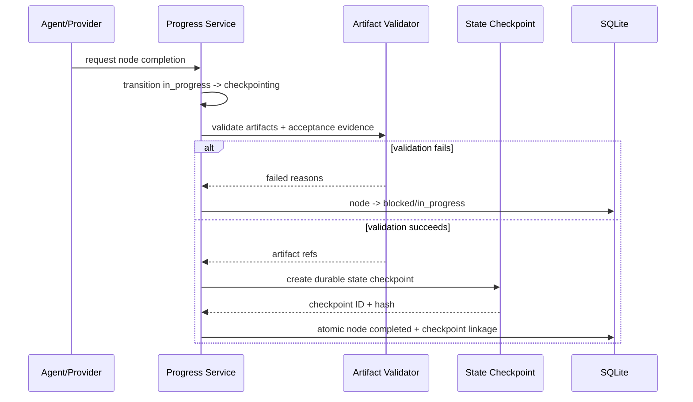

## 18.1 目的

將 agent 的「工作記憶」從 transient context 轉成 durable、可驗證、可重播的 task state。

## 18.2 Progress Tree 結構

```text
Task: Build Preflight ADD
├── 01 Executive decisions [completed]
│   └── artifact: Preflight_ADD.md#1
├── 02 Requirements [completed]
│   └── artifact: Preflight_ADD.md#5
├── 03 Architecture [completed]
│   └── artifact: Preflight_ADD.md#7
├── 04 State Checkpointing [in_progress]
├── 05 Graceful Pause [ready]
└── 06 Final validation [pending]
```

Tree 支援 DAG dependencies；UI 可 tree 顯示，但 storage 用 nodes + edges。

## 18.3 Canonical state

Canonical state 是：

1. SQLite Progress Tree；
2. artifact checksums；
3. State Checkpoint manifest。

Provider plan/task state 是 observation，不是 canonical。

## 18.4 Node completion protocol



## 18.5 Document section contract

```yaml
node:
  id: section-20
  kind: document_section
  title: Graceful Pause
  artifact_contract:
    type: file
    path: Preflight_ADD.md
    selector: heading:#20-graceful-pause-與-auto-resume
    media_type: text/markdown
    minimum_bytes: 4000
    required_subheadings:
      - Trigger model
      - Safe point
      - Resume validation
    validators:
      - markdown-fence-balance
      - heading-exists
      - no-placeholder-text
```

「寫完一章」的定義不是 agent 說 done，而是：

- heading 存在；
- section content persisted；
- validators pass；
- checksum recorded；
- state checkpoint complete。

## 18.6 Storage modes

### File artifact

適合 docs/code/config。記錄 file + optional selector range。

### Database artifact

適合 structured decisions、progress metadata、small generated plans。

### External artifact reference

未來可指 Git blob、object store；v1 只 local。

## 18.7 Atomicity

跨 filesystem + SQLite 無 distributed transaction，因此使用 staged protocol：

1. 寫 artifact temp；
2. fsync；
3. atomic rename；
4. 建 `artifacts` row status `prepared`；
5. 寫 state checkpoint temp；
6. fsync + rename；
7. SQLite transaction：artifact `committed`、node `completed`、checkpoint row；
8. crash recovery 掃描 orphan prepared artifacts。

若 artifact 是 agent 已直接寫入 repo：

- 不重寫；
- 讀取 checksum；
- capture repository snapshot；
- transaction link evidence。

## 18.8 State checkpoint contents

```yaml
schema_version: preflight.state-checkpoint.v1
checkpoint_id: 0198...
task_id: 0198...
progress_tree_version: 17
active_node:
  id: section-20
  status: paused
completed_nodes:
  - section-01
  - section-02
artifacts:
  - uri: file:Preflight_ADD.md
    sha256: ...
repository:
  git_head: f1a83bc
  worktree_fingerprint: sha256:...
provider:
  name: codex
  session_id: thr_123
  turn_id: turn_456
quota:
  latest_observations: [quota-1, quota-2]
next_action:
  node_id: section-20
  description: Continue from subsection Resume validation.
resume:
  strategy: provider_session
  bootstrap_template: progress-v1
created_at: 2026-07-12T18:00:00Z
integrity_sha256: ...
```

## 18.9 Reconciliation

On startup/resume：

1. load latest state checkpoint；
2. verify hash；
3. recalculate artifact checksums；
4. compare repo fingerprint；
5. compare provider plan/task events；
6. mark stale contradictions；
7. never downgrade an evidenced completed node based only on provider prose；
8. require user resolution for destructive conflict。

## 18.10 Progress Tree import

### Codex

`turn/plan/updated` steps map to proposed nodes；status update maps observation。Preflight assigns canonical IDs。

### Claude

`TaskCreated`／`TaskCompleted` hooks map to provider nodes；Preflight still validates artifacts。

### Fallback

- user-defined YAML plan；
- `preflight progress add`；
- plan extracted from prompt by deterministic headings；
- optional LLM plan only after consent。

## 18.11 Long-document enforcement

Managed mode can inject developer instruction：

```text
Work one Progress Tree node at a time.
Before starting the next document section, persist the current section to the
configured Markdown artifact and report the artifact path. Preflight will not
mark the node complete until validation and State Checkpointing succeed.
```

Preflight itself validates；不信任 instruction compliance。

## 18.12 Node idempotency

Each node has `completion_key`：

```text
SHA256(task_id + node_id + artifact hashes + acceptance evidence hashes)
```

Resume 時若 key 已存在，跳過 node，防止重複執行。

---

